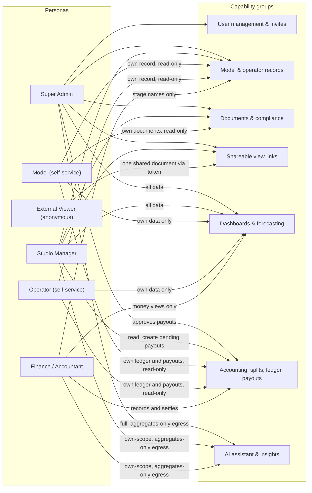

# 01 — Product Overview & Requirements

This document defines what the Studio Management System is, who uses it, what it must do, and — just as importantly — what it deliberately does not do. It introduces the six personas, maps them to the system's capability groups, states the non-functional priorities that shape every other design decision in this package, and fixes the product boundary. It is the entry point for requirements; the detailed designs it points to live in the sibling documents. This package is design-only: nothing described here is implied to exist yet.

**Related docs:** [00 — Index & Conventions](00-index.md) · [02 — System Architecture](02-architecture.md) · [03 — Roles & RBAC](03-roles-rbac.md) · [04 — Database Schema & RLS](04-database-erd.md) · [05 — Auth, Invites & Mandatory 2FA](05-auth-2fa.md) · [06 — Document Management & Shareable Links](06-documents-sharing.md) · [07 — Statistics & Dashboards](07-analytics.md) · [08 — Security & Threat Model](08-security-threat-model.md) · [09 — Accounting](09-accounting.md) · [10 — Deployment & Operations](10-deployment-operations.md) · [11 — AI Assistant & LLM Gateway](11-ai-llm.md)

---

## 1. What the application is

The Studio Management System is **back-office management software for a studio that manages adult-webcam performers ("models")**. It is the studio's internal system of record for the business side of that work: who the models and support staff are, which external platform accounts they work on, how many hours they work, what those platforms pay, how revenue is split between the studio, its models, and its operators, what each payee is owed, and whether the studio's identity and compliance paperwork is current.

The system is designed to hold three kinds of data, and only these:

1. **Business records** — models, operators, platform accounts, work sessions, statement-period earnings, commission schemes, ledger entries, payouts, and forecasts.
2. **Identity and compliance documents** — government IDs, contracts, releases, consent forms, and tax forms, stored privately and shareable only through controlled, expiring links.
3. **Financial data** — an append-only ledger of what is owed to each payee, and a maker-checker payout workflow to settle it.

Two clarifications bound the product from the start:

- **It is explicitly not a streaming or content platform.** The studio's performers work on *external* platforms; this system records the business consequences of that work. No media content of any kind is stored — no video, no images from performances, no chat transcripts.
- **It is an internal tool for a small, known set of people.** There is no public registration of any kind. Every account is created by invitation, and every session requires TOTP two-factor authentication (see [05 — Auth, Invites & Mandatory 2FA](05-auth-2fa.md)).

## 2. Personas

The system serves six personas. Five are authenticated staff or contributor roles; the sixth is an anonymous outsider who can see exactly one shared document through a controlled link and nothing else. The authoritative capability matrix — precisely which persona can do what, per capability, with row- and column-level scoping — lives in [03 — Roles & RBAC](03-roles-rbac.md); the summaries here are descriptive only.

| # | Persona | Who they are | Access mode | In one sentence |
|---|---------|--------------|-------------|-----------------|
| 1 | **Super Admin** | The studio owner. Exactly one exists, enforced at the database level (see [03 — Roles & RBAC](03-roles-rbac.md)). | Full authenticated access, plus a guarded direct-database path (see [05](05-auth-2fa.md)) | Owns everything: invites and deactivates users, authorizes payouts, edits commission schemes, and is the only reader of the audit log. |
| 2 | **Studio Manager** | Day-to-day operations staff. | Authenticated, broad operational access | Runs the roster: manages model and operator records, platform accounts, sessions and earnings data, documents, and share links — but cannot manage users, approve payouts, or read the audit log. |
| 3 | **Model** | A performer managed by the studio, optionally given a self-service login linked to their business record. | Authenticated, self-service, own-data only | Sees their own record, own platform accounts, own earnings and hours, own documents, own payouts and ledger — and nothing belonging to anyone else. |
| 4 | **Operator** | Support staff (e.g. chatters / account operators) who participate in revenue splits, optionally given a self-service login. | Authenticated, self-service, own-data only | Sees their own operator record, assignments, computed ledger share, balance, and payouts — never raw earnings figures and never documents. |
| 5 | **Finance / Accountant** | The person who keeps the books. | Authenticated, money-scoped access | Works the accounting module: reads earnings, posts ledger entries, runs share generation and forecast snapshots, creates payouts and records settlement — but is denied all identity documents and cannot approve payouts. |
| 6 | **External Viewer** | Anyone outside the system who has been sent a share link — an external accountant, a platform's compliance desk, a lawyer. | **Unauthenticated**, share-link only | Can open exactly the one document behind a valid, unexpired, unrevoked share token, through a dedicated public endpoint (see [06 — Document Management & Shareable Links](06-documents-sharing.md)); has zero access to anything else. |

Two persona-design points worth calling out:

- **Models and operators are business records first, logins second.** A model or operator exists in the system (and can be owed money) whether or not they have ever logged in; the self-service login is an optional link to the business record. The schema consequences are specified in [04 — Database Schema & RLS](04-database-erd.md).
- **The External Viewer is not a role.** They have no account, no session, and no database grants. Their entire interaction surface is a single public share-view endpoint, which is why it is designed as an isolated Edge Function rather than part of the authenticated application (rationale in [02 — System Architecture](02-architecture.md) and [06](06-documents-sharing.md)).

## 3. Core capabilities

Each capability group below is a requirement stated at product level; the linked documents carry the full design.

| Capability group | What it must do | Design doc(s) |
|------------------|-----------------|---------------|
| **User management & invites** | Invite-only account creation with role assignment; forced TOTP enrollment on first login; deactivation with immediate session revocation. Only the Super Admin manages users. | [03 — Roles & RBAC](03-roles-rbac.md), [05 — Auth, Invites & Mandatory 2FA](05-auth-2fa.md) |
| **Model & operator records** | Maintain the roster of models and operators: identity details, status, platform accounts per model, operator↔model assignments with pool shares, work sessions (hours) and statement-period earnings (money). | [04 — Database Schema & RLS](04-database-erd.md) |
| **Documents & compliance** | Store identity/compliance documents in a private bucket, track expiry, and surface derived compliance status (valid / expiring / expired) per model. Documents are model-scoped. | [06 — Document Management & Shareable Links](06-documents-sharing.md) |
| **Shareable view links** | Let admins and managers share a single document externally via a high-entropy, expiring, revocable, view-limited token — with every view audited and no public URLs ever. | [06 — Document Management & Shareable Links](06-documents-sharing.md) |
| **Statistics dashboards & forecasting** | Per-role dashboards (earnings, hours, payouts, compliance, balances) where every viewer sees only what their row-level permissions allow, plus revenue forecasting with accuracy tracking. | [07 — Statistics & Dashboards](07-analytics.md), [09 — Accounting](09-accounting.md) |
| **Accounting: commission splits, ledger, payouts** | Resolve the applicable commission scheme per earning, split studio net revenue across model / operator pool / studio, post append-only ledger entries, and pay out **both models and operators** through a maker-checker workflow (Finance records, Super Admin authorizes). | [09 — Accounting](09-accounting.md) |
| **AI assistant & insights** | Answer operational and financial questions via whitelisted, RLS-scoped tools; semantic search over internal notes and metadata; monthly AI market reports. Only aggregated, de-identified data ever reaches the external LLM providers. | [11 — AI Assistant & LLM Gateway](11-ai-llm.md) |

### Persona → capability map

The flowchart below is the high-level map of which persona reaches which capability group. Edge labels summarize the scoping; the binding per-capability matrix is in [03 — Roles & RBAC](03-roles-rbac.md).

Reading the map: the Super Admin and Studio Manager cover the operational surface, with user management and payout approval reserved to the Super Admin alone; Model and Operator are strictly self-service; Finance is confined to money flows and sees people only as stage/display names; the External Viewer touches exactly one capability through one endpoint.

## 4. Non-functional priorities

These priorities are ordered, and the ordering is a design instruction: where two goals conflict, the higher one wins. They recur throughout the package and are treated as binding constraints, not aspirations.

| Priority | Requirement | Consequence in the design |
|----------|-------------|---------------------------|
| 1 | **Security over performance** | Where a safer design costs latency or convenience — e.g. an extra database round-trip for a restrictive RLS check, or short-lived signed URLs that must be re-minted — the safer design is chosen. The full threat analysis is [08 — Security & Threat Model](08-security-threat-model.md). |
| 2 | **Deny by default** | No table, bucket, or endpoint is readable until a policy explicitly grants it. Row Level Security is the final authority; application-layer checks are UX, not security (see [02 — System Architecture](02-architecture.md) and [04 — Database Schema & RLS](04-database-erd.md)). |
| 3 | **Invite-only** | Public registration is disabled at the auth-provider level and rejected again by a database trigger as defense in depth. Every account traces to a Super Admin invitation ([05](05-auth-2fa.md)). |
| 4 | **Mandatory TOTP 2FA (AAL2)** | Two-factor enrollment is forced on first login, and a restrictive database policy requires an AAL2 session for every table access — a stolen password-only session reads zero rows ([05](05-auth-2fa.md)). |
| 5 | **Full audit trail** | Sensitive actions — invites, deactivations, document uploads/downloads, share creation/revocation/views, ledger posts, scheme changes, payout approvals and settlements — are written to an append-only audit log readable only by the Super Admin ([04](04-database-erd.md), [08](08-security-threat-model.md)). |

## 5. Out of scope

Boundaries stated now prevent scope creep later. The following are explicitly out of scope for this design; two are flagged as future considerations.

| Out of scope | Why | Future consideration? |
|--------------|-----|-----------------------|
| **Public registration** | The user base is a small, known set of staff and contributors; open signup contradicts the invite-only security stance. | No |
| **Content hosting** | The system stores business records and compliance documents only. Performance media never enters the system; the studio's platforms host their own content. | No |
| **Chat / messaging** | Communication between staff, models, and operators happens outside this system. | No |
| **Scheduling / shift planning** | Work sessions are recorded after the fact for hours tracking; the system does not plan or assign shifts. | No |
| **Multi-studio tenancy** | The system is single-tenant: one studio, one deployment. Multi-studio support would change the data model and RLS design pervasively. | Yes — future consideration |
| **Operator compliance documents** | Documents are model-scoped in this design; operators carry no document records. | Yes — future consideration |
| **External market-data ingestion for AI** | v1 market analysis uses internal aggregates only; ingesting third-party web text would open a fresh prompt-injection channel and add crawling and provider surface ([11](11-ai-llm.md)). | Yes — future consideration |
| **AI access for the Model and Operator roles** | Their scope is narrow self-service, the assistant's value is operational/analytical, and excluding them shrinks the injection and cost surface ([11](11-ai-llm.md)). | Yes — future consideration |
| **AI write actions / agent mutations** | The assistant is read-only by design: no write tools exist, and every mutation remains a human workflow with its existing controls ([11](11-ai-llm.md)). | No |

Everything else in this package — architecture, roles, schema, auth, documents, analytics, threat model, accounting, and operations — elaborates the scope defined here without extending it.
