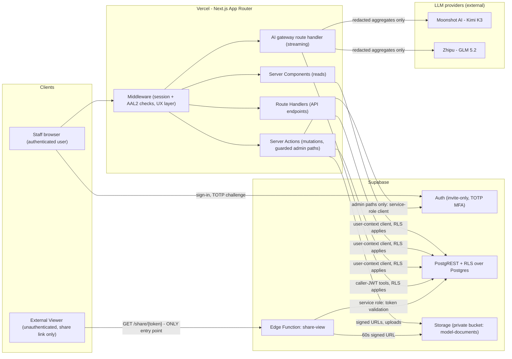
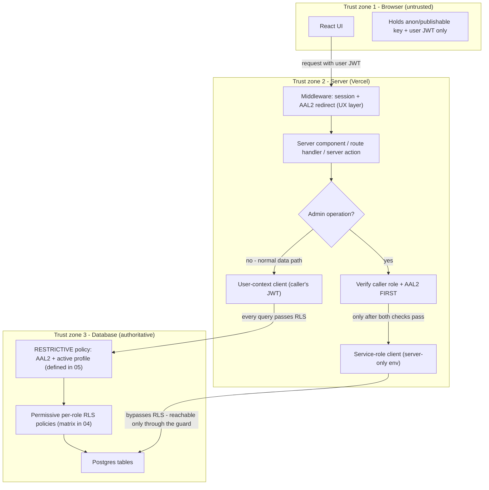

# 02 — System Architecture

This document defines the system architecture for the studio management application: the technology stack, the container-level structure (C4 style), the request path through the three trust zones, and the key architecture decisions recorded as mini-ADRs. It is a design document — no code or infrastructure exists yet; everything described here is what the system *is designed to* be. The architecture is shaped by one non-negotiable stance: security over performance, deny-by-default, with Row Level Security (RLS) in the database as the final authority for every data access.

Related docs: [00 — Index & Conventions](00-index.md) · [01 — Product Overview](01-overview.md) · [03 — Roles & RBAC](03-roles-rbac.md) · [04 — Database Schema & RLS](04-database-erd.md) · [05 — Auth, Invites & Mandatory 2FA](05-auth-2fa.md) · [06 — Documents & Shareable Links](06-documents-sharing.md) · [07 — Statistics & Dashboards](07-analytics.md) · [08 — Security & Threat Model](08-security-threat-model.md) · [09 — Accounting](09-accounting.md) · [10 — Deployment & Operations](10-deployment-operations.md) · [11 — AI Assistant & LLM Gateway](11-ai-llm.md)

## 1. Technology stack

| Layer | Technology | Role in this system |
|---|---|---|
| Web application | Next.js (App Router) on Vercel | All UI and server-side application logic: middleware, server components, route handlers, server actions |
| Database | Supabase Postgres with RLS | System of record for all business data; RLS policies are the authoritative access-control layer |
| Authentication | Supabase Auth | Invite-only sign-up (public registration disabled) with mandatory TOTP MFA; sessions carry an assurance level (AAL1/AAL2) — see [05 — Auth, Invites & Mandatory 2FA](05-auth-2fa.md) |
| File storage | Supabase Storage | A single private bucket for identity/compliance documents; never publicly addressable — see [06 — Documents & Shareable Links](06-documents-sharing.md) |
| Serverless edge | Supabase Edge Functions | Exactly one public endpoint, `share-view`, which serves anonymous share-link access to documents |
| LLM providers | Moonshot (Kimi K3) / Zhipu (GLM 5.2) via a server-side gateway | Reached only from Next.js server code through a redaction chokepoint; the browser never talks to a provider and provider keys are server-only — see [11 — AI Assistant & LLM Gateway](11-ai-llm.md) |
| Provisioning tooling | Supabase MCP / Vercel MCP | Used at implementation and provisioning time only (project creation, migrations, edge-function deploys, env configuration) — details in [10 — Deployment & Operations](10-deployment-operations.md) |

The application stores no media content. It manages business records, identity/compliance documents, and financial data; it is back-office software, not a streaming or content platform (scope in [01 — Product Overview](01-overview.md)).

## 2. Container view (C4 style)

Two client populations exist, and they are deliberately given disjoint entry points:

- **Authenticated staff and self-service users** (all roles defined in [03 — Roles & RBAC](03-roles-rbac.md)) enter through the Next.js application on Vercel. Every request passes the Next.js middleware, which enforces session and assurance-level checks as a UX layer before any page or action runs.
- **External Viewers** (unauthenticated recipients of a share link) can reach exactly one endpoint in the entire system: the `share-view` Edge Function. They have no Supabase Auth session, no anon-key database access, and no route into the Next.js application's data surfaces.

### Container responsibilities

| Container | Responsibility | Trust notes |
|---|---|---|
| Staff browser | Renders the UI; holds a Supabase session (JWT) and the anon/publishable key | Untrusted. Anything it sends is validated again server-side and by RLS |
| Next.js middleware | Redirects unauthenticated or under-assured (AAL1) sessions to sign-in / TOTP challenge / enrollment | UX convenience only; bypassing it must never grant data access (see trust zones below) |
| Server components / route handlers | Read data for pages and APIs using a per-request user-context Supabase client | Queries execute under the caller's JWT; RLS filters rows |
| Server actions | All mutations; the only place admin/service-role operations may run, after verifying caller role and AAL2 | Holds `SUPABASE_SERVICE_ROLE_KEY` from server-only env; the key never reaches the browser (invariant boxed in [05](05-auth-2fa.md)) |
| AI gateway route handler | Streams the AI assistant; runs the agent loop, the whitelisted read-only tool registry, and the redaction chokepoint before any provider call | Tools execute under the caller's JWT so RLS applies; only redacted aggregates ever leave for Moonshot/Zhipu; provider keys are server-only env — design in [11 — AI Assistant & LLM Gateway](11-ai-llm.md) |
| Supabase Auth | Passwords, invite delivery, TOTP factors, assurance levels, session revocation | Public signups disabled; flows specified in [05](05-auth-2fa.md) |
| PostgREST + RLS | Auto-generated API over Postgres; every row-level decision is made by RLS policies | The final authority; policy matrix in [04 — Database Schema & RLS](04-database-erd.md) |
| Storage | Private `model-documents` bucket; access via short-lived signed URLs only | Storage RLS and sharing design in [06](06-documents-sharing.md) |
| Edge Function `share-view` | Validates hashed share tokens and serves a viewer page with a 60-second signed URL | Runs with the service role so anonymous users need **zero** database grants; flow in [06](06-documents-sharing.md) |

## 3. Request path and trust zones

The system defines three trust zones. Each zone assumes the zones above it can be compromised, and remains safe anyway. The controlling principle: **app-layer checks are UX, not security — RLS is the final authority.**

| Zone | Holds | Security posture |
|---|---|---|
| 1. Browser | Anon/publishable key + the user's JWT only | Fully untrusted. Every query it issues passes RLS in the database. The service-role key is never present here, in any build artifact or `NEXT_PUBLIC_*` variable |
| 2. Server (Next.js server actions / route handlers on Vercel) | May hold the service-role key (server-only env) | Semi-trusted. Guarded admin paths verify the caller's role **and** AAL2 *before* the service-role client is used for anything. Non-admin paths use a user-context client so RLS still applies |
| 3. Database (Postgres) | The data and the RLS policies | Authoritative. Deny-by-default: a table with RLS enabled and no matching permissive policy returns zero rows. A per-table RESTRICTIVE policy additionally requires an AAL2 session and an active profile (snippet defined once in [05 — Auth, Invites & Mandatory 2FA](05-auth-2fa.md)) |

Consequences of this layering, stated as design invariants:

1. A stolen AAL1 session token reads **zero rows**, even if the middleware is bypassed entirely, because the RESTRICTIVE policy in zone 3 rejects it ([05](05-auth-2fa.md)).
2. A compromised browser can only ever act as the user it is signed in as — the anon key plus RLS confines it to that user's permitted rows.
3. The service-role key exists only in zone 2's server environment, and every code path that uses it is preceded by an explicit role + AAL2 verification of the caller. There is no unguarded service-role path.
4. External Viewers never touch zones 1–2 of the authenticated app at all; their sole path is the `share-view` Edge Function, whose validation and audit behavior is specified in [06](06-documents-sharing.md).

## 4. Architecture decision records (mini-ADRs)

| # | Decision | Status |
|---|---|---|
| ADR-01 | RLS as the primary authorization mechanism | Accepted |
| ADR-02 | Service-role key is server-only | Accepted |
| ADR-03 | Edge Function for anonymous share access | Accepted |
| ADR-04 | Enum-based roles, not a roles table | Accepted |
| ADR-05 | SECURITY INVOKER for all analytics objects | Accepted |
| ADR-06 | Polymorphic payee on ledger and payouts | Accepted |
| ADR-07 | Server-side AI gateway, whitelisted tools, aggregates-only egress | Accepted |

### ADR-01 — RLS as primary authorization

**Context.** Authorization could live in application middleware, in a service layer, or in the database. App-layer checks are easy to write but every new route, action, or API client is a chance to forget one.

**Decision.** Row Level Security policies in Postgres are the authoritative access-control layer. Application-layer checks (middleware redirects, UI hiding) exist for user experience only. Every table carries deny-by-default RLS plus the AAL2/active-profile RESTRICTIVE policy; the full policy-intent matrix lives in [04 — Database Schema & RLS](04-database-erd.md).

**Consequences.** A bug or bypass anywhere above the database cannot widen data access. The cost is that policies must be written carefully per table × role, and performance-sensitive checks (e.g. row-ownership helpers) must be designed to avoid joins inside policies — a constraint that visibly shaped the schema in 04.

### ADR-02 — Server-only service key

**Context.** Supabase issues an anon/publishable key (safe to ship to browsers because RLS constrains it) and a service-role key (bypasses RLS entirely).

**Decision.** The service-role key lives exclusively in server-side environment configuration (`SUPABASE_SERVICE_ROLE_KEY` in Vercel server env and Edge Function secrets — inventory in [10 — Deployment & Operations](10-deployment-operations.md)); it is never a `NEXT_PUBLIC_*` variable and never reaches the browser. Server code paths that use it must first verify the caller is authorized (role check + AAL2) — see the invariant in [05](05-auth-2fa.md).

**Consequences.** Admin capabilities (invites, role assignment, session revocation, share validation) are possible without weakening RLS for ordinary traffic. Key exposure is reduced to a server-compromise scenario, which the threat model addresses with rotation runbooks ([08](08-security-threat-model.md), [10](10-deployment-operations.md)).

### ADR-03 — Edge Function for anonymous share access

**Context.** External recipients of a document share link have no account and must never be given one implicitly. Serving them from the main app would require anon-role database grants or public storage paths.

**Decision.** All anonymous share traffic goes to a dedicated Supabase Edge Function, `share-view`, which runs with the service role, validates the hashed token, enforces expiry/view limits/revocation, records the view, and returns a viewer page embedding a 60-second signed URL. Anonymous users therefore need **zero** database grants — the `anon` role has no permissive policy on any table ([04](04-database-erd.md)); the complete flow is specified in [06 — Documents & Shareable Links](06-documents-sharing.md).

**Consequences.** The public attack surface of the whole system is a single endpoint with uniform-404 failure behavior and per-IP rate limiting. The trade-off is that share-link logic lives outside the Next.js codebase and is deployed separately ([10](10-deployment-operations.md)).

### ADR-04 — Enum-based roles

**Context.** Roles could be modeled as a `roles` table with a join, or as a Postgres enum column on the user's profile.

**Decision.** A Postgres `ENUM user_role` on `profiles.role`. The role set is product-defined and tiny; users never create roles; and a join table would put a join inside every RLS policy. Adding a role is a deliberate migration — desirable governance for a security-first system. Full rationale, the JWT custom-claim mechanism, and the single-Super-Admin enforcement live in [03 — Roles & RBAC](03-roles-rbac.md); the enum definition lives in [04](04-database-erd.md).

**Consequences.** RLS policies stay simple and fast (`auth.jwt()->>'user_role'` checks, no joins), at the cost of a migration whenever the role set changes — which is exactly the change-control the design wants.

### ADR-05 — SECURITY INVOKER analytics

**Context.** Analytics views and RPCs could run as SECURITY DEFINER (seeing all rows, enabling cross-row aggregates a caller cannot see row-wise) or SECURITY INVOKER (caller's own RLS applies).

**Decision.** Every analytics view and RPC is SECURITY INVOKER, so one set of objects serves every role and each caller sees only what RLS grants them. No DEFINER analytics objects exist; the only DEFINER functions in the system are the narrow RLS helpers ([04](04-database-erd.md)) and share validation ([06](06-documents-sharing.md)). The full trade-off analysis and the view/RPC catalog live in [07 — Statistics & Dashboards](07-analytics.md).

**Consequences.** Zero risk of an analytics object leaking cross-tenant aggregates, at the cost of forgoing "your share of the studio total"-style comparisons for restricted roles.

### ADR-06 — Polymorphic payee

**Context.** Money is owed to two kinds of business entities — models and operators — and either may lack a login account entirely.

**Decision.** Ledger entries and payouts reference their payee via `payee_type` + `payee_id`, pointing at the business tables (`models` / `operators`), not at `profiles`. The lost declarative FK is mitigated by a BEFORE INSERT validation trigger. The full decision record and column specs live in [04 — Database Schema & RLS](04-database-erd.md); the accounting flows built on it live in [09 — Accounting](09-accounting.md).

**Consequences.** One ledger and one payout pipeline serve both payee kinds symmetrically, and payees without logins are first-class. Referential integrity for the polymorphic pair is trigger-enforced rather than declarative — accepted as the standard cost of this pattern.

### ADR-07 — Server-side AI gateway, whitelisted tools, aggregates-only egress

**Context.** The AI assistant needs data access to be useful, and the studio requires switchability between two external LLM providers — Kimi K3 (Moonshot) and GLM 5.2 (Zhipu). Letting the browser reach a provider would expose keys; letting the model query the database freely would turn prompt injection into a data-exfiltration path.

**Decision.** All AI traffic flows through a server-only gateway (a streaming route handler plus a report server action). The agent can invoke only a whitelisted, read-only tool registry whose tools execute under the **caller's** JWT against the SECURITY INVOKER objects of [07 — Statistics & Dashboards](07-analytics.md); every provider-bound payload passes a single redaction chokepoint enforcing the aggregates-only egress policy; and the active provider is one global setting writable only by the Super Admin. The full design — registry, redaction contract, embeddings, reports, budgets — lives in [11 — AI Assistant & LLM Gateway](11-ai-llm.md).

**Consequences.** A compromised or injected LLM can obtain at most what the calling user's RLS already grants, and the providers never see PII — only stage/display names and numbers. The cost is that the assistant can never produce cross-user answers beyond the caller's own RLS scope — accepted, consistent with ADR-05.

## 5. What this document does not cover

Authentication and session-assurance flows are in [05](05-auth-2fa.md); role capabilities are canonical in [03](03-roles-rbac.md); table and policy definitions are canonical in [04](04-database-erd.md); document storage and sharing mechanics are in [06](06-documents-sharing.md); the threat model that stress-tests this architecture is in [08](08-security-threat-model.md); environments, provisioning (including the Supabase MCP / Vercel MCP checklist), and runbooks are in [10](10-deployment-operations.md).
