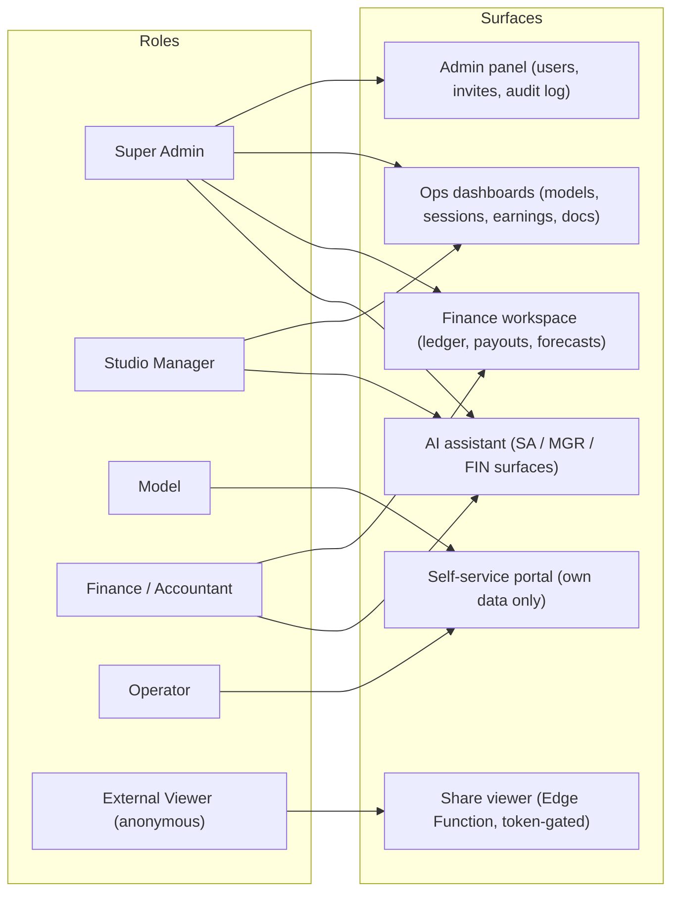

# 03 — Roles & RBAC

This document defines the role model for the Studio Management System: the decision to represent roles as a Postgres enum with a JWT custom claim, the mechanism that guarantees exactly one Super Admin, and the **authoritative capability matrix** that every other document derives from. Role capabilities are canonical here and only here — the RLS policy-intent matrix in [04 — Database Schema & RLS](04-database-erd.md) is the row-level translation of this matrix, and the threat mitigations in [08 — Security & Threat Model](08-security-threat-model.md) reference it. This is a design document; nothing described here is implemented or deployed yet.

**Related docs:** [00 — Index & Conventions](00-index.md) · [01 — Product Overview](01-overview.md) · [02 — System Architecture](02-architecture.md) · [04 — Database Schema & RLS](04-database-erd.md) · [05 — Auth, Invites & Mandatory 2FA](05-auth-2fa.md) · [06 — Documents & Sharing](06-documents-sharing.md) · [07 — Statistics & Dashboards](07-analytics.md) · [08 — Security & Threat Model](08-security-threat-model.md) · [09 — Accounting](09-accounting.md) · [10 — Deployment & Operations](10-deployment-operations.md) · [11 — AI Assistant & LLM Gateway](11-ai-llm.md)

---

## 1. The role set

The system defines five authenticated roles plus one unauthenticated access mode. Personas and their business context are described in [01 — Product Overview](01-overview.md); this document defines what each role *can do*.

| Role | Enum value | Summary |
|---|---|---|
| Super Admin | `super_admin` | The studio owner. Exactly one exists (enforced in the database, §3). Full control, sole authorizer of payouts, sole reader of the audit log. |
| Studio Manager | `manager` | Day-to-day operations: model and operator records, platform accounts, sessions and earnings entry, documents, share links. No user administration, no financial authorization. |
| Model | `model` | Self-service: reads their own records, earnings, payouts, documents, and dashboards. No write access to business data. |
| Finance / Accountant | `finance` | Money only: enters ledger entries, runs share generation and forecasts, creates and settles payouts. Explicitly denied access to identity/compliance documents. |
| Operator | `operator` | Self-service support staff (chatters/account operators) participating in revenue splits: sees their own computed share via the ledger, their payouts, and their balance — never raw earnings. |
| External Viewer | *(no role — anonymous)* | Unauthenticated access to a single shared document via a share-link token, served exclusively by the `share-view` Edge Function ([06 — Documents & Sharing](06-documents-sharing.md)). Holds zero database grants. |

Two global preconditions apply to **every** capability in this document: the caller's profile must have `status = 'active'`, and the session must be at AAL2 (password + TOTP verified). Both are enforced in the database by a RESTRICTIVE policy on every table — the exact policy snippet is defined once in [05 — Auth, Invites & Mandatory 2FA](05-auth-2fa.md).

## 2. Role-model decision: enum, not a roles table

**Decision: roles are a Postgres enum, `user_role` (`'super_admin'`, `'manager'`, `'model'`, `'finance'`, `'operator'`), stored on `profiles.role`. There is no `roles` table and no `user_roles` join table.**

Rationale:

- **The role set is product-defined and tiny.** Users never create, rename, or compose roles at runtime. A normalized `roles`/`user_roles` design would model flexibility the product deliberately does not have — and would pay for it with a join inside every RLS policy. That is more surface area for policy mistakes and a per-row cost on every access check, in a system whose stated priority is security over performance but which still evaluates policies on every query.
- **Adding a role is a migration — and that is desirable governance.** In a security-first application, a change to the privilege model *should* be a reviewed, versioned, auditable schema migration rather than a row insert. This was validated in practice by the design's own evolution: the Operator role was added exactly this way, as a single `ALTER TYPE user_role ADD VALUE 'operator';` migration, followed by the symmetric RLS policies described in [04 — Database Schema & RLS](04-database-erd.md) and the accounting integration in [09 — Accounting](09-accounting.md).
- **Enum values are closed-world.** RLS policies can compare against a fixed set of literals; there is no path by which a compromised account invents a novel privileged role, which directly supports the privilege-escalation mitigations in [08 — Security & Threat Model](08-security-threat-model.md).

### 2.1 Role in the JWT: custom claim with a database fallback

The role is injected into every access token as a `user_role` custom claim via a **Custom Access Token Auth Hook** in Supabase Auth. RLS policies can therefore check `auth.jwt()->>'user_role'` without touching `profiles` at all — no extra table read per policy evaluation, and no recursive-policy hazard on the `profiles` table itself.

A fallback helper, `public.current_user_role()`, reads the role from `profiles` when the claim is absent (for example, tokens minted before the hook was enabled). It is declared `SECURITY DEFINER`, `STABLE`, with `SET search_path = ''` — the full function spec, alongside `is_aal2()`, `is_active_profile()`, `my_model_id()`, and `my_operator_id()`, lives in [04 — Database Schema & RLS](04-database-erd.md).

**Caveat — claim staleness.** JWT claims refresh only when the token refreshes, so a role change or account deactivation is not instantly reflected in an outstanding token. Two compensating controls close this window:

1. Sensitive policies do not trust the claim alone: they additionally check `profiles.status` (via `is_active_profile()`, folded into the per-table RESTRICTIVE policy defined in [05](05-auth-2fa.md)), so a deactivated user's still-valid token reads zero rows.
2. The deactivation flow revokes the user's sessions immediately via the Supabase Auth admin API, so stale tokens are invalidated rather than merely neutered. The operational runbook for deactivation is in [10 — Deployment & Operations](10-deployment-operations.md).

### 2.2 Exactly one Super Admin

The invariant "there is exactly one Super Admin" is enforced in the database, not in application code, with a partial unique index over a constant expression:

```sql
CREATE UNIQUE INDEX one_super_admin ON profiles ((true)) WHERE role = 'super_admin';
```

The index covers only rows where `role = 'super_admin'`, and every such row indexes the same constant value `true` — so a second row with that role violates uniqueness and the `INSERT`/`UPDATE` fails at the database layer, regardless of which code path attempted it. This is a deliberate documented trick: it turns a business rule that is normally "checked in the app" into a constraint no service-role bug or console mistake can bypass. Because there is exactly one Super Admin, [05 — Auth, Invites & Mandatory 2FA](05-auth-2fa.md) documents the Super Admin's own MFA-lockout recovery path explicitly.

## 3. Authoritative capability matrix

This matrix is the **single source of truth for what each role may do**. The per-table RLS policy-intent matrix in [04 — Database Schema & RLS](04-database-erd.md) is derived from it and must never grant more than this table allows. Global preconditions (repeated for emphasis): every capability requires an `active` profile **and** an AAL2 session — no exceptions, enforced by the RESTRICTIVE policy defined in [05](05-auth-2fa.md).

| Capability | Super Admin | Manager | Model | Finance | Operator |
|---|---|---|---|---|---|
| Invite/deactivate users, assign roles | ✅ | ❌ | ❌ | ❌ | ❌ |
| Model records (CRUD) | ✅ | ✅ | own: read-only (limited columns) | read stage names only (via views) | ❌ |
| Operator records (CRUD) | ✅ | ✅ | ❌ | read display names only (via view) | own: read (limited cols) |
| Operator assignments | ✅ | ✅ | ❌ | read | own: read |
| Platform accounts (CRUD) | ✅ | ✅ | own: read | read | ❌ |
| Sessions & earnings (CRUD) | ✅ | ✅ | own: read | read all | ❌ (sees own computed *share* via ledger only) |
| Commission schemes | ✅ CRUD | read | ❌ | read | ❌ |
| Ledger entries | ✅ create+read (no U/D) | read | own: read | create + read (no U/D — append-only) | own: read |
| Run earning-share generation / forecast snapshots (RPCs) | ✅ | ❌ | ❌ | ✅ | ❌ |
| Payouts create / record settlement (mark paid) | ✅ | create (pending only) | ❌ | create, update pending, mark paid | ❌ |
| Payouts approve | ✅ only | ❌ | ❌ | ❌ | ❌ |
| Payouts read | ✅ | ✅ | own | ✅ all | own |
| Forecasts & accuracy | ✅ | ✅ | ❌ | ✅ | ❌ |
| Documents upload/manage | ✅ | ✅ | own: read/download | ❌ none | ❌ none |
| Create/revoke share links | ✅ | ✅ | ❌ | ❌ | ❌ |
| Dashboards | all data | all data | own data only | earnings/payouts/ledger only | own ledger/payouts only |
| Audit log read | ✅ | ❌ | ❌ | ❌ | ❌ |
| Direct DB / Supabase dashboard | ✅ (see [05](05-auth-2fa.md)) | ❌ | ❌ | ❌ | ❌ |
| Use AI assistant (chat + whitelisted tools + semantic search) | ✅ | ✅ | ❌ | ✅ | ❌ |
| Switch active AI model / edit AI settings | ✅ | ❌ | ❌ | ❌ | ❌ |
| Generate / read AI market reports | ✅ | ❌ | ❌ | ✅ | ❌ |
| View AI usage & cost | ✅ all | own | ❌ | own | ❌ |
| Manage embeddings / trigger reindex | ✅ | ❌ | ❌ | ❌ | ❌ |

Reading notes on deliberate asymmetries:

- **Finance is denied documents entirely.** Identity and compliance documents (government IDs, contracts, consent forms) are not needed to run the books; excluding the finance role shrinks the document-leakage surface analyzed in [08 — Security & Threat Model](08-security-threat-model.md). Finance reads models only as `id` + `stage_name` (and operators as `id` + `display_name`) through dedicated views, never legal names or contact details.
- **Operators never see raw earnings.** An operator's economic interest is their computed share, which materializes as ledger credits ([09 — Accounting](09-accounting.md)). Exposing per-model gross earnings to support staff would leak business data far beyond what the split requires.
- **The ledger is append-only for everyone**, including the Super Admin. No role holds UPDATE or DELETE on ledger entries; corrections are posted as reversing adjustment entries ([09 — Accounting](09-accounting.md)).
- **Audit-log reads are Super-Admin-only**, and no role — including the Super Admin in-app — can modify or delete audit rows. An audit trail readable or editable by the people it watches is not an audit trail.
- **The AI assistant grants no new data access.** Every AI tool executes under the caller's own JWT against the existing RLS-scoped views and RPCs, so the rows already in this matrix bound exactly what the assistant can retrieve for each role — the model is a consumer of pre-scoped data, never an authority ([11 — AI Assistant & LLM Gateway](11-ai-llm.md)). Model and Operator get no AI surface in v1: their scope is narrow self-service, the assistant's value is operational/analytical, and excluding them shrinks the prompt-injection and cost surface. The exclusion is enforced at the database level — no permissive policies on the AI tables exist for those roles ([04 — Database Schema & RLS](04-database-erd.md)) — not just in the UI.

## 4. Maker-checker: why payout approval is Super-Admin-only

The payout lifecycle deliberately splits three powers across roles:

1. **Originate** — Finance creates the obligations: it posts ledger entries and generates earning shares.
2. **Authorize** — only the Super Admin can move a payout from `pending` to `approved`.
3. **Execute** — Finance records settlement by marking an approved payout `paid` (which triggers the settlement ledger entry, per [09 — Accounting](09-accounting.md)).

If the finance role could also approve, one insider could *originate* an obligation (post a fabricated ledger credit), *authorize* its payment, and *execute* the release — fraud end-to-end with a single compromised or malicious account. Splitting authorization out means Finance records and the Super Admin authorizes: no single role can move money from invention to release. The Manager's payout power is narrower still — create `pending` payouts only, never approve, never mark paid.

The enforcement is in the database, not just the UI: the payout policies in [04 — Database Schema & RLS](04-database-erd.md) make `status = 'approved'` writable only by `super_admin` (a `WITH CHECK` clause forbids Finance from writing it), and Finance may set `'paid'` only from `'approved'`. This control directly mitigates the insider-misuse and financial-fraud threats catalogued in [08 — Security & Threat Model](08-security-threat-model.md).

## 5. Roles → application surfaces

Each role lands on a distinct surface of the application. Surface routing is a UX convenience implemented in Next.js middleware ([02 — System Architecture](02-architecture.md)); the security boundary remains RLS — a user who somehow reaches the wrong surface still reads only the rows this document grants them.



The External Viewer's surface is intentionally disconnected from the rest of the application: it is served by the `share-view` Edge Function with zero database grants for anonymous users, as designed in [06 — Documents & Sharing](06-documents-sharing.md). Per-role dashboard composition (which widgets each role sees) is specified in [07 — Statistics & Dashboards](07-analytics.md).
