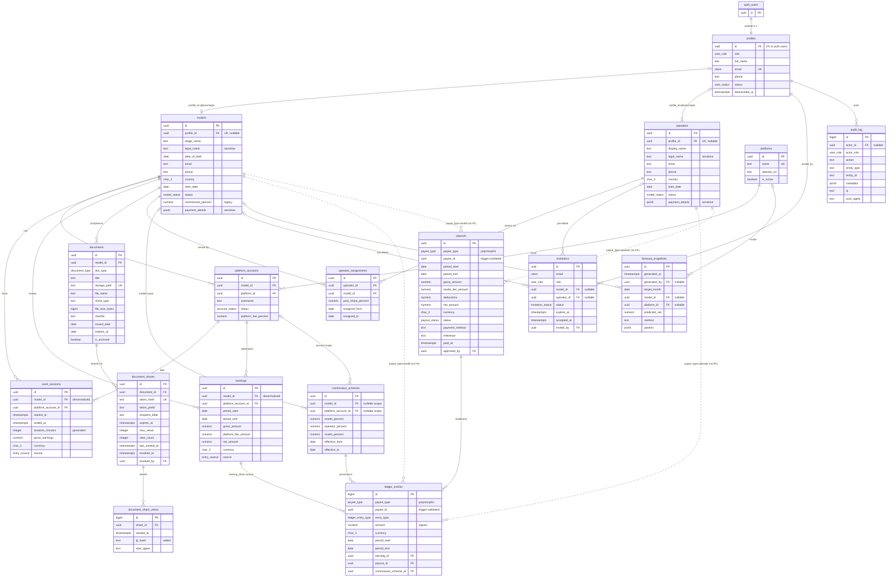

# 04 — Database Schema & RLS

This document is the canonical definition of the Postgres schema for the studio management system: every enum, every table with its columns and constraints, the entity-relationship diagram, the security helper functions, the complete Row-Level Security (RLS) policy-intent matrix, the index plan, and the trigger inventory. Table and column definitions live **only** here — every other document links to this one rather than restating schema. The design is deny-by-default: RLS is the final authority on every read and write, an AAL2 (TOTP-verified) session is a hard precondition for touching any row, and the money tables are append-only. This is a design document; no database exists yet, and everything below is written as the schema the migrations will create.

**Related docs:** [00 — Index & Conventions](00-index.md) · [01 — Overview](01-overview.md) · [02 — Architecture](02-architecture.md) · [03 — Roles & RBAC](03-roles-rbac.md) · [05 — Auth, Invites & Mandatory 2FA](05-auth-2fa.md) · [06 — Documents & Sharing](06-documents-sharing.md) · [07 — Analytics](07-analytics.md) · [08 — Security & Threat Model](08-security-threat-model.md) · [09 — Accounting](09-accounting.md) · [10 — Deployment & Operations](10-deployment-operations.md)

---

## 1. Schema conventions

- All IDs are `uuid` (default `gen_random_uuid()`) except append-only journals (`ledger_entries`, `audit_log`, `document_share_views`), which use `bigint GENERATED ALWAYS AS IDENTITY` for cheap, strictly ordered keys.
- Money columns are `numeric(12,2)`; percentage columns are `numeric(5,2)`.
- Every mutable table carries `created_at` / `updated_at` (`timestamptz NOT NULL DEFAULT now()`); `updated_at` is maintained by trigger (§9), never by application code.
- Roles are a Postgres enum, not a roles table — the rationale is owned by [03 — Roles & RBAC](03-roles-rbac.md).
- Required extensions: `citext` (case-insensitive email columns) and `btree_gist` (overlap-exclusion constraints on `operator_assignments` and `commission_schemes`). `gen_random_uuid()` is built into modern Postgres and needs no extension.

## 2. Enums

All enums are product-defined and fixed at design time; users can never create values. Extending one (as happened when the `operator` role was added) is a deliberate migration — see [03](03-roles-rbac.md) for why this governance property is desirable.

| Enum | Values | Used by | Notes |
|---|---|---|---|
| `user_role` | `super_admin`, `manager`, `model`, `finance`, `operator` | `profiles.role`, `invitations.role`, `audit_log.actor_role` | Injected into the JWT as the `user_role` claim (see [03](03-roles-rbac.md)). |
| `user_status` | `invited`, `active`, `deactivated` | `profiles.status` | Checked by `is_active_profile()` in the restrictive RLS layer. |
| `model_status` | `active`, `inactive`, `on_leave`, `terminated` | `models.status`, `operators.status` | Deliberately reused for operators — the lifecycle is identical. |
| `account_status` | `active`, `suspended`, `closed` | `platform_accounts.status` | |
| `payout_status` | `pending`, `approved`, `paid`, `cancelled` | `payouts.status` | Transitions are role-gated in policy (maker-checker; §8 notes). |
| `document_type` | `government_id`, `passport`, `contract`, `model_release`, `consent_form`, `tax_form`, `other` | `documents.doc_type` | |
| `invitation_status` | `pending`, `accepted`, `expired`, `revoked` | `invitations.status` | |
| `entry_source` | `manual`, `import` | `work_sessions.source`, `earnings.source` | Distinguishes hand entry from bulk statement import. |
| `payee_type` | `model`, `operator` | `ledger_entries.payee_type`, `payouts.payee_type` | Discriminator of the polymorphic payee (§4.10). |
| `ledger_entry_type` | `earning_share`, `adjustment`, `deduction`, `payout_settlement` | `ledger_entries.entry_type` | Sign convention per type in §4.10. |

## 3. Supabase-managed objects referenced (not owned by this schema)

| Object | Relationship to our schema |
|---|---|
| `auth.users` | FK target for `profiles.id`; `auth.uid()` and `auth.jwt()` are used inside RLS policies. |
| `auth.mfa_factors` | Read via the Supabase Auth API only — never queried directly by application SQL. Enrollment/challenge flows are in [05](05-auth-2fa.md). |
| `storage.objects`, bucket `model-documents` | Private storage bucket for compliance documents. Its RLS policies (path-prefix scoping) are defined in [06 — Documents & Sharing](06-documents-sharing.md). |

## 4. Tables

Column-table legend: **Null** = nullable; **Default** shown where defined; constraints that span columns are listed under each table. CHECK constraints appear here and *only* here — the Mermaid ER diagram in §5 cannot express them (it shows types and PK/FK/UK markers only).

### 4.1 `profiles` — 1:1 extension of `auth.users`

Application-facing identity row for every authenticated user, created by the `handle_new_user` trigger (§9) from a pending invitation. Holds the role and account status that the entire RLS layer keys off.

| Column | Type | Null | Default | Constraints / Notes |
|---|---|---|---|---|
| `id` | `uuid` | no | — | PK; FK → `auth.users(id)` ON DELETE CASCADE |
| `role` | `user_role` | no | `'model'` | Changes only via the guarded service-role server path ([03](03-roles-rbac.md)) |
| `full_name` | `text` | no | — | |
| `email` | `citext` | no | — | UNIQUE; denormalized from `auth.users` for in-app display/search |
| `phone` | `text` | yes | — | |
| `status` | `user_status` | no | `'invited'` | `'active'` required by the restrictive RLS layer (§7) |
| `deactivated_at` | `timestamptz` | yes | — | Set by the deactivation flow ([10](10-deployment-operations.md) runbook) |
| `created_at` | `timestamptz` | no | `now()` | |
| `updated_at` | `timestamptz` | no | `now()` | Trigger-maintained |

Table-level: partial unique index `one_super_admin` on `((true)) WHERE role = 'super_admin'` guarantees **exactly one** Super Admin row can exist. The rationale and the full DDL for this trick are documented in [03 — Roles & RBAC](03-roles-rbac.md).

### 4.2 `models` — model business records

The business entity for a performer. Deliberately decoupled from login identity: `profile_id` is nullable, because a model may exist as a business record long before (or without ever) receiving a self-service login.

| Column | Type | Null | Default | Constraints / Notes |
|---|---|---|---|---|
| `id` | `uuid` | no | `gen_random_uuid()` | PK |
| `profile_id` | `uuid` | yes | — | UNIQUE; FK → `profiles(id)` ON DELETE SET NULL — optional self-service link |
| `stage_name` | `text` | no | — | Public-facing working name |
| `legal_name` | `text` | no | — | Sensitive; non-admin reads go through column-restricted views (§7 notes) |
| `date_of_birth` | `date` | no | — | CHECK `date_of_birth <= current_date - interval '18 years'` — hard age gate |
| `email` | `text` | yes | — | |
| `phone` | `text` | yes | — | |
| `country` | `char(2)` | yes | — | ISO 3166-1 alpha-2 |
| `start_date` | `date` | yes | — | |
| `status` | `model_status` | no | `'active'` | |
| `commission_percent` | `numeric(5,2)` | no | — | CHECK `commission_percent >= 0 AND commission_percent <= 100`. **Legacy** studio-cut field: superseded by `commission_schemes` ([09](09-accounting.md)) but retained as a display default |
| `payment_details` | `jsonb` | yes | — | Bank/wallet details. PII: encrypting via pgsodium/Supabase Vault is an **open decision** — flagged, not yet resolved |
| `notes` | `text` | yes | — | Internal; excluded from self-service views |
| `created_by` | `uuid` | no | — | FK → `profiles(id)` |
| `created_at` / `updated_at` | `timestamptz` | no | `now()` | Trigger-maintained |

### 4.3 `operators` — operator business records

Support staff (chatters/account operators) who participate in revenue splits. Mirrors the `models` pattern column-for-column, minus date-of-birth and compliance-document linkage (documents are model-scoped for now — see out-of-scope list in [01](01-overview.md)). The mirrored-table decision is argued in [09 — Accounting](09-accounting.md).

| Column | Type | Null | Default | Constraints / Notes |
|---|---|---|---|---|
| `id` | `uuid` | no | `gen_random_uuid()` | PK |
| `profile_id` | `uuid` | yes | — | UNIQUE; FK → `profiles(id)` ON DELETE SET NULL — optional self-service login |
| `display_name` | `text` | no | — | Working name |
| `legal_name` | `text` | no | — | Sensitive; view-restricted like `models.legal_name` |
| `email` | `text` | yes | — | |
| `phone` | `text` | yes | — | |
| `country` | `char(2)` | yes | — | ISO 3166-1 alpha-2 |
| `start_date` | `date` | yes | — | |
| `status` | `model_status` | no | `'active'` | Enum reused from models |
| `payment_details` | `jsonb` | yes | — | Same PII/Vault open decision as `models.payment_details` |
| `notes` | `text` | yes | — | |
| `created_by` | `uuid` | no | — | FK → `profiles(id)` |
| `created_at` / `updated_at` | `timestamptz` | no | `now()` | Trigger-maintained |

### 4.4 `platforms` — lookup

Reference list of webcam platforms the studio works with.

| Column | Type | Null | Default | Constraints / Notes |
|---|---|---|---|---|
| `id` | `uuid` | no | `gen_random_uuid()` | PK |
| `name` | `text` | no | — | UNIQUE |
| `website_url` | `text` | yes | — | |
| `is_active` | `boolean` | no | `true` | |
| `created_at` | `timestamptz` | no | `now()` | |

### 4.5 `platform_accounts` — a model's account on a platform

| Column | Type | Null | Default | Constraints / Notes |
|---|---|---|---|---|
| `id` | `uuid` | no | `gen_random_uuid()` | PK |
| `model_id` | `uuid` | no | — | FK → `models(id)` ON DELETE CASCADE |
| `platform_id` | `uuid` | no | — | FK → `platforms(id)` ON DELETE RESTRICT — platforms with accounts cannot be deleted |
| `username` | `text` | no | — | |
| `status` | `account_status` | no | `'active'` | |
| `platform_fee_percent` | `numeric(5,2)` | yes | — | CHECK `>= 0 AND <= 100` — the platform's revenue cut |
| `created_at` / `updated_at` | `timestamptz` | no | `now()` | Trigger-maintained |

Table-level: UNIQUE `(model_id, platform_id, username)`.

### 4.6 `work_sessions` — time tracking (the HOURS source of truth)

The schema deliberately splits time from money: `work_sessions` is authoritative for **hours worked**, while `earnings` (§4.7) is authoritative for **money received**. Per-session `gross_earnings` is recorded when known, but statement-period `earnings` rows are what accounting consumes.

| Column | Type | Null | Default | Constraints / Notes |
|---|---|---|---|---|
| `id` | `uuid` | no | `gen_random_uuid()` | PK |
| `model_id` | `uuid` | no | — | FK → `models(id)` ON DELETE CASCADE. Denormalized from the account on purpose: the model's own-rows RLS policy becomes a single-hop `model_id = my_model_id()` comparison with no join inside the policy |
| `platform_account_id` | `uuid` | no | — | FK → `platform_accounts(id)` |
| `started_at` | `timestamptz` | no | — | |
| `ended_at` | `timestamptz` | yes | — | NULL while a session is open; CHECK `ended_at > started_at` |
| `duration_minutes` | `integer` | — | — | `GENERATED ALWAYS AS` (minutes from `ended_at − started_at`) `STORED` — never written directly |
| `gross_earnings` | `numeric(12,2)` | no | `0` | CHECK `>= 0` — per-session earnings when known |
| `currency` | `char(3)` | no | `'USD'` | |
| `source` | `entry_source` | no | `'manual'` | |
| `entered_by` | `uuid` | no | — | FK → `profiles(id)` |
| `notes` | `text` | yes | — | |
| `created_at` / `updated_at` | `timestamptz` | no | `now()` | Trigger-maintained |

### 4.7 `earnings` — money records per platform statement period (the MONEY source of truth)

One row per platform statement period per account. `net_amount` — what the studio actually received — is the input to the commission split in [09 — Accounting](09-accounting.md).

| Column | Type | Null | Default | Constraints / Notes |
|---|---|---|---|---|
| `id` | `uuid` | no | `gen_random_uuid()` | PK |
| `model_id` | `uuid` | no | — | FK → `models(id)` ON DELETE CASCADE (same single-hop-RLS denormalization as §4.6) |
| `platform_account_id` | `uuid` | no | — | FK → `platform_accounts(id)` |
| `period_start` | `date` | no | — | |
| `period_end` | `date` | no | — | CHECK `period_end >= period_start` |
| `gross_amount` | `numeric(12,2)` | no | — | CHECK `>= 0` |
| `platform_fee_amount` | `numeric(12,2)` | no | `0` | |
| `net_amount` | `numeric(12,2)` | no | — | Amount received by the studio; split input for [09](09-accounting.md) |
| `currency` | `char(3)` | no | `'USD'` | |
| `source` | `entry_source` | no | `'manual'` | |
| `entered_by` | `uuid` | no | — | FK → `profiles(id)` |
| `created_at` / `updated_at` | `timestamptz` | no | `now()` | Trigger-maintained |

Table-level: UNIQUE `(platform_account_id, period_start, period_end)` — one statement row per account per period.

### 4.8 `operator_assignments` — M:N operator ↔ model, with period

Which operator serves which model over which date range, and what fraction of the *operator pool* they receive when several operators serve one model ([09](09-accounting.md) §pool weighting).

| Column | Type | Null | Default | Constraints / Notes |
|---|---|---|---|---|
| `id` | `uuid` | no | `gen_random_uuid()` | PK |
| `operator_id` | `uuid` | no | — | FK → `operators(id)` ON DELETE RESTRICT — operators with assignment history cannot be deleted |
| `model_id` | `uuid` | no | — | FK → `models(id)` ON DELETE CASCADE |
| `pool_share_percent` | `numeric(5,2)` | no | `100` | CHECK `>= 0 AND <= 100` — this operator's share of the operator pool |
| `assigned_from` | `date` | no | — | |
| `assigned_to` | `date` | yes | — | NULL = open-ended; CHECK `assigned_to > assigned_from` |
| `notes` | `text` | yes | — | |
| `created_by` | `uuid` | no | — | FK → `profiles(id)` |
| `created_at` | `timestamptz` | no | `now()` | |

Table-level: `EXCLUDE USING gist (operator_id WITH =, model_id WITH =, daterange(assigned_from, assigned_to, '[]') WITH &&)` — requires `btree_gist`; prevents the same operator being assigned to the same model over overlapping periods. The complementary rule — per-model pool shares summing to ≤ 100 on any date — is **cross-row** and cannot be a CHECK constraint; it is enforced by trigger (§9). Under-assignment (< 100) is legal: the remainder falls to the studio ([09](09-accounting.md)).

### 4.9 `commission_schemes` — split rules

Three-way percentage split of `earnings.net_amount` between model, operator pool, and studio, scoped and effective-dated. Resolution order (account-specific → model-specific → default, matching on the earning row's `period_end`) is diagrammed in [09 — Accounting](09-accounting.md).

| Column | Type | Null | Default | Constraints / Notes |
|---|---|---|---|---|
| `id` | `uuid` | no | `gen_random_uuid()` | PK |
| `model_id` | `uuid` | yes | — | FK → `models(id)` — model-specific scope |
| `platform_account_id` | `uuid` | yes | — | FK → `platform_accounts(id)` — account-specific scope |
| `model_percent` | `numeric(5,2)` | no | — | CHECK `>= 0 AND <= 100` |
| `operator_percent` | `numeric(5,2)` | no | — | CHECK `>= 0 AND <= 100` — this is the operator **pool**, weighted by `operator_assignments.pool_share_percent` |
| `studio_percent` | `numeric(5,2)` | no | — | CHECK `>= 0 AND <= 100` |
| `effective_from` | `date` | no | — | |
| `effective_to` | `date` | yes | — | NULL = open-ended; CHECK `effective_to > effective_from` |
| `notes` | `text` | yes | — | |
| `created_by` | `uuid` | no | — | FK → `profiles(id)` |
| `created_at` | `timestamptz` | no | `now()` | |

Table-level constraints:

- CHECK `NOT (model_id IS NOT NULL AND platform_account_id IS NOT NULL)` — scope is account-specific, model-specific, or default (both NULL); never both.
- CHECK `model_percent + operator_percent + studio_percent = 100`.
- `EXCLUDE USING gist` on the coalesced scope columns + `daterange(effective_from, effective_to)` — at most one scheme per scope per date, so resolution is always deterministic.
- Exactly one default scheme (both scope columns NULL) must exist at all times: seeded by migration; deletion blocked.

### 4.10 `ledger_entries` — append-only, double-entry-lite journal

Every amount owed to or recovered from a payee, forever. **No role — including Super Admin — has UPDATE or DELETE on this table**; corrections are posted as reversing `adjustment` entries. A payee's balance is simply `SUM(amount)` over their rows (surfaced as `v_payee_balances`, [07](07-analytics.md)).

| Column | Type | Null | Default | Constraints / Notes |
|---|---|---|---|---|
| `id` | `bigint` | no | identity | PK, `GENERATED ALWAYS AS IDENTITY` |
| `payee_type` | `payee_type` | no | — | Polymorphic discriminator (see decision below) |
| `payee_id` | `uuid` | no | — | → `models(id)` or `operators(id)` per `payee_type`; **no declarative FK** — trigger-validated (§9) |
| `entry_type` | `ledger_entry_type` | no | — | |
| `amount` | `numeric(12,2)` | no | — | CHECK `amount <> 0`. **Sign convention:** credits to the payee are positive (`earning_share`, positive `adjustment`); `deduction` and `payout_settlement` are negative. Balance per payee = `SUM(amount)` |
| `currency` | `char(3)` | no | `'USD'` | |
| `period_start` / `period_end` | `date` | yes | — | Set for `earning_share` entries |
| `earning_id` | `uuid` | yes | — | FK → `earnings(id)` — source statement row for `earning_share` |
| `payout_id` | `uuid` | yes | — | FK → `payouts(id)` — set for `payout_settlement` |
| `commission_scheme_id` | `uuid` | yes | — | FK → `commission_schemes(id)` — provenance: which scheme computed this split |
| `description` | `text` | yes | — | |
| `created_by` | `uuid` | no | — | FK → `profiles(id)` |
| `created_at` | `timestamptz` | no | `now()` | |

**Polymorphic-payee decision.** `payee_type` + `payee_id` reference the **business** tables (`models` / `operators`), not `profiles`: money is owed to business entities, and both `models.profile_id` and `operators.profile_id` are nullable — a payee may have no login at all. The cost is that Postgres cannot declare a foreign key whose target table varies by row; the mitigation is a `BEFORE INSERT` trigger (§9) that verifies the referent exists in the table named by `payee_type`. The same pattern is shared with `payouts` (§4.11). The full trade-off discussion lives in [09 — Accounting](09-accounting.md); the ER diagram in §5 marks these links as dashed because Mermaid cannot express polymorphism either.

### 4.11 `payouts` — generalized payee payouts

The maker-checker unit: finance creates and settles, only the Super Admin approves (rationale in [03](03-roles-rbac.md); flow in [09](09-accounting.md)).

| Column | Type | Null | Default | Constraints / Notes |
|---|---|---|---|---|
| `id` | `uuid` | no | `gen_random_uuid()` | PK |
| `payee_type` | `payee_type` | no | — | Polymorphic, trigger-validated — same pattern as §4.10 |
| `payee_id` | `uuid` | no | — | → `models(id)` or `operators(id)` per `payee_type` |
| `period_start` | `date` | no | — | |
| `period_end` | `date` | no | — | CHECK `period_end >= period_start` |
| `gross_amount` | `numeric(12,2)` | no | — | |
| `studio_fee_amount` | `numeric(12,2)` | no | `0` | |
| `deductions` | `numeric(12,2)` | no | `0` | |
| `net_amount` | `numeric(12,2)` | no | — | |
| `currency` | `char(3)` | no | `'USD'` | |
| `status` | `payout_status` | no | `'pending'` | Transitions role-gated in policy: only super_admin can write `'approved'`; finance can move `'approved'` → `'paid'` (§7 notes) |
| `payment_method` | `text` | yes | — | |
| `reference` | `text` | yes | — | External payment reference |
| `paid_at` | `timestamptz` | yes | — | |
| `created_by` | `uuid` | no | — | FK → `profiles(id)` |
| `approved_by` | `uuid` | yes | — | FK → `profiles(id)` |
| `notes` | `text` | yes | — | |
| `created_at` / `updated_at` | `timestamptz` | no | `now()` | Trigger-maintained |

**Settlement rule:** the transition to `status = 'paid'` fires a trigger (§9) that inserts the negative `payout_settlement` ledger entry. Settlement entries are **never** posted manually — the trigger is the only writer, which keeps `payouts` and `ledger_entries` permanently consistent.

### 4.12 `forecast_snapshots` — remembered predictions for accuracy tracking

Live projections are computed on the fly by SECURITY INVOKER views/RPCs ([07](07-analytics.md), [09](09-accounting.md)); this table exists **only** because forecast error cannot be measured without remembering what was predicted.

| Column | Type | Null | Default | Constraints / Notes |
|---|---|---|---|---|
| `id` | `uuid` | no | `gen_random_uuid()` | PK |
| `generated_at` | `timestamptz` | no | `now()` | |
| `generated_by` | `uuid` | yes | — | FK → `profiles(id)`; NULL = scheduled job |
| `target_month` | `date` | no | — | First day of the forecast month |
| `model_id` | `uuid` | yes | — | FK → `models(id)`; NULL = studio total |
| `platform_id` | `uuid` | yes | — | FK → `platforms(id)` |
| `predicted_net` | `numeric(12,2)` | no | — | |
| `method` | `text` | no | `'ma3_growth'` | Method identifier ([09](09-accounting.md) §forecasting) |
| `params` | `jsonb` | no | `'{}'` | Window size, growth clamp, etc. |

Table-level: unique **expression** index on `(target_month, coalesce(model_id, zero-uuid), coalesce(platform_id, zero-uuid), generated_at::date)` — one snapshot per scope per day (coalescing to a zero-UUID sentinel because NULLs never collide in plain unique indexes).

### 4.13 `documents` — compliance & identity document metadata

Metadata only; the bytes live in the private `model-documents` storage bucket ([06](06-documents-sharing.md)).

| Column | Type | Null | Default | Constraints / Notes |
|---|---|---|---|---|
| `id` | `uuid` | no | `gen_random_uuid()` | PK |
| `model_id` | `uuid` | no | — | FK → `models(id)` **ON DELETE RESTRICT** — compliance records must survive model-deletion attempts |
| `doc_type` | `document_type` | no | — | |
| `title` | `text` | no | — | |
| `storage_path` | `text` | no | — | UNIQUE; `model-documents/{model_id}/{document_id}/{filename}` — the path prefix is what storage RLS scopes on ([06](06-documents-sharing.md)) |
| `file_name` | `text` | no | — | |
| `mime_type` | `text` | no | — | |
| `file_size_bytes` | `bigint` | no | — | CHECK `> 0` |
| `sha256` | `text` | yes | — | Content hash for integrity verification |
| `issued_date` | `date` | yes | — | |
| `expires_at` | `date` | yes | — | Compliance status (valid / expiring ≤ 30 d / expired) is **derived** in a view ([07](07-analytics.md)) — never stored |
| `is_archived` | `boolean` | no | `false` | |
| `uploaded_by` | `uuid` | no | — | FK → `profiles(id)` |
| `notes` | `text` | yes | — | |
| `created_at` / `updated_at` | `timestamptz` | no | `now()` | Trigger-maintained |

### 4.14 `document_shares` — revocable external share tokens

The raw share token is returned to the creator exactly once and **never stored** — only its SHA-256 hash. Token generation, validation, and the anonymous view flow are specified in [06 — Documents & Sharing](06-documents-sharing.md).

| Column | Type | Null | Default | Constraints / Notes |
|---|---|---|---|---|
| `id` | `uuid` | no | `gen_random_uuid()` | PK |
| `document_id` | `uuid` | no | — | FK → `documents(id)` ON DELETE CASCADE |
| `token_hash` | `text` | no | — | UNIQUE — SHA-256 of the raw token |
| `token_prefix` | `text` | no | — | First 8 chars of the raw token; UI identification only |
| `recipient_label` | `text` | yes | — | e.g. "sent to accountant" |
| `expires_at` | `timestamptz` | no | — | |
| `max_views` | `integer` | yes | — | CHECK `> 0`; NULL = unlimited |
| `view_count` | `integer` | no | `0` | Incremented atomically by the Edge Function ([06](06-documents-sharing.md)) |
| `last_viewed_at` | `timestamptz` | yes | — | |
| `revoked_at` | `timestamptz` | yes | — | |
| `revoked_by` | `uuid` | yes | — | FK → `profiles(id)` |
| `created_by` | `uuid` | no | — | FK → `profiles(id)` |
| `created_at` | `timestamptz` | no | `now()` | |

### 4.15 `document_share_views` — external view audit

Append-only record of every anonymous share view; also the verification source for `view_count`.

| Column | Type | Null | Default | Constraints / Notes |
|---|---|---|---|---|
| `id` | `bigint` | no | identity | PK, `GENERATED ALWAYS AS IDENTITY` |
| `share_id` | `uuid` | no | — | FK → `document_shares(id)` ON DELETE CASCADE |
| `viewed_at` | `timestamptz` | no | `now()` | |
| `ip_hash` | `text` | yes | — | **Salted hash** — the raw IP is never stored |
| `user_agent` | `text` | yes | — | |

### 4.16 `audit_log` — append-only system audit trail

No UPDATE/DELETE policy exists for **any** role, including the Super Admin in-app; rows are written by triggers and service-role server paths only.

| Column | Type | Null | Default | Constraints / Notes |
|---|---|---|---|---|
| `id` | `bigint` | no | identity | PK, `GENERATED ALWAYS AS IDENTITY` |
| `actor_id` | `uuid` | yes | — | FK → `auth.users(id)`; NULL for anonymous/system actions |
| `actor_role` | `user_role` | yes | — | Snapshot at action time (roles can change later) |
| `action` | `text` | no | — | Dotted verbs: `user.invite`, `user.deactivate`, `document.upload`, `document.download`, `share.create`, `share.revoke`, `share.view`, `payout.approve`, `payout.paid`, `ledger.post`, `scheme.update`, `auth.mfa_enrolled`, … |
| `entity_type` | `text` | yes | — | |
| `entity_id` | `text` | yes | — | Text, not uuid — some entities have bigint keys |
| `metadata` | `jsonb` | no | `'{}'` | |
| `ip` | `text` | yes | — | |
| `user_agent` | `text` | yes | — | |
| `created_at` | `timestamptz` | no | `now()` | |

### 4.17 `invitations` — role-assignment intent

Records *who was invited as what*; the actual invite email and token are handled by Supabase Auth (`admin.inviteUserByEmail`) — flow in [05](05-auth-2fa.md). The `handle_new_user` trigger (§9) consumes the pending row at signup.

| Column | Type | Null | Default | Constraints / Notes |
|---|---|---|---|---|
| `id` | `uuid` | no | `gen_random_uuid()` | PK |
| `email` | `citext` | no | — | |
| `role` | `user_role` | no | — | |
| `model_id` | `uuid` | yes | — | FK → `models(id)` — pre-links a model-role invite to its business record |
| `operator_id` | `uuid` | yes | — | FK → `operators(id)` — same for operator invites |
| `status` | `invitation_status` | no | `'pending'` | |
| `expires_at` | `timestamptz` | no | `now() + interval '7 days'` | |
| `accepted_at` | `timestamptz` | yes | — | |
| `invited_by` | `uuid` | no | — | FK → `profiles(id)` |
| `created_at` | `timestamptz` | no | `now()` | |

Table-level: CHECK `NOT (model_id IS NOT NULL AND operator_id IS NOT NULL)` — an invite pre-links to at most one business record. Partial UNIQUE `(email) WHERE status = 'pending'` — one live invite per address.

## 5. Entity-relationship diagram

Reading notes for the diagram:

- Mermaid `erDiagram` shows **types and PK/FK/UK markers only** — CHECK constraints, defaults, exclusion constraints, and partial unique indexes cannot be expressed and live exclusively in the §4 tables.
- **Dashed lines mark the polymorphic payee links** (`ledger_entries` / `payouts` → `models` or `operators` via `payee_type` + `payee_id`). Mermaid has no polymorphic-association notation, and there is no declarative FK in the schema either — the dashed lines plus the BEFORE INSERT validation trigger (§9) are the honest representation.
- For legibility, `created_at` / `updated_at` / `notes` attributes and the many `created_by` / `entered_by` / `uploaded_by` audit FKs to `profiles` are omitted from the drawing; they are all present in §4.

## 6. Helper functions

Small, auditable primitives that every RLS policy composes. All five are declared `SECURITY DEFINER`, `STABLE`, with `SET search_path = ''` — the definer escalation is limited to reading the caller's own `profiles` / `models` / `operators` linkage, and the emptied search path blocks object-shadowing attacks. Per the analytics principle in [07](07-analytics.md), these helpers (plus share validation in [06](06-documents-sharing.md)) are the *only* SECURITY DEFINER functions in the system.

| Function | Returns | Behavior |
|---|---|---|
| `is_aal2()` | `boolean` | `(auth.jwt()->>'aal') = 'aal2'` — true only for a TOTP-verified session |
| `is_active_profile()` | `boolean` | True when the caller's `profiles.status = 'active'` — catches deactivated users whose JWT has not yet expired |
| `current_user_role()` | `user_role` | Reads the `user_role` JWT claim (set by the Custom Access Token Auth Hook, [03](03-roles-rbac.md)); falls back to `profiles.role` when the claim is absent |
| `my_model_id()` | `uuid` | `models.id` where `profile_id = auth.uid()`, else NULL |
| `my_operator_id()` | `uuid` | `operators.id` where `profile_id = auth.uid()`, else NULL |

## 7. Row-Level Security

### 7.1 The restrictive + permissive layering pattern

Postgres evaluates RLS as: a row is visible only if **at least one PERMISSIVE** policy allows it **and every RESTRICTIVE** policy allows it. The schema exploits this with a two-layer design:

1. **One RESTRICTIVE policy on every table** requires `is_aal2() AND is_active_profile()`. No matter what any permissive policy below grants, a session that has not completed TOTP verification — or whose profile is not `active` — reads and writes **zero rows**. This is the database-level half of the two-layer AAL2 enforcement; the exact policy snippet is defined once in [05 — Auth, Invites & Mandatory 2FA](05-auth-2fa.md) and is not repeated here.
2. **Permissive per-role policies** (the matrix below) layer the actual capability grants on top.

Because RLS is enabled with no permissive policy for a given role/verb, the default is **deny** — every cell in the matrix that says "deny" or is blank requires no policy at all, which keeps the deny surface impossible to get wrong.

### 7.2 Policy-intent matrix (table × role)

Legend: **C/R/U/D** = insert/select/update/delete. **own** = row-scoped via `auth.uid()`, `my_model_id()`, or `my_operator_id()`. **deny** = no permissive policy exists. **—** (anon) = no grant of any kind; anonymous access reaches the database only through the service-role Edge Function path ([06](06-documents-sharing.md)). This matrix is the RLS derivation of the authoritative capability matrix in [03 — Roles & RBAC](03-roles-rbac.md); global preconditions (active profile + AAL2) apply to every cell via the restrictive layer.

| Table | super_admin | manager | model | finance | operator | anon |
|---|---|---|---|---|---|---|
| `profiles` | CRUD (role changes via service-role path only) | R all; U contact fields of non-admins (never role/status — WITH CHECK) | R+U own (contact only) | R own | R+U own (contact only) | — |
| `models` | CRUD | CRUD | R own (limited columns via `v_my_model` view) | R (id, stage_name via directory view) | deny | — |
| `operators` | CRUD | CRUD | deny | R (id, display_name via directory view) | R own (limited columns via `v_my_operator` view) | — |
| `platforms` | CRUD | CRUD | R | R | deny | — |
| `platform_accounts` | CRUD | CRUD | R own | R | deny | — |
| `work_sessions` | CRUD | CRUD | R own | R | deny | — |
| `earnings` | CRUD | CRUD | R own | R | deny | — |
| `operator_assignments` | CRUD | CRUD | deny | R | R own (`operator_id = my_operator_id()`) | — |
| `commission_schemes` | CRUD | R | deny | R | deny | — |
| `ledger_entries` | C+R (no U/D) | R | R own (`payee_type='model' AND payee_id = my_model_id()`) | C+R (no U/D) | R own (`payee_type='operator' AND payee_id = my_operator_id()`) | — |
| `payouts` | CRUD + approve | C; R/U while `status='pending'` | R own (payee match) | C; R/U pending; U status→`'paid'` (WITH CHECK forbids writing `'approved'`) | R own (payee match) | — |
| `forecast_snapshots` | CRUD | R | deny | C+R | deny | — |
| `documents` | CRUD | CRUD | R own | deny all | deny all | — |
| `document_shares` | CRUD | C, R, revoke (U `revoked_at`) | deny | deny | deny | — (Edge Function via service role) |
| `document_share_views` | R | R (shares they created) | deny | deny | deny | insert via service role only |
| `audit_log` | R (no U/D) | deny | deny | deny | deny | insert via service role / trigger |
| `invitations` | CRUD | deny | deny | deny | deny | — |

### 7.3 Matrix notes

- **Append-only enforcement.** `ledger_entries` and `audit_log` simply have no UPDATE or DELETE policy for any role — including super_admin. Absence of policy *is* the enforcement; there is nothing to misconfigure. Ledger corrections are reversing `adjustment` entries ([09](09-accounting.md)).
- **Payout state machine in policy.** `status = 'approved'` is writable only by super_admin (maker-checker, [03](03-roles-rbac.md)); the finance UPDATE policy's WITH CHECK forbids writing `'approved'` and permits `'paid'` only when the existing row is `'approved'`. Managers may create and edit payouts only while `'pending'`.
- **Column restriction via views.** RLS restricts rows, not columns, so sensitive columns (`legal_name`, `payment_details`, `date_of_birth`, internal `notes`) are kept out of non-admin reads by SECURITY INVOKER views: `v_my_model` / `v_my_operator` project a limited column set of the caller's own business record, and finance's people-visibility is only `id` + `stage_name` / `display_name` through directory views. These are access-shaping views and belong to this schema; the analytics view catalog is owned by [07 — Analytics](07-analytics.md).
- **Role changes and deactivation** never happen through client-reachable policies: they run in the guarded service-role server path ([02](02-architecture.md) trust zones, [05](05-auth-2fa.md)), which also revokes the target's sessions. The manager's `profiles` UPDATE WITH CHECK explicitly excludes `role` and `status` to make privilege escalation via contact-field updates impossible ([08](08-security-threat-model.md)).
- **Documents are denied to finance and operators entirely** — a deliberate least-privilege stance ([08](08-security-threat-model.md), insider-misuse threat). Storage-bucket policies mirror this and are specified in [06](06-documents-sharing.md).
- **RPC surface.** `fn_generate_earning_shares` and `fn_snapshot_forecast` ([09](09-accounting.md)) are executable by super_admin and finance only, matching the [03](03-roles-rbac.md) capability matrix; analytics RPCs ([07](07-analytics.md)) are SECURITY INVOKER, so this matrix already governs whatever they can see.

## 8. Index plan

Every FK column gets an index (Postgres does not create these automatically); the table below lists those plus the deliberate composite, partial, and unique indexes.

| Index | Table / Definition | Purpose |
|---|---|---|
| `one_super_admin` | `profiles ((true)) WHERE role='super_admin'` — partial UNIQUE | Guarantees exactly one Super Admin (trick documented in [03](03-roles-rbac.md)) |
| `profiles_email_key` | `profiles (email)` UNIQUE | Login/email lookups |
| FK indexes | every FK column on every table | Join and cascade performance |
| `earnings_model_period` | `earnings (model_id, period_start)` | Per-model earnings timelines (dashboards, [07](07-analytics.md)) |
| `earnings_stmt_unique` | `earnings (platform_account_id, period_start, period_end)` UNIQUE | One statement row per account per period |
| `work_sessions_model_started` | `work_sessions (model_id, started_at)` | Hours trends, session lists |
| `platform_accounts_unique` | `platform_accounts (model_id, platform_id, username)` UNIQUE | Duplicate-account prevention |
| `documents_expires` | `documents (expires_at)` | Compliance expiry scans ([06](06-documents-sharing.md), [07](07-analytics.md)) |
| `document_shares_token_hash` | `document_shares (token_hash)` UNIQUE | O(1) token lookup in the share Edge Function; hashing at rest also removes timing-oracle concerns ([06](06-documents-sharing.md)) |
| `ledger_payee_created` | `ledger_entries (payee_type, payee_id, created_at)` | Balance sums and payee statements ([09](09-accounting.md)) |
| `operator_assignments_model_from` | `operator_assignments (model_id, assigned_from)` | Pool resolution per model per period |
| `operator_assignments_no_overlap` | EXCLUDE USING gist (§4.8) | No overlapping duplicate assignments |
| `commission_schemes_no_overlap` | EXCLUDE USING gist on coalesced scope + daterange (§4.9) | Deterministic scheme resolution |
| `invitations_pending_email` | `invitations (email) WHERE status='pending'` — partial UNIQUE | One live invitation per address |
| `forecast_snapshots_scope_day` | unique expression index (§4.12) | One snapshot per scope per day |

## 9. Triggers

| Trigger | Table(s) | Timing | Purpose |
|---|---|---|---|
| `set_updated_at` | every table with `updated_at` | BEFORE UPDATE | Maintains `updated_at = now()`; application code never writes it |
| `handle_new_user` | `auth.users` | AFTER INSERT | Creates the `profiles` row from the matching pending invitation (role, full name); links `models.profile_id` or `operators.profile_id` when the invitation pre-links a business record; **rejects** signup when no pending invitation exists — defense-in-depth behind the disabled public-signup setting ([05](05-auth-2fa.md)) |
| `validate_ledger_payee` | `ledger_entries` | BEFORE INSERT | Verifies `payee_id` exists in the table named by `payee_type` — the polymorphic-FK mitigation (§4.10) |
| `validate_payout_payee` | `payouts` | BEFORE INSERT | Same validation for payouts (§4.11) |
| `check_operator_pool` | `operator_assignments` | BEFORE INSERT OR UPDATE | Validates the cross-row rule that per-model `pool_share_percent` sums to ≤ 100 on every date of the assignment range — not expressible as a CHECK constraint (§4.8) |
| `payout_paid_settlement` | `payouts` | AFTER UPDATE | On transition to `status='paid'`, inserts the negative `payout_settlement` ledger entry — the only writer of settlement entries (§4.11) |
| `audit_sensitive_actions` | sensitive tables (payouts, commission_schemes, document_shares, invitations, profiles, …) | AFTER INSERT/UPDATE | Writes `audit_log` rows for the dotted-verb action catalog (§4.16); complements the audit writes performed by server actions and the share Edge Function |
