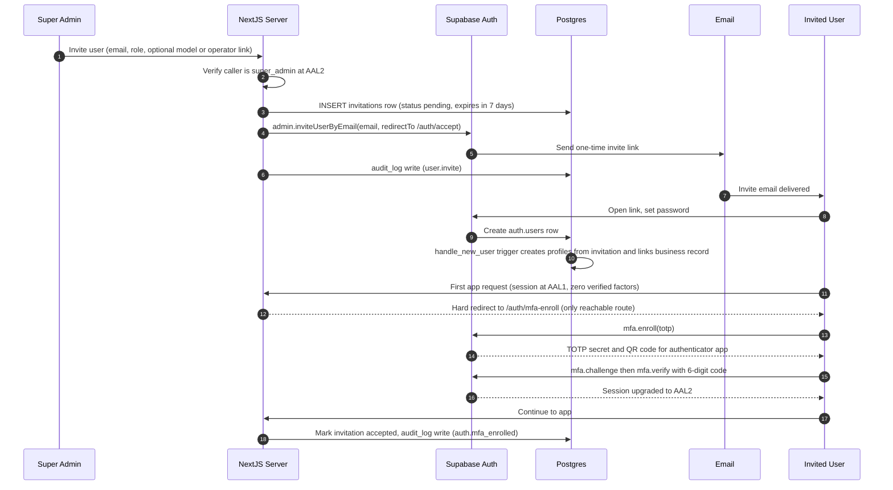
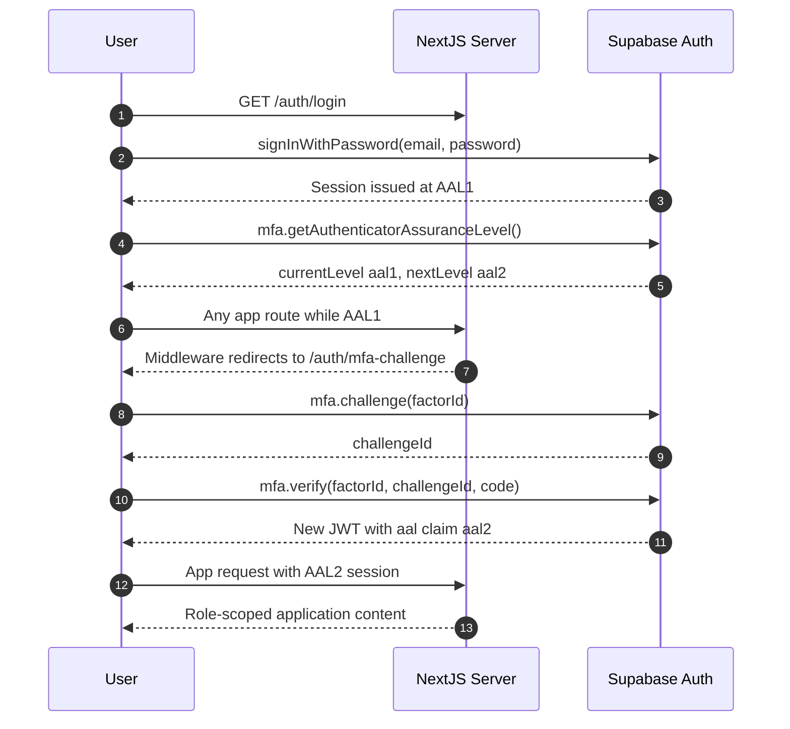
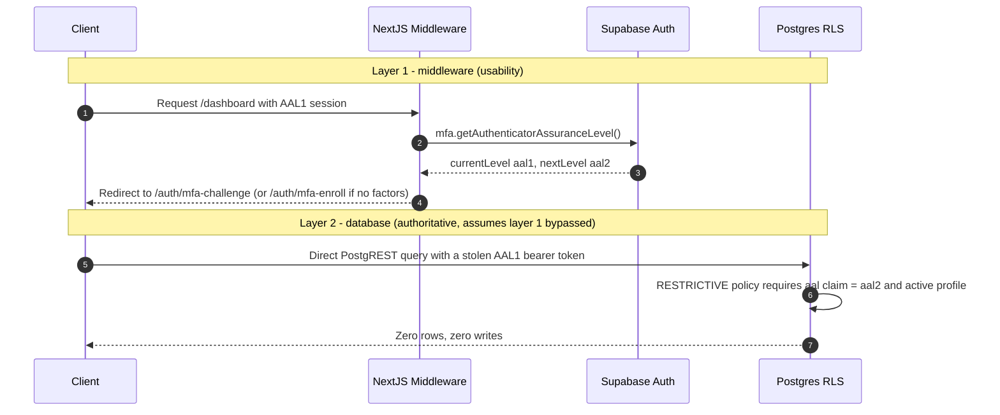
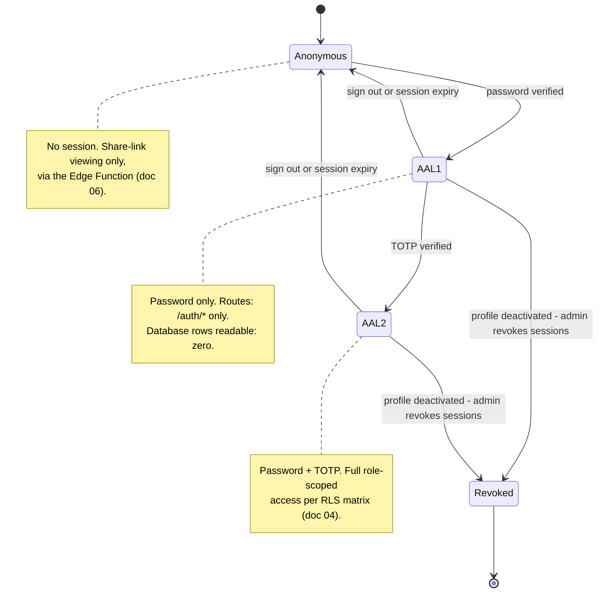

# 05 — Auth, Invites & Mandatory 2FA

This document designs the authentication and session-assurance model for the studio management system: invite-only account provisioning through Supabase Auth, mandatory TOTP two-factor enrollment before any application access, and two-layer AAL2 enforcement in which the database — not the application — is the final authority. It also defines the single canonical AAL2 restrictive-policy SQL snippet used by every table (referenced from [04 — Database Schema & RLS](04-database-erd.md)), the safety model under which the Super Admin exercises "full database access", and the recovery runbooks for lost TOTP factors. This package is design-only; nothing described here is deployed yet.

**Related docs:** [00 — Index](00-index.md) · [01 — Overview](01-overview.md) · [02 — Architecture](02-architecture.md) · [03 — Roles & RBAC](03-roles-rbac.md) · [04 — Database Schema & RLS](04-database-erd.md) · [06 — Documents & Sharing](06-documents-sharing.md) · [07 — Statistics & Dashboards](07-analytics.md) · [08 — Security & Threat Model](08-security-threat-model.md) · [09 — Accounting](09-accounting.md) · [10 — Deployment & Operations](10-deployment-operations.md) · [11 — AI Assistant & LLM Gateway](11-ai-llm.md)

---

## 1. Design principles

The auth design follows the package-wide security stance (security > performance, deny-by-default) and applies it to identity:

| Principle | Consequence in this design |
|---|---|
| Invite-only, no public registration | Supabase Auth public signups are disabled (config inventory in [10](10-deployment-operations.md)); accounts exist only because the Super Admin invited them. A defense-in-depth signup trigger rejects any account with no pending invitation ([04](04-database-erd.md)). |
| Mandatory TOTP 2FA | A freshly invited user cannot reach any application route until a TOTP factor is enrolled and verified. There is no "skip for now". |
| AAL2 or nothing | A session that has authenticated with password only (AAL1) can read **zero rows** from the database. Every table carries a restrictive policy requiring AAL2 (Section 5, the canonical snippet). |
| App checks are UX, not security | The Next.js middleware redirects under-assured sessions for usability; Row Level Security enforces the same rule authoritatively, so bypassing the middleware gains nothing (trust zones in [02](02-architecture.md)). |
| Everything audited | Invites, enrollments, factor resets, and deactivations write to the append-only `audit_log` ([04](04-database-erd.md)) using the dotted-verb action convention (`user.invite`, `auth.mfa_enrolled`, …). |

Role capabilities themselves (who may invite, who may deactivate) are defined once in [03 — Roles & RBAC](03-roles-rbac.md) and are not restated here.

## 2. Building blocks

- **Supabase Auth** provides passwords, session JWTs, MFA factor management (`auth.mfa_factors`, read via the Auth API only), and the Authenticator Assurance Level (`aal`) claim: `aal1` after password, `aal2` after TOTP verification.
- **`invitations`** ([04](04-database-erd.md)) records the *intent* of an invite — target email, assigned role, and an optional pre-link to a `models` or `operators` business record. The actual invite email and one-time token are Supabase Auth's `admin.inviteUserByEmail`.
- **`handle_new_user` trigger** ([04](04-database-erd.md)) creates the `profiles` row from the matching pending invitation at signup, links `models.profile_id` or `operators.profile_id` when the invite carries one, and rejects signups that have no pending invitation.
- **Custom Access Token Auth Hook** injects the user's role into the JWT as the `user_role` claim so RLS can check it without querying `profiles`; the design and its token-refresh caveat live in [03](03-roles-rbac.md).
- **Next.js middleware** on Vercel inspects the session's assurance level on every request and routes under-assured users into the enrollment or challenge flow. At AAL1 the route allowlist is `/auth/*` only.

## 3. Flow A — Invite, first login, forced TOTP enrollment

Only the Super Admin can invite users ([03](03-roles-rbac.md)). The server action verifies the caller's role **and** AAL2 assurance before touching the service-role client — app-layer verification first, service key second, per the invariant in Section 7.



Notes on the design:

- The invitation row and the Auth invite are created in the same server action; if the Auth call fails, the invitation row is not committed. Expiry defaults to 7 days ([04](04-database-erd.md)); expired or revoked invitations render the emailed link useless because `handle_new_user` finds no *pending* invitation and rejects the signup.
- Between password-set and TOTP enrollment the user holds an AAL1 session. That session can render exactly one page (`/auth/mfa-enroll`) and can read **no rows** — the restrictive policy in Section 5 applies from the first moment the account exists. Enrollment is therefore "forced" by both layers, not by front-end goodwill.
- The user's profile is created with `status = 'invited'` and is activated on successful enrollment; `is_active_profile()` ([04](04-database-erd.md)) participates in the restrictive policy, so a half-provisioned account also reads nothing.

## 4. Flow B — Normal login

Every subsequent login is password followed by a TOTP challenge. The client asks Supabase Auth for the current and required assurance levels rather than guessing.



`mfa.getAuthenticatorAssuranceLevel()` returning `{ currentLevel: 'aal1', nextLevel: 'aal2' }` is the signal that a verified factor exists and must be challenged. If it instead reports no enrolled factors (a reset user, Section 8), the middleware routes to `/auth/mfa-enroll` — the same forced-enrollment path as Flow A.

## 5. AAL2 enforcement — two independent layers

Enforcement is deliberately duplicated in two layers that fail independently. The first exists for usability; the second is the security boundary.

**Layer 1 — Middleware (UX).** On every request the middleware evaluates the session: if `nextLevel === 'aal2' && currentLevel !== 'aal2'`, redirect to the TOTP challenge; if no factors are enrolled, redirect to enrollment. The only routes reachable at AAL1 are `/auth/*`. This layer produces friendly redirects — it is *not* trusted for security, because middleware can in principle be bypassed by calling Supabase APIs directly with a bearer token.

**Layer 2 — Database (authoritative).** Every application table carries a RESTRICTIVE Row Level Security policy requiring an AAL2 session and an active profile. This is the **single canonical definition** of that policy in the documentation package; [04 — Database Schema & RLS](04-database-erd.md) references this snippet rather than restating it:

```sql
create policy aal2_active_required on <table>
  as restrictive for all to authenticated
  using ( (select auth.jwt()->>'aal') = 'aal2' and public.is_active_profile() );
```

Why RESTRICTIVE matters: Postgres combines PERMISSIVE policies with OR, but RESTRICTIVE policies are ANDed **on top of** whatever the permissive policies grant. The per-role permissive policies in [04](04-database-erd.md) therefore never need to repeat the AAL2 check — this one policy gates all of them, per table, and a forgotten check in a future permissive policy cannot reopen the door. `(select auth.jwt()->>'aal')` is wrapped in a subselect so the planner evaluates it once per statement rather than per row; `is_active_profile()` additionally closes the JWT-staleness window described in [03](03-roles-rbac.md) (a deactivated user whose token has not yet expired still reads nothing).

The consequence, shown end-to-end:



A stolen AAL1 token — phished password, hijacked half-completed login — reads **zero rows even if the middleware never runs**. This is the property claimed by the threat model in [08 — Security & Threat Model](08-security-threat-model.md) under "Stolen AAL1 session / MFA bypass".

## 6. Session assurance state machine



Deactivation is not merely a status flip: the deactivation flow sets `profiles.status = 'deactivated'` **and** revokes the user's sessions via the Auth admin API, because JWT claims persist until refresh ([03](03-roles-rbac.md)). Even in the revocation gap, `is_active_profile()` inside the restrictive policy denies every query. The operational runbook for deactivation lives in [10 — Deployment & Operations](10-deployment-operations.md).

## 7. Super Admin "full DB access", safely

The Super Admin's capability matrix ([03](03-roles-rbac.md)) grants full data access, and the Super Admin is the studio owner. The design gives that access through three channels — none of which ever places a privileged credential in a browser:

1. **Supabase Dashboard** — raw SQL, migrations, and Auth administration happen here, under the owner's Supabase account, which is itself protected by MFA on the Supabase platform. This is the only place ad-hoc SQL is ever run.
2. **In-app admin surfaces** — Next.js server actions and route handlers that FIRST verify the caller is `super_admin` at AAL2 (session check against Supabase Auth plus role check), and only THEN instantiate the service-role client. The check precedes the privilege, always.
3. **The browser** — holds only the anon/publishable key, for every user including the Super Admin. All Super Admin browser queries pass through RLS like anyone else's; elevated operations round-trip through the guarded server paths.

> **BOXED INVARIANT — the service-role key never reaches a browser.**
>
> - `SUPABASE_SERVICE_ROLE_KEY` exists only as a Vercel **server-side** environment variable (and as an Edge Function secret for `share-view`, [06](06-documents-sharing.md)). It is never named `NEXT_PUBLIC_*`, never imported into client components, never serialized into a page payload.
> - No code path constructs a service-role client before the caller's `super_admin` role and AAL2 assurance have both been verified in that same server invocation.
> - The Super Admin's browser session is an ordinary RLS-governed AAL2 session. "Full DB access" is a property of the guarded server paths and the Supabase Dashboard — never of a token held client-side.
>
> If any one of these lines is violated, every RLS guarantee in [04](04-database-erd.md) is void. The key-rotation runbook in [10](10-deployment-operations.md) exists for the day one of them is suspected.

## 8. Recovery runbooks

### 8.1 User lost their TOTP device

Any role except the Super Admin recovers through the Super Admin. There are no self-service backup codes in the initial design — with a staff-sized user base, a human-verified admin reset is simpler and leaves a better audit trail.

| Step | Actor | Action |
|---|---|---|
| 1 | User | Reports factor loss out-of-band (in person, phone, known channel). |
| 2 | Super Admin | Verifies the person's identity out-of-band — the design deliberately requires human judgment here. |
| 3 | Super Admin | In the in-app admin surface (guarded per Section 7), triggers the MFA reset: the server action calls the Auth admin API `mfa.deleteFactor` for the user's TOTP factor and revokes the user's active sessions. |
| 4 | System | Writes `auth.mfa_reset` to `audit_log` (dotted-verb convention, [04](04-database-erd.md)) with actor, target, and timestamp. |
| 5 | User | Logs in with password → session is AAL1 with zero factors → middleware forces `/auth/mfa-enroll` (Flow A tail) → re-enrolls, session upgrades to AAL2; `auth.mfa_enrolled` audited. |

During the window between reset and re-enrollment the account is exactly as constrained as a brand-new invitee: AAL1, `/auth/*` only, zero rows. A compromised reset request therefore cannot read data — it can at worst enroll an attacker's authenticator, which is why step 2 is mandatory and step 4 is append-only.

### 8.2 Super Admin lockout

There is **exactly one** Super Admin (enforced by partial unique index, [03](03-roles-rbac.md)), so no in-app actor outranks them and no in-app reset path can exist. Their recovery path is the platform layer:

| Step | Actor | Action |
|---|---|---|
| 1 | Owner | Signs in to the **Supabase Dashboard** with the owner's Supabase account (protected by Supabase-platform MFA and its own recovery codes — see prerequisites below). |
| 2 | Owner | Via the Dashboard's Auth administration (or Management API), deletes the Super Admin app-user's TOTP factor and revokes that user's sessions. |
| 3 | Owner | Logs in to the app with password; zero factors → forced re-enrollment → AAL2 restored; `auth.mfa_enrolled` audited. |
| 4 | Owner | Reviews `audit_log` and Supabase auth logs for activity during the lockout window. |

Prerequisites this design imposes on the owner, stated explicitly because there is no fallback behind them:

- The Supabase account credentials and its MFA recovery codes are stored offline (e.g. printed, in a safe). The Supabase account is the root of trust for the entire system.
- The Vercel account is protected the same way; it holds the service-role key as an env var.
- Under no circumstances is the restrictive policy of Section 5 relaxed, dropped, or "temporarily disabled" to work around a lockout. Recovery always goes through factor deletion and re-enrollment, never through weakening the boundary.

## 9. Audit events in this domain

The `audit_log` schema and write mechanics are defined in [04](04-database-erd.md); the auth flows above emit these actions:

| Action | Emitted when |
|---|---|
| `user.invite` | Flow A step 3–6: invitation row created and Auth invite sent. |
| `auth.mfa_enrolled` | Flow A tail and runbook step 5: TOTP factor verified, session at AAL2. |
| `auth.mfa_reset` | Runbook 8.1 step 4: an admin deleted a user's factor. |
| `user.deactivate` | Deactivation flow (runbook in [10](10-deployment-operations.md)). |
