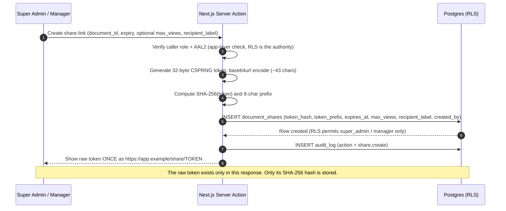
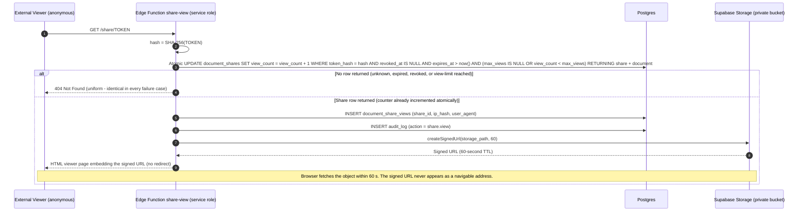
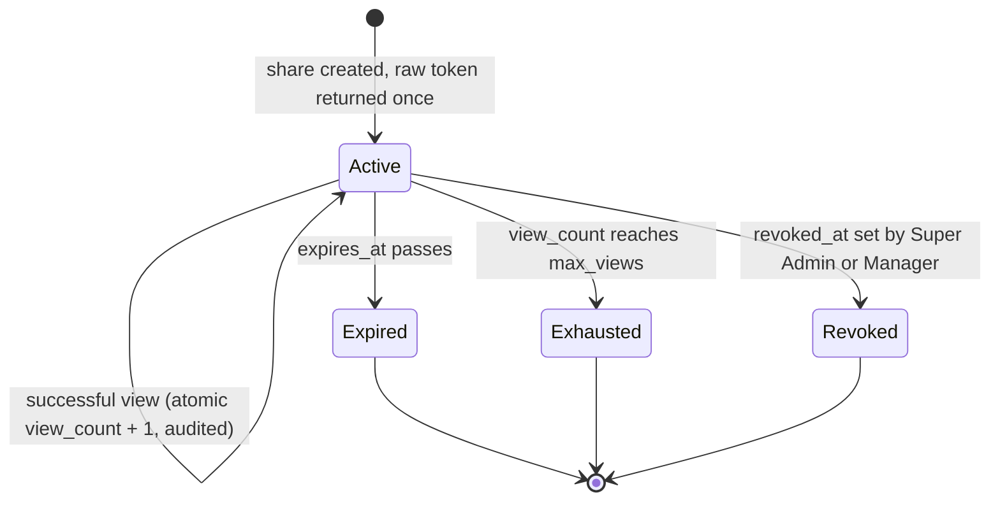

# 06 — Document Management & Shareable Links

This document specifies the design of the document subsystem: the private Supabase Storage bucket that holds identity and compliance documents for models, the storage-level RLS policies that gate every read and write, the authenticated upload and download flows, the derived compliance-expiry model, and the anonymous shareable-link mechanism (token design, creation and view flows, failure behavior, revocation, and rate limiting). It is a design document only — no bucket, function, or policy described here exists yet. Column definitions for `documents`, `document_shares`, and `document_share_views` are canonical in [04 — Database Schema & RLS](04-database-erd.md); role capabilities are canonical in [03 — Roles & RBAC](03-roles-rbac.md); the AAL2 RESTRICTIVE policy snippet is defined once in [05 — Auth, Invites & Mandatory 2FA](05-auth-2fa.md).

**Related docs:** [00 — Index](00-index.md) · [01 — Overview](01-overview.md) · [02 — Architecture](02-architecture.md) · [03 — Roles & RBAC](03-roles-rbac.md) · [04 — Database Schema & RLS](04-database-erd.md) · [05 — Auth & 2FA](05-auth-2fa.md) · [07 — Analytics](07-analytics.md) · [08 — Security & Threat Model](08-security-threat-model.md) · [09 — Accounting](09-accounting.md) · [10 — Deployment & Operations](10-deployment-operations.md)

---

## 1. What this subsystem holds — and what it does not

The studio stores **business and compliance documents only**: government IDs, passports, contracts, model releases, consent forms, and tax forms (the `document_type` enum in [04](04-database-erd.md)). No media content is ever stored — this system is back-office software, not a content platform ([01 — Overview](01-overview.md)). That framing drives every decision below: these files are among the most sensitive data the studio holds (identity documents of performers), so the design treats **document leakage as a top-tier threat** ([08 — Security & Threat Model](08-security-threat-model.md)) and optimizes for revocability and auditability over retrieval convenience.

Documents are **model-scoped**. Operator compliance documents are explicitly out of scope for now ([01 — Overview](01-overview.md)); the `documents` table carries a `model_id` foreign key with `ON DELETE RESTRICT`, so compliance records survive attempts to delete the model they belong to ([04](04-database-erd.md)).

---

## 2. Storage design: one private bucket

### 2.1 Bucket and path layout

All files live in a **single private bucket**, `model-documents`, with public access **off**. The object path convention is:

```
{model_id}/{document_id}/{filename}
```

This path is recorded verbatim (with the bucket prefix) in `documents.storage_path`, which is `UNIQUE` — every storage object has exactly one metadata row, and vice versa ([04](04-database-erd.md)). The layout is deliberate:

| Path segment | Purpose |
|---|---|
| `{model_id}` (first folder) | The RLS scoping key. Storage policies grant a model read access by matching this prefix against `my_model_id()` — a single-segment check, no join. |
| `{document_id}` (second folder) | Guarantees uniqueness even when the same filename is uploaded twice for one model, and ties the object to its metadata row. |
| `{filename}` | Original filename, preserved for download UX. Also recorded in `documents.file_name`. |

### 2.2 Why private and never publicly addressable

A public bucket would give every object a **stable, guessable URL with no revocation mechanism**: once a URL leaks — into a chat log, an email thread, a browser history — it works forever, for anyone, invisibly. That is unacceptable for identity documents.

With a private bucket, there are exactly **two retrieval paths**, and both are auditable, expiring, and revocable:

1. **Authenticated path** — an in-app download via `createSignedUrl(path, 60)`, which is gated by storage RLS (the caller must be permitted to see the object) and produces a URL valid for **60 seconds**.
2. **Anonymous path** — the `share-view` Edge Function (Section 5), which validates a hashed, expiring, revocable share token before minting the same short-lived signed URL.

There is no third path. The browser never holds a durable object URL, and nothing in the system ever produces one.

### 2.3 Storage RLS policies

Storage access is enforced by RLS policies on `storage.objects`, scoped to the `model-documents` bucket. These policies are defined here (they are the one piece of RLS not specified in [04](04-database-erd.md), which covers the database tables); they follow the same restrictive-plus-permissive layering as every table policy — the AAL2 + active-profile precondition from [05](05-auth-2fa.md) applies to all authenticated storage access, and the permissive policies below layer on top.

| Role | `model-documents` bucket access | Policy intent |
|---|---|---|
| `super_admin` | Read + write, all objects | Full CRUD on any path in the bucket. |
| `manager` | Read + write, all objects | Managers upload and manage documents for all models. |
| `model` | **Read own prefix only** | `SELECT` where `(storage.foldername(name))[1] = my_model_id()::text` — the first path segment must equal the caller's own model id. No write, ever: models cannot upload or delete. |
| `finance` | **None** | Finance works with money, not identity documents. Deny all. |
| `operator` | **None** | Deny all. |
| `anon` | **None** | Zero grants. The `share-view` Edge Function accesses storage with the service-role key server-side (see [02 — Architecture](02-architecture.md) trust zones); anonymous callers themselves can address nothing. |

The helper `my_model_id()` is the `SECURITY DEFINER` function specified in [04](04-database-erd.md). Denying finance and operators outright — rather than giving them "harmless" read access — is a deliberate least-privilege decision that directly narrows the insider-misuse surface analyzed in [08](08-security-threat-model.md).

---

## 3. Authenticated upload and download flows

These flows are simple enough that prose suffices; the sequence diagrams in this document are reserved for the share-link flows, where ordering and failure branches carry real design weight.

### 3.1 Upload (Super Admin / Manager only)

1. The client submits the file plus metadata (`doc_type`, `title`, optional `issued_date` / `expires_at`) to a **Next.js server action**.
2. The server action validates file type, size, and MIME type (allow-list, not deny-list). This is an app-layer check — UX, not security; storage RLS remains the authority ([02](02-architecture.md)).
3. The server uploads the object to `model-documents/{model_id}/{document_id}/{filename}` — the upload is performed server-side, never by handing the browser a write-capable credential.
4. The server inserts the `documents` metadata row (`storage_path`, `file_name`, `mime_type`, `file_size_bytes`, optional `sha256` integrity hash, `uploaded_by`).
5. An `audit_log` row is written with action `document.upload` ([04](04-database-erd.md)).

Object upload and metadata insert are treated as one logical operation: a failure in either step rolls the other back (orphaned objects are deleted; orphaned rows are never committed).

### 3.2 Download (Super Admin / Manager any document; Model own documents)

1. The caller requests a download for a `document_id` they can see (per the RLS matrix in [04](04-database-erd.md)).
2. The server calls `createSignedUrl(storage_path, 60)` — a **60-second TTL**, the tightest practical bound for a click-through download.
3. An `audit_log` row is written with action `document.download`.
4. The browser fetches the object via the signed URL before it expires.

Every retrieval of every document — by anyone, through either path — therefore leaves an audit row.

---

## 4. Compliance expiry

Documents carry an optional `expires_at` date. Compliance status is **always derived, never stored** — there is no status column to drift out of date and no batch job to forget to run. The derivation rule:

| Derived status | Rule |
|---|---|
| `expired` | `expires_at < current_date` |
| `expiring` | `expires_at` within the next **30 days** |
| `valid` | `expires_at` more than 30 days away, or no `expires_at` (non-expiring document types such as some contracts) |

The derivation lives in the `v_document_compliance` and `v_model_compliance_summary` views, specified in [07 — Analytics](07-analytics.md). Compliance is surfaced in two places:

- **Dashboards** — the compliance donut (valid / expiring / expired) for Super Admin and Manager, and a model's own compliance widget in the self-service portal ([07](07-analytics.md)).
- **Per-model compliance list** — the model detail screen shows every document with its derived status, so a manager renewing an expiring passport sees exactly which record to replace.

An index on `documents(expires_at)` ([04](04-database-erd.md) index plan) keeps the expiring-soon scans cheap.

---

## 5. Shareable links

Studios routinely need to show a specific document to an outside party — an accountant, a lawyer, a platform's compliance desk — who has no account and never will (the **External Viewer** persona, [01](01-overview.md)). Emailing the file loses all control the moment it is sent. Share links replace that with a **single-document, time-boxed, view-limited, revocable, fully audited** grant.

Only Super Admin and Manager can create or revoke share links ([03 — Roles & RBAC](03-roles-rbac.md)); models, finance, and operators cannot ([04](04-database-erd.md) RLS matrix).

### 5.1 Token design

| Property | Design |
|---|---|
| Entropy | **32 bytes from a CSPRNG** — 256 bits, far beyond brute-force reach. |
| Encoding | base64url, ~43 characters; URL-safe with no padding. |
| At rest | Only the **SHA-256 hash** (`token_hash`, unique-indexed) is stored. The raw token is **never** persisted — a database dump yields no usable links ([08](08-security-threat-model.md)). |
| UI handle | `token_prefix` — the first 8 characters, stored for identification in the admin UI ("which link did I send the accountant?") without being remotely sufficient to reconstruct the token. |
| Limits | Mandatory `expires_at`; optional `max_views` with a `view_count` counter; `recipient_label` for human context. |
| Lookup | By `token_hash` via its unique index. Because the presented token is hashed **before** lookup, equality is decided by an index probe on hashes — there is no secret-dependent string comparison to time, so timing-attack concerns on the lookup are moot. |

### 5.2 Creating a share link



The creator copies the URL and sends it through whatever channel they choose. If the URL is lost, it cannot be recovered — a new link is created and the old one revoked.

### 5.3 Viewing a share link (anonymous)

The public viewer URL resolves to the `share-view` **Edge Function** — the only surface an unauthenticated user can reach ([02 — Architecture](02-architecture.md)). The function runs with the service-role key precisely so that the `anon` role needs **zero** database or storage grants.



Two details in this flow are load-bearing:

- **The atomic counted UPDATE.** Validation and increment are a single statement: the `WHERE` clause re-checks revocation, expiry, and the view limit at increment time, and `RETURNING` tells the function whether it won. Two concurrent requests racing for the last permitted view cannot both succeed — one increments, the other matches zero rows and gets the 404. A separate "validate, then increment" pair would have exactly that race. `document_share_views` provides the row-per-view audit that lets `view_count` be verified after the fact ([04](04-database-erd.md)).
- **HTML viewer page, not a redirect.** If the function 302-redirected to the signed URL, that URL would land in the viewer's address bar, browser history, and any intermediary logs — becoming a second shareable artifact with its own (short) life. Embedding it inside a returned HTML page keeps the token URL as the only address anyone ever sees or forwards.

### 5.4 Failure behavior: uniform 404

Every failure mode returns the **same 404 response** — same status, same body, same headers:

| Condition | Response |
|---|---|
| Token unknown (no hash match) | 404 |
| Token expired (`expires_at <= now()`) | 404 |
| Token revoked (`revoked_at IS NOT NULL`) | 404 |
| View limit exhausted (`view_count >= max_views`) | 404 |

The endpoint is therefore **not a state oracle**: an attacker probing tokens learns nothing about whether a guess was near a real token, whether a leaked link was revoked, or how many views remain. Distinguishable errors ("this link has expired") would be friendlier — and would leak exactly the signal this design refuses to provide. This pairs with the share-token-guessing analysis in [08](08-security-threat-model.md).

### 5.5 Revocation and the exposure bound

Revocation sets `revoked_at` (and `revoked_by`) on the share row — per the [04](04-database-erd.md) RLS matrix, Super Admin has full update and Manager's update capability on `document_shares` is scoped to revocation. The effect:

- **New views: blocked immediately.** The atomic UPDATE's `revoked_at IS NULL` predicate fails on the next request.
- **Residual exposure: bounded at ≤ 60 seconds.** The only thing revocation cannot recall is a signed URL minted just before the revocation landed — and that URL dies within its 60-second TTL. This bound should be stated in the admin UI ("access ends within one minute") so operators understand exactly what revoke guarantees.

For a suspected mass leak (e.g. a compromised recipient mailbox), the incident-response runbook in [10 — Deployment & Operations](10-deployment-operations.md) specifies a mass-revoke query across all active shares of the affected documents.

### 5.6 Rate limiting

The `share-view` endpoint is the system's only anonymous surface, so it gets dedicated abuse protection:

- **Per-IP rate limit at the Edge Function** — a token-bucket check before any database lookup. Implementation option (recorded, not yet decided): a Postgres-backed counter table, or Upstash Redis for lower-latency distributed counting. Given 256-bit tokens, rate limiting is defense-in-depth against nuisance traffic and log flooding rather than a guessing safeguard — brute force is already computationally hopeless.
- **Vercel WAF / platform-level protection** on the app domain in front of the share route, as an additional coarse layer (see [08](08-security-threat-model.md) platform hardening and [10](10-deployment-operations.md)).
- Rate-limit rejections also return an indistinguishable error to preserve the no-oracle property, and IPs are only ever stored as salted hashes (`document_share_views.ip_hash`) — never raw.

### 5.7 Token lifecycle



All three terminal states are permanent: a token is never un-expired, un-exhausted, or un-revoked. Extending access always means minting a **new** token (a fresh `document_shares` row with its own hash, expiry, and audit trail) — reactivating an old token would resurrect every copy of a URL whose distribution is no longer known.

---

## 6. Audit trail summary

Every mutation and every retrieval in this subsystem writes to the append-only `audit_log` ([04](04-database-erd.md)), readable in-app by Super Admin only ([03](03-roles-rbac.md)):

| Action | When |
|---|---|
| `document.upload` | Document object + metadata row created |
| `document.download` | Authenticated signed-URL issuance |
| `share.create` | Share link minted |
| `share.view` | Anonymous view served (paired with a `document_share_views` row) |
| `share.revoke` | Share link revoked |

Together with the uniform-404 endpoint, the private bucket, and the 60-second signed-URL ceiling, this gives the studio a complete answer to the question that matters most for identity documents: *who could have seen this file, and when.*
