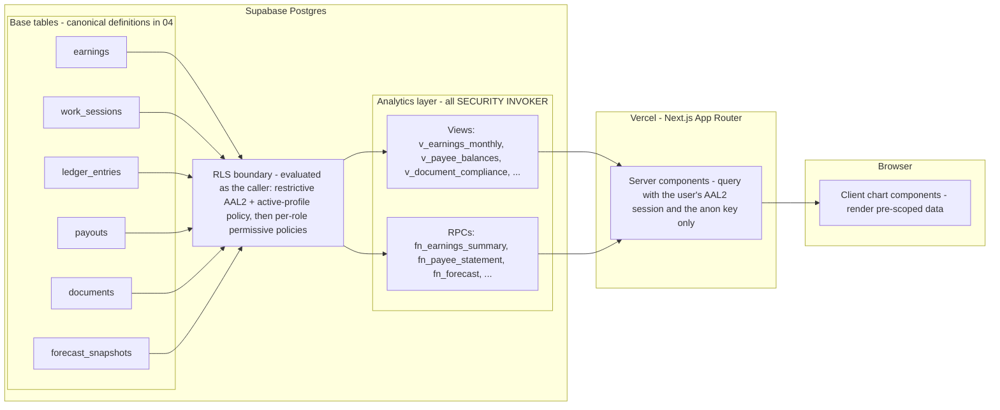

# 07 — Statistics & Dashboards

This document designs the analytics layer of the studio management system: the database views and RPC functions that aggregate business data, the mapping from metrics to chart types, and the per-role composition of the dashboards. The central design principle is that **every analytics object runs as SECURITY INVOKER**, so a single set of views and functions serves every role while Row Level Security remains the sole authority over what each caller can see. This is a design document only — no code or infrastructure described here exists yet.

**Related docs:** [00 — Index & Conventions](00-index.md) · [01 — Product Overview](01-overview.md) · [02 — System Architecture](02-architecture.md) · [03 — Roles & RBAC](03-roles-rbac.md) · [04 — Database Schema & RLS](04-database-erd.md) · [05 — Auth, Invites & Mandatory 2FA](05-auth-2fa.md) · [06 — Documents & Shareable Links](06-documents-sharing.md) · [08 — Security & Threat Model](08-security-threat-model.md) · [09 — Accounting](09-accounting.md) · [10 — Deployment & Operations](10-deployment-operations.md) · [11 — AI Assistant & LLM Gateway](11-ai-llm.md)

---

## 1. Design principle: SECURITY INVOKER everywhere

All analytics views will be created `WITH (security_invoker = on)` and all analytics RPCs declared `SECURITY INVOKER`. The consequence is that when a view or function reads the base tables, Postgres evaluates the **caller's** RLS policies — including the restrictive AAL2-plus-active-profile policy defined once in [05 — Auth, Invites & Mandatory 2FA](05-auth-2fa.md) and the per-role permissive policies whose intent matrix lives in [04 — Database Schema & RLS](04-database-erd.md).

This yields one set of analytics objects for the whole system, with scoping done by the database rather than by the application:

- A **model** querying `v_earnings_monthly` sees only rows where `model_id = my_model_id()`.
- **Finance** querying the same view sees every model's rows.
- An **operator** querying `v_payee_balances` sees only the balance row where `payee_type = 'operator' AND payee_id = my_operator_id()`.

No per-role view variants, no `WHERE` clauses duplicated in application code as a security measure, and no way for an analytics object to become an accidental data-exfiltration channel: the worst a buggy view can do is show the caller data RLS already allows them to read row-wise.

### Tradeoff: SECURITY INVOKER vs SECURITY DEFINER

| Dimension | SECURITY INVOKER (chosen) | SECURITY DEFINER (rejected for analytics) |
|---|---|---|
| Row visibility | Caller's RLS policies apply inside the view/function; each role sees exactly its permitted rows | Runs with the object owner's privileges; caller's RLS is bypassed entirely |
| Cross-row aggregates | Not available to restricted roles. A model cannot be shown "your % of the studio total" because the denominator requires rows the model cannot read; share percentages are computed only over rows the caller can see | Would allow safe-looking global denominators (e.g. studio-wide totals surfaced to a model as a single ratio) |
| Blast radius of a bug | Bounded: a mistaken predicate exposes nothing beyond what RLS already grants the caller | One mistaken or missing predicate leaks other payees' financial data or the whole studio's figures |
| Object count & drift | One set of objects serves all five roles; no per-role forks | Tends to fork into per-role variants with filters baked into SQL — filters that silently drift from the RLS matrix |
| Policy maintenance | RLS changes in 04/05 propagate automatically to every dashboard | Every DEFINER object must be re-reviewed on every policy change |
| Fit with security stance | Matches deny-by-default and "RLS is the final authority" ([01 — Product Overview](01-overview.md)) | Creates a parallel authorization path that competes with RLS |

**Decision: no SECURITY DEFINER analytics objects exist in this system.** The cross-row aggregate capability is the only thing given up, and it is given up deliberately — a "your share of studio total" widget is not worth a class of leak risk in an application whose priority order is security over performance. The **only** SECURITY DEFINER functions anywhere in the design are:

1. The narrow RLS helper functions (`is_aal2()`, `is_active_profile()`, `current_user_role()`, `my_model_id()`, `my_operator_id()`) specified in [04 — Database Schema & RLS](04-database-erd.md), and
2. The share-token validation path executed by the `share-view` Edge Function in [06 — Documents & Shareable Links](06-documents-sharing.md),

each of which is `STABLE` where applicable and defined with `SET search_path = ''` to prevent search-path hijacking.

### Global preconditions

Because the restrictive policy from 05 sits on every base table, **all** analytics reads require an `active` profile and an AAL2 session. There is no analytics surface reachable at AAL1, and the anonymous role can reach no analytics object at all — the only anonymous surface in the entire system is the share-view Edge Function in 06.

---

## 2. Analytics views

All views below are `WITH (security_invoker = on)`. Monetary columns are `numeric(12,2)`, percentages `numeric(5,2)`, identifiers `uuid`, consistent with the conventions in [04 — Database Schema & RLS](04-database-erd.md). Base-table definitions are canonical in 04 and are not repeated here.

| View | Output columns (signature) | Grain / source | Purpose |
|---|---|---|---|
| `v_earnings_monthly` | `model_id uuid, platform_id uuid, month date, gross_amount numeric(12,2), net_amount numeric(12,2)` | model × platform × month, aggregated from `earnings` (platform resolved via `platform_accounts`) | Core earnings trend series; feeds line charts and period comparisons |
| `v_earnings_share_by_model` | `month date, model_id uuid, stage_name text, net_amount numeric(12,2), share_percent numeric(5,2)` | model × month | Pie/comparison input. `share_percent` is computed over the rows *visible to the caller* — meaningful for SA/MGR (full denominator); a model would trivially see 100% and is therefore not shown this widget |
| `v_earnings_share_by_platform` | `month date, platform_id uuid, platform_name text, net_amount numeric(12,2), share_percent numeric(5,2)` | platform × month | Platform-mix pie; for a model the denominator is their own accounts, which is exactly the intended "own accounts" scope |
| `v_sessions_hours_monthly` | `model_id uuid, month date, hours numeric, session_count integer` | model × month, aggregated from `work_sessions.duration_minutes` | Hours-worked trend; `work_sessions` is the hours source of truth (see 04) |
| `v_payout_history` | `payout_id uuid, payee_type payee_type, payee_id uuid, payee_name text, period_start date, period_end date, net_amount numeric(12,2), currency char(3), status payout_status, paid_at timestamptz` | one row per payout | Payout history charts and tables; payee name resolved from `models.stage_name` / `operators.display_name` |
| `v_document_compliance` | `document_id uuid, model_id uuid, doc_type document_type, title text, expires_at date, status text` | one row per non-archived document | `status` is **derived, never stored**: `'expired'` when `expires_at < today`, `'expiring'` when within 30 days, else `'valid'` (thresholds defined in [06 — Documents & Shareable Links](06-documents-sharing.md)) |
| `v_model_compliance_summary` | `model_id uuid, stage_name text, valid_count integer, expiring_count integer, expired_count integer` | one row per model | Compliance donut and per-model compliance list |
| `v_payee_balances` | `payee_type payee_type, payee_id uuid, display_name text, currency char(3), balance numeric(12,2)` | one row per payee × currency | `balance = SUM(ledger_entries.amount)` under the sign convention defined in [09 — Accounting](09-accounting.md); the outstanding-balances chart and the payee's own balance tile |
| `v_split_distribution` | `month date, bucket text, amount numeric(12,2), share_percent numeric(5,2)` | month × bucket (`'studio'` / `'model'` / `'operator'`) | Source for the split-distribution pie: sums `ledger_entries` `earning_share` credits by `payee_type` per month; the `'studio'` bucket is the residue of monthly `earnings.net_amount` after the model and operator shares (split mechanics and sign convention in [09 — Accounting](09-accounting.md)) |
| `v_earnings_forecast` | `target_month date, model_id uuid, platform_id uuid, predicted_net numeric(12,2)` | scope × future month, default 3 months ahead | **Live** projection computed on read from `earnings` — never a stored copy; method (MA3 × clamped growth) is specified in 09 |
| `v_forecast_accuracy` | `target_month date, model_id uuid, predicted_net numeric(12,2), actual_net numeric(12,2), error_amount numeric(12,2), error_percent numeric(5,2), rolling_mape numeric(5,2)` | snapshot scope × month; `model_id IS NULL` = studio total | Joins `forecast_snapshots` against realized `earnings` aggregates; rolling MAPE per model and studio-wide (snapshot mechanics in 09) |

Two notes on the forecast pair, decided in [09 — Accounting](09-accounting.md) and only summarized here: live projections are pure INVOKER reads with no staleable derived-money copies, and the `forecast_snapshots` table exists solely so that accuracy can be measured later — you cannot compute error against a prediction you did not remember.

---

## 3. Analytics RPCs

All RPCs are `SECURITY INVOKER`, `STABLE`, and take explicit date-range parameters so dashboards never encode period logic client-side. Like the views, they read through the caller's RLS — an RPC result is automatically scoped to the invoking role.

| RPC signature | Returns | Purpose |
|---|---|---|
| `fn_earnings_summary(p_from date, p_to date, p_group_by text)` | set of `(group_key text, gross_amount numeric(12,2), net_amount numeric(12,2))` | Period earnings totals grouped by `'model'`, `'platform'`, `'week'`, or `'month'`; backs KPI tiles, the earnings trend line at either grain, and grouped bar charts |
| `fn_hours_summary(p_from date, p_to date)` | set of `(model_id uuid, hours numeric, session_count integer)` | Hours and session counts for an arbitrary period |
| `fn_payout_summary(p_from date, p_to date)` | set of `(status payout_status, payout_count integer, total_net numeric(12,2))` | Payout totals by status for the period; feeds the pending-payouts KPI tile |
| `fn_compliance_counts()` | `(valid_count integer, expiring_count integer, expired_count integer)` | Studio-wide (or, for a model, own) compliance counts for the donut widget |
| `fn_payee_statement(p_payee_type payee_type, p_payee_id uuid, p_from date, p_to date)` | opening balance, ledger entry rows, closing balance | Payee statement; the full contract (opening balance = sum of entries before `p_from`, entry rows, closing balance) is specified in [09 — Accounting](09-accounting.md) |
| `fn_forecast(p_months_ahead integer)` | set of `(target_month date, model_id uuid, platform_id uuid, predicted_net numeric(12,2))` | Parameterized variant of `v_earnings_forecast` for horizons other than the default 3 months |
| `fn_semantic_search(p_embedding vector, p_top_k integer, p_source_types embedding_source[])` | set of `(source_type embedding_source, subject_name text, snippet text, similarity numeric)` | Semantic search over the `embeddings` table; INVOKER like every RPC here, so the caller's RLS on `embeddings` (which mirrors source-row visibility, see 04) scopes the matches. Returns only a redacted content snippet plus a source reference — semantics, redaction contract, and query flow are canonical in [11 — AI Assistant & LLM Gateway](11-ai-llm.md) |

**Boundary with 09:** the write-side RPCs `fn_generate_earning_shares(...)` and `fn_snapshot_forecast()` are *not* analytics objects — they mutate `ledger_entries` and `forecast_snapshots` respectively, are restricted to Super Admin and Finance per the capability matrix in [03 — Roles & RBAC](03-roles-rbac.md), and are specified in [09 — Accounting](09-accounting.md). Everything in this document is read-only.

**Boundary with 11:** the AI tool registry in [11 — AI Assistant & LLM Gateway](11-ai-llm.md) maps 1:1 onto the objects in this catalog and adds no privileged query path — every AI tool call executes these same SECURITY INVOKER views and RPCs under the caller's own JWT, so the assistant can never return rows this catalog would not return to that user directly.

---

## 4. Chart mapping

The authoritative metric-to-chart specification for the dashboards. Audience abbreviations follow [03 — Roles & RBAC](03-roles-rbac.md): SA = Super Admin, MGR = Studio Manager, FIN = Finance/Accountant; "own" means the row scope RLS grants that role.

| Metric | Chart | Audience |
|---|---|---|
| Earnings share by model (period) | Pie | SA, MGR |
| Earnings share by platform | Pie | SA, MGR; Model (own accounts) |
| Split distribution of net revenue (studio / model pool / operator pool) | Pie | SA, FIN |
| Earnings trend (weekly/monthly) | Line | SA, MGR, FIN; Model own. (Operator is denied `earnings` — their dashboard shows the ledger-based share trend from §5 instead) |
| Projected vs actual net revenue | Line (solid actual, dashed projection) | SA, MGR, FIN |
| Hours & session count trend | Line (two series) | SA, MGR; Model own |
| Model-vs-model earnings, period comparison | Bar (grouped) | SA, MGR |
| Forecast breakdown by model (next N months) | Bar (stacked) | SA, MGR, FIN |
| Forecast accuracy (error % trailing 3 months) | Bar | SA, FIN |
| Payout history by month | Bar (stacked by status) + table | SA, MGR, FIN; Model own; Operator own |
| Payee outstanding balances | Horizontal bar + table | SA, FIN |
| Document compliance status | Donut (valid / expiring / expired) | SA, MGR; Model own |
| KPI tiles (period gross, net, hours, pending payouts, own balance) | Stat tiles | per role |
| AI monthly insight (latest `ai_reports`, see 11) | Text/insight panel | SA, FIN |

The "Audience" column is a *presentation* decision — which widgets a role's dashboard renders. It is deliberately narrower than or equal to what RLS permits, never wider; even if a widget were mistakenly rendered for the wrong role, the INVOKER query behind it would return only RLS-permitted rows (usually an empty set). Rows driven by the accounting module (splits, balances, forecasts, payouts) are cross-referenced from [09 — Accounting](09-accounting.md) rather than duplicated there.

---

## 5. Per-role dashboard composition

Role capabilities are canonical in [03 — Roles & RBAC](03-roles-rbac.md); this section only composes the widgets above into per-role dashboards.

| Role | Dashboard scope | Widgets |
|---|---|---|
| **Super Admin** | Studio-wide, all data | Every widget in the chart-mapping table: earnings pies and trends, model comparisons, split distribution, forecasts and accuracy, payout history, payee balances, compliance donut, full KPI tile row, AI monthly insight panel (latest `ai_reports`, see 11) |
| **Studio Manager** | Studio-wide, all data | As Super Admin *except* the money-governance widgets reserved to SA/FIN: no split-distribution pie, no forecast-accuracy bar, no payee-balances chart, no AI monthly insight panel — its report inputs include those same SA/FIN-only aggregates, see 11 (managers read schemes and ledger but do not govern them — see 03) |
| **Model** | Own data only | Own earnings trend line, platform-share pie over own accounts, own hours & session trend, own payout history, own compliance donut, KPI tiles (own gross/net, hours, pending payout) |
| **Operator** | Own ledger and payouts only | Own share trend line (from `ledger_entries` `earning_share` credits), own payouts table, own balance tile — **no raw earnings data of any model**, by design (03/09) |
| **Finance/Accountant** | Money only, studio-wide | Earnings trends and summaries, split-distribution pie, projected-vs-actual line, forecast breakdown and accuracy, payout history, payee outstanding balances, ledger statements via `fn_payee_statement`, AI monthly insight panel (latest `ai_reports`, see 11) — **no documents/compliance widget** (finance is denied the `documents` table entirely, see 04/06) |

The operator scope deserves emphasis because it is the sharpest asymmetry in the system: an operator participates in revenue splits but never sees the underlying `earnings` or `work_sessions` rows. Their dashboard is derived exclusively from their own `ledger_entries` and `payouts` rows — the computed *result* of the split, not its inputs. The rationale for this boundary is part of the operator design decision in [09 — Accounting](09-accounting.md).

---

## 6. Data flow

The path from base tables to rendered charts. The RLS boundary is inside Postgres: every read performed by a view or RPC is evaluated as the calling user, under the restrictive AAL2 policy (05) layered with the per-role permissive policies (04).

**Implementation notes.**

- Server components query the views and RPCs using the **user's own session** (anon/publishable key + AAL2 JWT). The service-role key is never used on any analytics path — there is nothing for it to do, since INVOKER objects are designed to be queried as the end user. This keeps the analytics surface entirely inside trust-zone rules 1 and 3 of [02 — System Architecture](02-architecture.md).
- Charts are rendered client-side with a React chart library (e.g. Recharts), fed serialized, already-scoped result sets by the server components. The browser never holds a query capability broader than the user's own RLS-filtered session.
- Because scoping happens in the database, dashboard code is identical across roles: the same component tree renders "the earnings trend", and the data it receives is whatever RLS returned for the signed-in user.
