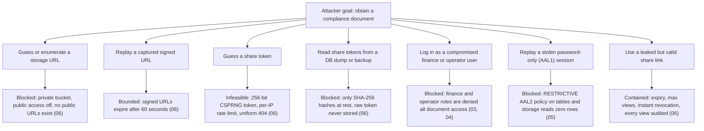

# 08 — Security & Threat Model

This document is the consolidated threat model and platform-hardening specification for the studio management system: it enumerates the threats the design defends against, maps each threat to its concrete vectors and mitigations (with pointers to the documents where each mitigation is specified in full), and defines the platform-level hardening that surrounds the application — HTTP security headers with exact values, Vercel deployment protection, the rate-limiting strategy, a secrets inventory, the dependency-update policy, and logging & retention rules. It is design-only: nothing described here is deployed yet; every control is written as a build-time requirement.

**Related docs:** [00 — Index & Conventions](00-index.md) · [01 — Product Overview](01-overview.md) · [02 — System Architecture](02-architecture.md) · [03 — Roles & RBAC](03-roles-rbac.md) · [04 — Database Schema & RLS](04-database-erd.md) · [05 — Auth, Invites & Mandatory 2FA](05-auth-2fa.md) · [06 — Documents & Shareable Links](06-documents-sharing.md) · [07 — Statistics & Dashboards](07-analytics.md) · [09 — Accounting](09-accounting.md) · [10 — Deployment & Operations](10-deployment-operations.md) · [11 — AI Assistant & LLM Gateway](11-ai-llm.md)

---

## 1. Security posture

The system's non-functional priorities are fixed and ordered: **security over performance**. The stance that every other document reflects, and that this document audits, is:

- **Deny-by-default.** No table, bucket, or endpoint grants access unless a policy explicitly allows it. The RLS policy-intent matrix in [04 — Database Schema & RLS](04-database-erd.md) is written as an allowlist; anything not listed is denied.
- **Invite-only.** Public registration is disabled at the Supabase Auth level, and the `handle_new_user` trigger independently rejects any signup without a pending invitation (defense-in-depth, specified in 04/05).
- **Mandatory TOTP 2FA.** Every authenticated capability requires an AAL2 session, enforced twice: middleware as the UX layer, and a per-table RESTRICTIVE RLS policy as the authoritative security layer. The canonical policy snippet lives in [05 — Auth, Invites & Mandatory 2FA](05-auth-2fa.md).
- **RLS is the final authority.** Application-layer checks (middleware, server actions) are treated as usability affordances, never as the security boundary. The trust-zone model is drawn in [02 — System Architecture](02-architecture.md).
- **Full audit trail.** Sensitive actions write append-only rows to `audit_log` (schema in 04); the log is readable by the Super Admin only and is not updatable or deletable by any role, including the Super Admin in-app.

### 1.1 Assets and adversaries

The system stores no media content. The assets worth attacking are:

| Asset | Sensitivity | Where specified |
|---|---|---|
| Identity & compliance documents (government IDs, contracts, releases) | Highest — legally sensitive PII of models | [06](06-documents-sharing.md), [04](04-database-erd.md) |
| Legal names, DOB, contact details, payment details of models and operators | High — PII, payment routing data | [04](04-database-erd.md) |
| Financial records: earnings, ledger, payouts, commission schemes | High — money movement and its authorization state | [09](09-accounting.md), [04](04-database-erd.md) |
| Credentials & secrets: service-role key, share tokens, TOTP factors | High — each is a bypass of one control layer if leaked | this doc §4.4, [05](05-auth-2fa.md), [06](06-documents-sharing.md) |
| Audit log | Medium — its integrity underpins every insider-misuse mitigation | [04](04-database-erd.md) |
| AI conversation logs & embeddings (redacted business text, spend telemetry) | Medium — pre-redacted at write time, but still business-revealing in aggregate | [11](11-ai-llm.md), [04](04-database-erd.md) |

Adversaries considered: external attackers (no credentials), share-link recipients (deliberately granted one-document, time-boxed access), and **insiders** — any authenticated role attempting to act beyond the capability matrix in [03 — Roles & RBAC](03-roles-rbac.md), including a malicious manager or finance user. The single Super Admin is trusted by definition (they own the Supabase project), but their actions are still audited and their account is the most hardened (05). The LLM providers (Moonshot, Zhipu) are additionally treated as **semi-trusted third parties**: the design assumes anything sent to them may be retained, which is why only aggregated, de-identified data ever crosses that boundary ([11](11-ai-llm.md)).

---

## 2. Threat → vector → mitigation table

Each row names the threat, how it would realistically be attempted, and the mitigations the design already contains. Mitigations are cross-referenced to the document that specifies them; this table adds no new mechanisms, it verifies coverage.

| # | Threat | Vector | Mitigations |
|---|---|---|---|
| 1 | **Account takeover** | Credential stuffing, phishing, password reuse against a known staff email | Invite-only: public signup disabled in Supabase Auth *and* rejected by the `handle_new_user` trigger (04/05). Mandatory TOTP: a password alone yields only AAL1, and the AAL2 RESTRICTIVE RLS policy makes an AAL1 session read zero rows (05). Supabase Auth built-in rate limits on sign-in and OTP endpoints. Leaked-password protection (HaveIBeenPwned check) enabled in Auth settings (10). Deactivation revokes all sessions via the Auth admin API (05). |
| 2 | **Document leakage** | Guessed storage URL, replayed download link, over-shared link, insider with excessive access | Single private bucket, public access off — no publicly addressable URL ever exists (06). Downloads only via `createSignedUrl` with 60 s TTL (06). Share links are 256-bit CSPRNG tokens stored only as SHA-256 hashes, with expiry, optional max-views, and instant revocation (06). Storage RLS scopes models to their own path prefix; **finance and operator roles have zero document access** (03/04/06). Every external view is audited in `document_share_views` (04/06). See the attack-path flowchart in §3. |
| 3 | **Privilege escalation** | A model/operator/manager tries to grant themselves a higher role or reactivate a deactivated account | Role changes execute only through the service-role server path after the caller is verified as Super Admin at AAL2 (05). RLS `WITH CHECK` clauses block any write to `role` or `status` by non-SA roles (04). Roles are a Postgres enum — users cannot create roles; adding one is a migration (03). Exactly one Super Admin is enforced by a partial unique index (03). JWT role claim is cross-checked against `profiles.status` in sensitive policies, closing the stale-claim window (03). |
| 4 | **Share-token guessing** | Brute-force or enumeration of `/share/{token}` URLs | Tokens are 32 bytes from a CSPRNG (256-bit space — enumeration is computationally infeasible) (06). Only the SHA-256 hash is stored, so a database dump yields no usable links (06). Uniform 404 for invalid, expired, revoked, and exhausted tokens — no state oracle to guide a search (06). Per-IP rate limiting on the `share-view` Edge Function plus expiry and max-view caps bound any online attempt (06, §4.3 here). |
| 5 | **Insider misuse (manager / finance)** | A trusted staff account exfiltrates data or quietly manipulates records within its normal login | Least-privilege capability matrix: each role sees the minimum column set, often via views (03/04). Finance is denied all documents; operators are denied raw earnings (03). `audit_log` is append-only and readable **only** by the Super Admin — a manager or finance user cannot inspect or scrub their own trail (04). Payout approval is Super-Admin-only (maker-checker, rationale in 03), so finance can record but never authorize. |
| 6 | **Financial fraud / split manipulation** | Altering commission schemes or ledger rows to redirect money, or fabricating payouts | Commission-scheme writes are SA-only; every other role reads at most (03/04). The ledger is append-only for every role — corrections are reversing entries, never edits (04/09). Maker-checker payout flow: finance creates and settles, only SA approves (03/09). Every `earning_share` ledger entry carries a `commission_scheme_id` provenance FK, so the rule that produced each amount is reconstructable (04/09). Scheme changes and payout transitions are audited (`scheme.update`, `payout.approve`, `payout.paid`) (04/09). |
| 7 | **Stolen AAL1 session / MFA bypass** | An attacker obtains a valid password-only session token and hits the API directly, skipping the middleware redirect | The per-table RESTRICTIVE `aal2_active_required` policy (canonical snippet in [05](05-auth-2fa.md)) enforces `aal = 'aal2'` **in the database**, independent of any application code. A stolen AAL1 token reads zero rows and writes nothing, on every table, by construction. |
| 8 | **Service-key exposure** | The `SUPABASE_SERVICE_ROLE_KEY` leaks via client bundle, logs, or repository | The key exists only as a server-scoped Vercel env var — never `NEXT_PUBLIC_*`, never imported into client components, never in the repo (02/05). Edge Function secrets are held in Supabase Function secrets, not in code (06/10). Guarded admin paths verify caller role + AAL2 *before* instantiating the service client (05). Key-rotation runbook in [10](10-deployment-operations.md). Secrets inventory in §4.4. |
| 9 | **SQL injection / API abuse** | Malicious input through forms, query params, or direct PostgREST calls | PostgREST issues parameterized queries only — there is no string-concatenated SQL path from the client (02). All server-action inputs are validated with zod schemas before any database call. RLS is the backstop: even a syntactically successful malicious request is scoped to the rows its session may see (02/04). |
| 10 | **Data loss** | Accidental deletion, bad migration, regional incident | Supabase point-in-time recovery plus daily backups (10). Restore runbook rehearsed and documented in [10](10-deployment-operations.md). Compliance documents resist cascading deletion: `documents.model_id` is `ON DELETE RESTRICT` (04). Append-only ledger and audit tables cannot be truncated through the app by any role (04). |
| 11 | **XSS / clickjacking** | Injected script in a rendered field, or the app framed by a hostile page to hijack clicks | Strict CSP with nonce-based scripts and no `unsafe-inline` for script (exact value in §4.1). `frame-ancestors 'none'` everywhere — including the share-viewer page (decision recorded in §4.1). HSTS with preload, `nosniff`, and a strict referrer policy (§4.1). React's default output encoding; no `dangerouslySetInnerHTML` on user-supplied content. |
| 12 | **Prompt injection → tool misuse** | Untrusted text stored in the DB (notes, descriptions, doc titles) enters the model context and instructs the agent to exfiltrate or misuse tools | Whitelisted read-only tool registry — no raw SQL, no write tools (11). Tools execute under the **caller's** JWT, so the worst obtainable output is data RLS already grants that user (04/11). Tool results pass the redaction chokepoint before re-entering context, so blocklisted fields cannot transit even if requested (11). Instruction/data separation in the system prompt (defense-in-depth only, stated as non-boundary). Registry names validated server-side against the fixed list. |
| 13 | **Cross-border / third-party data exposure** | Business data sent to Moonshot/Zhipu APIs is retained, logged, or breached by the provider | **Aggregates-only egress policy** enforced by the single chokepoint: stage/display names and numbers only; never legal names, DOB, contact/payment details, IPs, document contents, or storage paths — for prompts, tool results, and embedding inputs alike (11). Redacted forms are what's persisted, making egress auditable (`ai_messages`). Provider data-retention terms reviewed at provisioning; no PII means no data-subject exposure even under full provider compromise. |
| 14 | **Model-switch / AI-settings abuse** | A non-SA user or compromised account flips the provider or budgets | `app_settings` writes are SA-only in RLS with a validation trigger; every change audited (`ai.model_switch`, `ai.settings_update`) (04/11). No auto-failover — the processor never changes without an audited SA action (11). |
| 15 | **LLM cost abuse / DoS** | Scripted or runaway chat traffic burns provider spend | Per-user hourly request limit, per-user and global daily token budgets from `app_settings`, enforced in the gateway against `ai_usage` before any provider call; over-budget requests refused and recorded (`status='budget_exceeded'`) (11). Provider-console spend caps as backstop (10). AI surface requires an active AAL2 staff session — no anonymous path exists. |
| 16 | **Embedding leakage** | The vector store or provider embedding logs become a PII side-channel | Embedding inputs are allowlist-built + scrubbed **before** embedding; document file contents are never embedded — metadata only (11). `embeddings` rows carry pre-redacted content and RLS mirroring source visibility; write path is service-role-only (04). One live embedding model avoids stale forgotten namespaces (11). |

---

## 3. Document-leak attack paths

Documents are the highest-value asset, so their threat row deserves an explicit map. Every path an attacker could take to a compliance document terminates in a control specified in [06](06-documents-sharing.md), [05](05-auth-2fa.md), or the RLS matrix in [04](04-database-erd.md); the one deliberately open path — a valid, unexpired share link — is time-boxed, view-capped, revocable, and fully audited.

The residual exposure after revoking a share is bounded by the 60-second signed-URL TTL — the bound is stated and justified in [06](06-documents-sharing.md). The incident-response runbook for a suspected mass token leak (revoke-all query) is in [10 — Deployment & Operations](10-deployment-operations.md).

---

## 4. Platform hardening

### 4.1 HTTP security headers — exact values

Headers are set globally in the Next.js configuration (and mirrored by the `share-view` Edge Function for the pages it serves itself). These are the required production values; weakening any of them is a design change requiring review of this document.

| Header | Value | Purpose |
|---|---|---|
| `Strict-Transport-Security` | `max-age=63072000; includeSubDomains; preload` | Forces HTTPS for two years, including subdomains; eligible for browser preload lists. |
| `Content-Security-Policy` | `default-src 'self'; script-src 'self' 'nonce-{per-request}' 'strict-dynamic'; style-src 'self' 'unsafe-inline'; img-src 'self' blob: data:; font-src 'self'; connect-src 'self' https://{project-ref}.supabase.co wss://{project-ref}.supabase.co; object-src 'none'; base-uri 'self'; form-action 'self'; frame-ancestors 'none'; upgrade-insecure-requests` | Scripts run only with a per-request nonce — no `unsafe-inline` for script, no third-party script hosts. `connect-src` is pinned to the single Supabase project origin. `style-src 'unsafe-inline'` is a recorded concession to Next.js inline style tags; it does not permit script execution. |
| `X-Frame-Options` | `DENY` | Legacy mirror of `frame-ancestors` for older user agents. |
| `X-Content-Type-Options` | `nosniff` | Disables MIME sniffing; uploads are served with their stored `mime_type` (04). |
| `Referrer-Policy` | `strict-origin-when-cross-origin` | Path components (which may include share tokens in the viewer URL) never leak cross-origin. |
| `Permissions-Policy` | `camera=(), microphone=(), geolocation=(), payment=(), usb=()` | The app uses none of these capabilities; deny them outright. |
| `Cross-Origin-Opener-Policy` | `same-origin` | Severs window references from cross-origin openers. |
| `Cross-Origin-Resource-Policy` | `same-origin` | App resources cannot be embedded by other origins. |

**Decision — share-viewer framing:** the spec required a decision on whether the share-viewer page gets a `frame-ancestors` exception. **It does not.** Recipients open share links directly in a browser tab; embedding the viewer in third-party pages is not a supported use case, and allowing it would reintroduce clickjacking and referrer-leak surface exactly where the most sensitive content is rendered. `frame-ancestors 'none'` therefore applies uniformly, including the HTML page returned by the `share-view` Edge Function (which sets these headers itself, since it responds outside the Next.js pipeline — flow in [06](06-documents-sharing.md)).

### 4.2 Deployment protection

- **Vercel Deployment Protection is enabled for all non-production deployments.** Preview deployments sit behind Vercel Authentication: only team members can open a preview URL. Preview URLs are never shared externally and never indexed.
- **Previews never touch production data.** Preview deployments are wired to a separate Supabase branch database (or a dedicated non-production project) seeded exclusively with fake data. Production env vars — above all `SUPABASE_SERVICE_ROLE_KEY` — are scoped to the Production environment in Vercel and are not readable by preview builds. The environment topology and seeding pipeline are specified in [10 — Deployment & Operations](10-deployment-operations.md).
- **Production deploys come only from the protected default branch** through the CI/CD pipeline in 10; no direct `vercel deploy --prod` from developer machines.

### 4.3 Rate-limiting strategy

| Surface | Mechanism | Notes |
|---|---|---|
| Supabase Auth endpoints (sign-in, MFA verify, invite accept) | Supabase Auth built-in rate limits | Configured values reviewed at provisioning time (10); defaults kept or tightened, never loosened. |
| `share-view` Edge Function | Per-IP token bucket | Implementation option (Postgres-backed counter vs. Upstash) recorded in [06](06-documents-sharing.md); the limit exists to bound online token guessing (§2 row 4) and scraping of a leaked link. |
| Vercel edge | Vercel WAF managed rules | Generic L7 protection in front of all Next.js routes; noted in 06 and configured in 10. |
| Authenticated API (PostgREST via anon key) | RLS + AAL2 restrictive policy as the abuse backstop | No unauthenticated data path exists at all; abusive authenticated traffic is bounded to the caller's own row scope. |
| AI gateway (`/api/ai/chat`) | Per-user request + token budgets (`app_settings`) enforced against `ai_usage` | Checked in the gateway before any provider call (§2 row 15); refusals recorded with `status='budget_exceeded'`; budgets SA-tunable, semantics in [11](11-ai-llm.md). |

### 4.4 Secrets inventory

Which secret lives where — and, critically, what is *not* a secret. The invariant from [05](05-auth-2fa.md) holds: **the browser only ever holds the anon/publishable key.** Rotation procedures for every row live in [10 — Deployment & Operations](10-deployment-operations.md).

| Secret / credential | Secret? | Lives in | Reaches the browser? | Blast radius if leaked |
|---|---|---|---|---|
| `NEXT_PUBLIC_SUPABASE_URL` | No | Vercel env (all environments) | Yes (by design) | None — public endpoint identifier. |
| `NEXT_PUBLIC_SUPABASE_ANON_KEY` | No (publishable) | Vercel env (all environments) | Yes (by design) | None beyond design: every request under it passes RLS, and the AAL2 restrictive policy denies anonymous and AAL1 sessions everything. |
| `SUPABASE_SERVICE_ROLE_KEY` | **Yes — highest** | Vercel env, server scope, Production only | **Never** | Full RLS bypass. Mitigated by server-only scope, pre-use role+AAL2 verification (05), rotation runbook (10). |
| `MOONSHOT_API_KEY` | Yes | Vercel env, server scope, Production only | Never | Provider spend + impersonated API traffic — the key holds no studio data access. Rotation runbook in [10](10-deployment-operations.md). |
| `ZHIPU_API_KEY` | Yes | Vercel env, server scope, Production only | Never | Provider spend + impersonated API traffic — the key holds no studio data access. Rotation runbook in [10](10-deployment-operations.md). |
| `SHARE_TOKEN_PEPPER` (optional) | Yes | Supabase Edge Function secrets | Never | Combined with a DB dump, would ease offline token verification; alone, nothing. Hashing design in 06. |
| SMTP credentials (invite email) | Yes | Supabase Auth settings | Never | Sender abuse; no data access. |
| Supabase dashboard owner account | Yes | Owner's password manager, MFA enforced | n/a | Full project control — this is the Super Admin's raw-SQL path (05); hardened with MFA and recovery codes. |
| Vercel & GitHub accounts | Yes | Team members' password managers, MFA enforced | n/a | Deploy/source tampering; mitigated by protected branch + review (§4.5, 10). |
| TOTP secrets (per user) | Yes | Supabase Auth (`auth.mfa_factors`) | Never (QR shown once at enrollment) | Single-account MFA bypass; recovery/re-enroll flow in 05. |
| Share tokens (raw) | Yes — ephemeral | Nowhere — shown once at creation, only SHA-256 hash stored | Only to the creating admin, once | One document, until expiry/revocation (06). |

### 4.5 Dependency & update policy

- Lockfile-pinned dependencies; automated update PRs (Renovate or Dependabot) reviewed and merged weekly — security advisories same-day.
- `npm audit` (high/critical fail the build) runs in CI on every push; the pipeline is defined in [10](10-deployment-operations.md).
- No third-party scripts at runtime — the CSP in §4.1 structurally enforces this: any CDN-hosted analytics or widget would fail `script-src` and is therefore a reviewed design change, not a casual addition.
- Supabase CLI / SDK versions upgraded deliberately with migration notes, never floated.

### 4.6 Logging & retention

| Data | Store | Write path | Retention | Notes |
|---|---|---|---|---|
| `audit_log` | Postgres, append-only | Triggers + service-role writes only (04) | Financial & compliance actions (`payout.*`, `ledger.post`, `scheme.update`, `document.*`, `share.*`): **7 years**. Auth/session events: **2 years**. | No UPDATE/DELETE for any role in-app. Expiry beyond retention is an operator-run archival export + partition drop under the runbook in 10 — never an in-app mutation. |
| `document_share_views` | Postgres | Service role via `share-view` Edge Function (06) | 2 years | Stores `ip_hash` (salted) only — raw IPs are never persisted (04). |
| `ai_usage` | Postgres | Service role via the AI gateway (11) | **2 years** | Per-request token/cost telemetry — the substance of the cost-abuse mitigation (§2 row 15) and the SA's oversight surface for AI activity (11). |
| `ai_conversations` / `ai_messages` | Postgres | Caller-scoped inserts via the AI gateway; messages append-only (04) | Until the owner deletes; a quarterly archival sweep may purge conversations older than 1 year | Stores **redacted** provider-bound forms only, so the conversation log doubles as an egress audit (11). The purge is operator-run under the §5.8 pattern in [10](10-deployment-operations.md) — never an in-app mutation by other roles. |
| Supabase platform logs (Auth, PostgREST, Storage, Functions) | Supabase → external log drain | Automatic | Supabase plan default is short-lived; a log drain to external storage extends security-relevant logs to **90 days** (10). | Drains configured at provisioning (10). |
| Vercel request/build logs | Vercel → log drain | Automatic | 90 days via drain | Request logs contain no tokens: share tokens ride in the path of the Edge Function origin, not through Vercel; signed URLs are embedded in viewer HTML, not redirected through logged locations (06). |
| Backups / PITR | Supabase | Automatic | Daily backups + PITR window per [10](10-deployment-operations.md) | Backups contain token *hashes* only, so a leaked backup exposes no usable share links (06). |

Retention here is deliberately asymmetric: audit and financial trails are kept for years because they are the substance of the insider-misuse and fraud mitigations (§2 rows 5–6), while operational logs and IP-derived data are kept only as long as incident response plausibly needs them.

---

## 5. Open items tracked elsewhere

- Encryption-at-rest for `payment_details` (pgsodium / Vault) is flagged as an open decision on the column definitions in [04 — Database Schema & RLS](04-database-erd.md).
- `get_advisors` (Supabase security lint) runs as a post-deploy gate — provisioning checklist in [10 — Deployment & Operations](10-deployment-operations.md).
- Rate-limit implementation choice for the share endpoint (Postgres vs. Upstash) is recorded as an implementation option in [06 — Documents & Shareable Links](06-documents-sharing.md).
