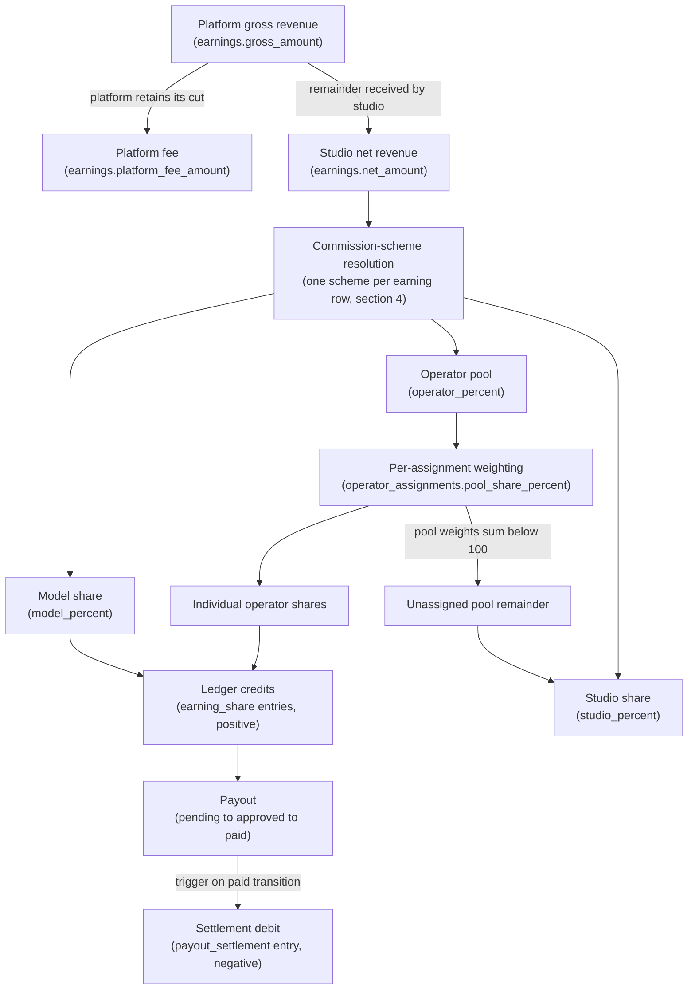
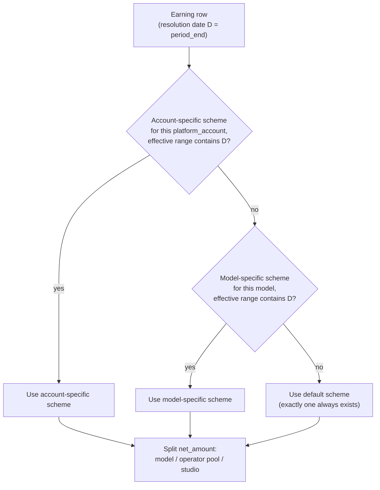
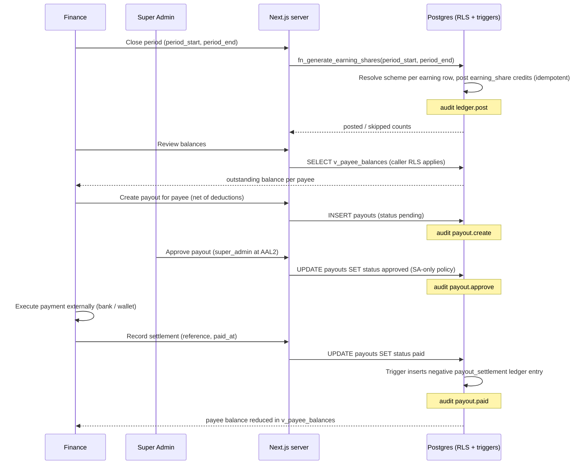
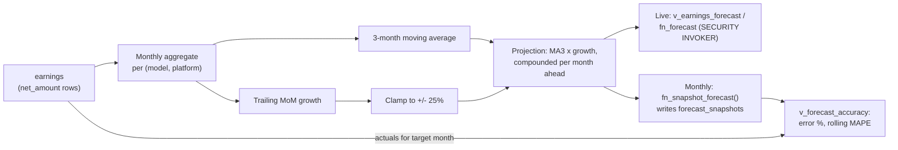

# 09 — Accounting: Splits, Ledger, Payouts & Forecasting

This document designs the accounting module of the studio management system: the party model (who money is owed to and who moves it), the flow of money from platform gross revenue down to settled payouts, the commission-scheme mechanism that splits studio net revenue between model, operator pool, and studio, the append-only payee ledger with its sign convention, the maker-checker payout and settlement workflow, payee statements, and the deterministic revenue-forecasting method with its accuracy-tracking snapshots. Table and column definitions for every object named here live in [04 — Database Schema & RLS](04-database-erd.md); the analytics views and RPCs that surface accounting data live in [07 — Statistics & Dashboards](07-analytics.md). This is a design document only — no code or infrastructure described here exists yet.

**Related docs:** [00 — Index & Conventions](00-index.md) · [01 — Product Overview](01-overview.md) · [02 — System Architecture](02-architecture.md) · [03 — Roles & RBAC](03-roles-rbac.md) · [04 — Database Schema & RLS](04-database-erd.md) · [05 — Auth, Invites & Mandatory 2FA](05-auth-2fa.md) · [06 — Documents & Shareable Links](06-documents-sharing.md) · [07 — Statistics & Dashboards](07-analytics.md) · [08 — Security & Threat Model](08-security-threat-model.md) · [10 — Deployment & Operations](10-deployment-operations.md) · [11 — AI Assistant & LLM Gateway](11-ai-llm.md)

---

## 1. Scope and party model

The accounting module answers one question end to end: **of the money the studio receives from platforms, who is owed what, and has it been paid?** Three parties participate in the money flow:

| Party | Represented by | Role in the flow |
|---|---|---|
| **Studio** | The system itself (no payee record) | Receives net revenue from platforms; retains the studio share and any unassigned operator-pool remainder |
| **Model** | `models` row ([04](04-database-erd.md)) | The performer whose platform accounts generate revenue; credited with the model share of each earning |
| **Operator** | `operators` row ([04](04-database-erd.md)) | Support staff (chatters/account operators) assigned to models; credited with a weighted portion of the operator pool |

**Payees are models and operators — and only those two.** Every ledger entry and every payout targets exactly one payee, addressed by the polymorphic pair `(payee_type, payee_id)` (§5). The studio is deliberately *not* a payee: its share is whatever remains of `earnings.net_amount` after payee credits are posted, so studio margin is derived, never posted, and can never drift out of reconciliation with the ledger.

Two human roles operate the module, deliberately kept apart:

- **Finance** *records*: posts earning shares and adjustments to the ledger, creates payouts, and records settlement (marking an approved payout paid).
- **Super Admin** *authorizes*: is the only role that can approve a payout.

This is the maker-checker separation whose rationale and authoritative capability rows live in [03 — Roles & RBAC](03-roles-rbac.md); the insider-misuse and financial-fraud threats it mitigates are analyzed in [08 — Security & Threat Model](08-security-threat-model.md). Managers may create pending payouts but can neither approve nor settle them; models and operators are read-only observers of their own money (§3).

## 2. The payment flow, end to end

Money enters the system as a per-statement-period `earnings` row — the authoritative money record, as distinct from `work_sessions`, the authoritative hours record (that split is documented in [04](04-database-erd.md)). From there it is split, credited, and eventually settled:



Reading the flow left to right in words:

1. **Platform gross → studio net.** The platform's cut is recorded as `platform_fee_amount`; what actually lands with the studio is `net_amount`. All downstream splitting operates on `net_amount` only — the platform fee is a fact about the platform relationship, not part of the studio's distributable revenue.
2. **Scheme resolution.** For each earning row, exactly one commission scheme resolves (§4) and yields three percentages summing to 100: `model_percent`, `operator_percent` (the operator *pool*), and `studio_percent`.
3. **Pool weighting.** The operator pool is divided among the operators actively assigned to the earning's model during the period, weighted by each assignment's `pool_share_percent`. If assignments sum to less than 100, the unassigned remainder falls to the studio (§4.3).
4. **Ledger credits.** Each model share and each individual operator share is posted as a positive `earning_share` ledger entry carrying provenance: the `earning_id` it derives from and the `commission_scheme_id` that produced the split.
5. **Payout and settlement.** Accumulated positive balance is paid out through the maker-checker workflow (§6); marking a payout paid automatically posts the negative `payout_settlement` entry that brings the payee's balance back down.

## 3. Design decision: a dedicated `operators` table

When operators were added to the product, two shapes were considered:

| Option | Description | Verdict |
|---|---|---|
| **A. Dedicated `operators` table mirroring `models`** | A second business-entity table with the same pattern: optional nullable `profile_id` link, sensitive `legal_name` behind a view, own status lifecycle | **Chosen** |
| **B. Generalized "staff" / "party" table** | One table holding models and operators, discriminated by a kind column | Rejected |

The generalized table was rejected because the two entities only look similar at a distance; their columns and their satellite tables diverge immediately. Models carry `date_of_birth` with an 18+ CHECK, compliance `documents`, and `platform_accounts`; operators carry none of these but anchor `operator_assignments` and pool splits. A single table would be a union of nullable columns whose validity depends on the kind column — CHECK constraints conditioned on a discriminator, RLS policies with kind-based branches, and a schema in which "which columns apply?" requires reading constraint predicates. Two mirrored tables instead give:

- **Symmetric, copy-paste-safe RLS.** The policy shapes for `operators` are the `models` policies with `my_model_id()` replaced by `my_operator_id()` — reviewable by diff, with no kind-branching inside policy expressions. Given that RLS is the final security authority ([02 — System Architecture](02-architecture.md)), keeping policies boring is a security feature.
- **A one-migration role addition.** Adding the operator role was exactly the migration governance [03](03-roles-rbac.md) designed for: `ALTER TYPE user_role ADD VALUE 'operator'`, plus the new table and its policies.
- **Independent evolution.** Operator compliance documents are explicitly out of scope for now ([01 — Product Overview](01-overview.md)); if they arrive later, they attach to `operators` without disturbing the model-scoped document design in [06](06-documents-sharing.md).

**Operator self-service scope.** An operator with a linked login sees their **own ledger entries, own payouts, and own balance — nothing else**. Operators never see raw `earnings` or `work_sessions` rows: the revenue a model generates is between the model and the studio, and an operator's window into it is only the computed share credited to them. This boundary is enforced in the RLS intent matrix in [04](04-database-erd.md) (`earnings`/`work_sessions`: deny for operator; `ledger_entries`/`payouts`: read own via `my_operator_id()`), with the capability rows canonical in [03](03-roles-rbac.md). Full column specifications for `operators` and `operator_assignments` live in [04](04-database-erd.md).

## 4. Commission schemes: the split rules

> **Superseded for the studio default by §4.5.** The three-way split below is still the schema and still the fallback for schemes without a rate card; the studio's live rates are the per-role card of migration 025.

The `commission_schemes` table (columns, CHECKs, and exclusion constraints specified in [04](04-database-erd.md)) holds three-way split rules — `model_percent + operator_percent + studio_percent = 100` — each scoped and effective-dated. `operator_percent` is a *pool*, not an individual's share; individuals get weighted slices of it (§4.3).

The legacy `models.commission_percent` column remains only as a display default; schemes supersede it for all ledger math ([04](04-database-erd.md) documents this note on the column itself).

### 4.1 Scope and resolution order

A scheme applies at exactly one of three scopes, and resolution walks them from most to least specific:



Three properties make resolution deterministic:

- **Resolution date.** The scheme whose effective range contains the earning row's `period_end` wins. A period that straddles a scheme change is governed entirely by the scheme in force when the period closed — one earning row, one scheme, clean provenance.
- **No overlaps within a scope.** The exclusion constraint in [04](04-database-erd.md) (GiST over the coalesced scope columns and the effective date range) guarantees that at most one scheme per scope can be effective on any date, so "account-specific? → model-specific? → default" can never encounter two candidates at the same tier.
- **Total coverage.** Exactly one default scheme (both scope columns NULL) must exist at all times — seeded at provisioning, deletion blocked. Resolution therefore always terminates with a scheme; there is no "no scheme" error path in share generation.

### 4.2 Effective dating

Scheme changes are never edits to money math in place: changing a split means closing the current scheme's `effective_to` and inserting a successor row. Historical earning rows keep resolving (and keep their posted provenance) against the scheme that was in force for their period. Scheme writes are Super-Admin-only and audited (`scheme.update`) — see the financial-fraud row in [08 — Security & Threat Model](08-security-threat-model.md).

### 4.3 Operator pool weighting

Within the operator pool, each operator assigned to the model (an `operator_assignments` row whose date range covers the resolution date) receives:

```
operator_share = net_amount × operator_percent/100 × pool_share_percent/100
```

The per-model constraint that active assignments' `pool_share_percent` values sum to **at most 100** is trigger-enforced ([04](04-database-erd.md)). Two boundary cases are defined behavior, not errors:

- **Under-assignment** (weights sum to less than 100, including zero assigned operators): the unassigned remainder of the pool **falls to the studio**. Nothing is ever posted to a phantom payee, and the invariant "posted credits + studio residue = net_amount" holds by construction.
- **Multiple operators**: each gets an independent `earning_share` entry with its own weight applied — shares are per-payee ledger facts, not a bundled pool entry needing later division.

### 4.5 The studio rate card (migration 025) — how the studio actually pays

The three-way split above is the ORIGINAL mechanism and remains the fallback. The studio's real structure, supplied by the owner on 2026-08-13, does not fit it: every role earns its **own** percentage of the model's weekly net, with its **own** brackets, and the model's own rate depends on who is around her.

| Weekly net (Sun–Sat) | Model alone | Model + coach | Model + operator | Operator | Coach | Team leader |
|---|---|---|---|---|---|---|
| up to 1500 | 80% | 60% | 45% | 25% | 7% | 2% |
| 1501–2499 | 80% | 65% | 50% | 28% | 7% | 3% |
| 2500–2999 | 80% | 70% | 55% | 28% | 7% | 3% |
| 3000+ | 80% | 70% | 55% | 30% | 7% | 4% |

A single pool split by fixed weights cannot express this: the operator's slice of a combined pool would drift as different roles cross different thresholds. So `commission_rates` stores one row per `(party, threshold)` and the close pays each person their own rate. Six parties exist — three of them are the model's, and exactly one applies per composition.

The rules, each a money decision someone will audit:

* **Week** — **Sunday through Saturday**, per the owner. Implemented as `date_trunc('week', period_end + 1 day)`, since Postgres' own week is ISO (Monday).
* **Basis** — the model's TOTAL net for that week, every statement summed. Four payouts reach a bracket the same as one large one.
* **Style** — flat, not progressive: reaching a bracket re-prices the whole week. There is a cliff at each threshold; that is what was asked for.
* **Brackets** — read exactly as written: `up to 1500` then `1501–`, so a week of 1500.99 is still the low bracket. `2500+` and `3000+` are inclusive.
* **Composition** — an operator's presence selects the with-operator row **even when a coach is also assigned** (more support staff, lower model rate); the coach still earns her 7%. A coach alone selects the with-coach row. Anyone else — including a team leader alone — leaves the model independent, and the team leader still earns their own cut.
* **Studio** — the remainder, never posted (the studio has no payee row). `fn_set_commission_rates` refuses to save a card where any composition exceeds 100% at any threshold, so the remainder can never go negative; the dialog previews the same arithmetic before saving.
* **Same role twice** — two operators on one model split the *operator* rate by their assignment weights, normalized within the role.

A scheme with no card rows keeps the §4.3 pool behaviour unchanged, which is what scoped overrides still use.


## 5. The ledger

`ledger_entries` (full column spec in [04](04-database-erd.md)) is the single source of truth for **what each payee is owed right now**. It is double-entry-lite: one row per movement against a payee, with the studio side implicit (§1), and a payee's balance is simply `SUM(amount)` over their rows — surfaced as `v_payee_balances` in [07](07-analytics.md).

### 5.1 Sign convention

| `entry_type` | Sign | Meaning | Origin |
|---|---|---|---|
| `earning_share` | **+** | Payee's computed share of an earning row | `fn_generate_earning_shares` (§5.3) |
| `adjustment` | **+ / −** | Manual correction; a reversing entry negates an earlier posting | Finance or Super Admin, manual |
| `deduction` | **−** | Amount withheld from the payee | Finance or Super Admin, manual |
| `payout_settlement` | **−** | Settlement of a paid payout | Trigger on payout `paid` transition — never manual |

**Balance per payee = `SUM(amount)`** for that `(payee_type, payee_id)`, per currency. A positive balance is money the studio owes the payee; the payout workflow (§6) exists to drive it back toward zero. The `CHECK (amount <> 0)` in [04](04-database-erd.md) keeps no-op rows out of the ledger.

### 5.2 Append-only, corrections by reversal

No role — including Super Admin — can UPDATE or DELETE a ledger entry ([04](04-database-erd.md) RLS matrix: super admin and finance get create+read only). A wrong posting is corrected by a reversing `adjustment` of the opposite sign plus, if needed, a fresh correct entry. The history of the mistake and its correction is permanent, which is precisely the property an auditable financial record needs and the direct mitigation for the ledger-tampering aspect of the financial-fraud threat in [08](08-security-threat-model.md). Every entry also carries `created_by` and its provenance FKs (`earning_id`, `commission_scheme_id`, `payout_id` as applicable), so any balance can be decomposed back to the earning rows and scheme versions that produced it.

### 5.3 Share generation: `fn_generate_earning_shares`

Earning shares are posted by one RPC, callable by finance and Super Admin only ([03](03-roles-rbac.md)):

| Contract element | Design |
|---|---|
| Signature | `fn_generate_earning_shares(p_period_start date, p_period_end date)` |
| Input | The statement period to process; operates on `earnings` rows in that period |
| Per earning row | Resolve the scheme (§4.1) → compute model share and weighted operator shares (§4.3) → post one positive `earning_share` entry per payee, stamped with `earning_id`, `commission_scheme_id`, and the period |
| **Idempotency** | Keyed per `(earning_id, payee)`: a re-run skips any earning/payee pair that already has a posted `earning_share` entry and posts only what is missing |
| Output | Counts of entries posted and skipped, for the finance UI to display |
| Audit | `ledger.post` rows for the generation run |

Idempotency is what makes the monthly close forgiving: a late-arriving earning row for an already-processed period means simply re-running the function — existing entries are untouched, the new row's shares are posted, and nothing is ever double-credited.

### 5.4 Polymorphic payee

Both `ledger_entries` and `payouts` address their payee as `(payee_type, payee_id)` pointing at the **business tables** (`models` / `operators`), not at `profiles` — money is owed to business entities, and both `models.profile_id` and `operators.profile_id` are nullable, so a payee may have no login at all. The cost is the loss of a declarative FK; the mitigation is a BEFORE INSERT trigger validating that the referent exists in the table named by `payee_type`. The full decision record and trigger spec live in [04 — Database Schema & RLS](04-database-erd.md); this section only notes why the accounting design depends on it: `payouts` is *generalized* over the same pair, so one payout table, one settlement trigger, and one balances view serve models and operators identically, and adding a future payee kind is an enum value plus a trigger branch — not a parallel set of tables.

## 6. Payout and settlement workflow

Payouts move a payee's positive balance out of the system under maker-checker control. The status lifecycle is `pending → approved → paid` (with `cancelled` available before payment), and the role split is strict: finance/manager may create, **only the Super Admin may approve**, and finance records the payment after executing it externally. In-policy enforcement details (WITH CHECK clauses forbidding finance from writing `approved`, and `paid` reachable only from `approved`) are specified in [04](04-database-erd.md).



Two invariants anchor the workflow:

- **Settlement entries are trigger-only.** The transition to `paid` fires a trigger that inserts the negative `payout_settlement` entry; no human posts it. The ledger and the payouts table therefore cannot disagree about whether a payout has been settled — the entry exists if and only if the status is `paid`, and each carries the `payout_id` linking them.
- **Every step is audited.** `ledger.post`, `payout.create`, `payout.approve`, and `payout.paid` land in the append-only `audit_log` ([04](04-database-erd.md)), giving a complete who-did-what trail for the entire money path — the evidence chain the maker-checker rationale in [03](03-roles-rbac.md) relies on.

Payees watch this from the outside: a model or operator sees their own payout rows and their own settlement entries appear (read-own policies in [04](04-database-erd.md)), but cannot touch any part of the workflow.

## 7. Payee statements

Statements are the payee-facing (and accountant-facing) rendering of the ledger, produced by `fn_payee_statement` — a SECURITY INVOKER RPC listed in [07 — Statistics & Dashboards](07-analytics.md), so a model or operator calling it can only ever produce their own statement while finance can produce anyone's. Its contract:

| Contract element | Design |
|---|---|
| Signature | `fn_payee_statement(p_payee_type payee_type, p_payee_id uuid, p_from date, p_to date)` |
| Opening balance | `SUM(amount)` of the payee's entries dated **before** `p_from` |
| Body | The payee's ledger entries within `[p_from, p_to]`, in order, each with type, amount, description, and provenance references |
| Closing balance | Opening balance + sum of body entries |

Because the ledger is append-only, a statement for a past period is reproducible forever: the same inputs always yield the same opening balance, rows, and closing balance, and any later correction appears in the period in which it was *posted*, not retroactively rewritten into the period it corrects.

## 8. Forecasting

### 8.1 Method: three-month moving average with clamped growth

Forecasts are computed per `(model, platform)` from monthly aggregates of `earnings.net_amount`, then rolled up to model, platform, and studio totals:

1. **Monthly aggregate**: sum `net_amount` per model, platform, and calendar month.
2. **Base**: the 3-month moving average (MA3) of the most recent complete months.
3. **Growth factor**: the average trailing month-over-month growth rate, **clamped to ±25%** — one exceptional month must not launch the projection to absurdity in either direction.
4. **Projection**: `MA3 × growth`, compounded once per month ahead (month *n* ahead multiplies the clamp-bounded growth *n* times).

Deliberately **no ML**: the studio's scale is tens of payees, the dominant signal is recent momentum, and a finance user must be able to reproduce any number by hand from the statement data. A method whose every intermediate (window, growth, clamp) is inspectable is worth more here than marginal accuracy from an opaque model. The method name and parameters are recorded on every snapshot (`method = 'ma3_growth'`, `params` jsonb holding window and clamp — column spec in [04](04-database-erd.md)), so the method can evolve without orphaning historical predictions.

### 8.2 Hybrid decision: live projections, snapshotted accuracy

| Concern | Mechanism | Why |
|---|---|---|
| **Live projections** (dashboards, "next 3 months" widgets) | Pure SECURITY INVOKER views/RPCs — `v_earnings_forecast`, `fn_forecast(p_months_ahead)` ([07](07-analytics.md)) | Computed from `earnings` at query time; there is **no staleable stored copy of derived money data** to drift out of sync when an earning row is added or corrected |
| **Accuracy tracking** | `forecast_snapshots` table ([04](04-database-erd.md)), written monthly by `fn_snapshot_forecast()` — finance/SA-invoked or scheduled | You cannot measure forecast error without remembering what was predicted *at the time*; a live view recomputed today "predicts" the past with today's data. Snapshots exist **only** for this |

The snapshot table is therefore not a cache and is never read by the live-projection path. Accuracy is served by `v_forecast_accuracy` ([07](07-analytics.md)): each snapshot joined against the actual monthly net for its `target_month`, yielding error amount, error %, and a rolling MAPE per model and studio-wide — which closes the loop on the clamp parameter: if MAPE trends up, the recorded `params` on historical snapshots show exactly which settings produced which errors.

### 8.3 Pipeline



## 9. Dashboard integration

The canonical chart-mapping table lives in [07 — Statistics & Dashboards](07-analytics.md) and is not repeated here. The rows of that table driven by this module's data are: **split distribution of net revenue** (studio / model pool / operator pool pie), **projected vs actual net revenue** (line), **forecast breakdown by model** (stacked bar), **forecast accuracy** (bar), **payout history by month** (stacked bar + table), **payee outstanding balances** (horizontal bar + table), and the **pending-payouts and own-balance KPI tiles**. Per-role scoping of those widgets — including the operator's deliberately narrow share-trend/payouts/balance view (§3) — follows the dashboard composition rules in [07](07-analytics.md), enforced end to end by the SECURITY INVOKER + RLS design.
