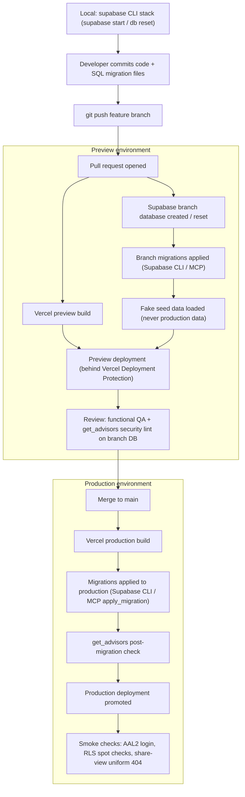

# 10 — Deployment & Operations

This document designs the runtime environments, CI/CD pipeline, provisioning procedure, and operational runbooks for the Studio Management System. It covers how the three environments (local, preview, production) are laid out; how code and database migrations travel from a developer's branch to production; the provisioning checklists mapped to the Supabase MCP and Vercel MCP tooling used at implementation time; the configuration and environment-variable inventory; and the standing runbooks for backup/restore, key rotation, MFA recovery, user deactivation, share-token leak response, the monthly accounting close, audit-log archival, the AI model switch, and embedding-model changes. Nothing described here exists yet — this is the design the operations setup will be built to.

**Related docs:** [00 — Index](00-index.md) · [01 — Product Overview](01-overview.md) · [02 — System Architecture](02-architecture.md) · [03 — Roles & RBAC](03-roles-rbac.md) · [04 — Database Schema & RLS](04-database-erd.md) · [05 — Auth, Invites & Mandatory 2FA](05-auth-2fa.md) · [06 — Documents & Sharing](06-documents-sharing.md) · [07 — Statistics & Dashboards](07-analytics.md) · [08 — Security & Threat Model](08-security-threat-model.md) · [09 — Accounting](09-accounting.md) · [11 — AI Assistant & LLM Gateway](11-ai-llm.md)

---

## 1. Environments

Three environments, strictly separated. The governing rule, restated from [08 — Security & Threat Model](08-security-threat-model.md): **preview environments never see production data.** Previews run against a Supabase branch database seeded exclusively with fake data, and preview deployments sit behind Vercel Deployment Protection.

| Environment | App hosting | Database | Data | Who can reach it |
|---|---|---|---|---|
| **Local** | `next dev` on the developer workstation | Supabase CLI local stack (`supabase start`): local Postgres, Auth, Storage, Edge Function runtime | Synthetic seed data from the repo's seed scripts; reset at will with `supabase db reset` | Developer only |
| **Preview** | Vercel preview deployment (one per pull request) | Supabase **branch database** created for the PR, migrated from the branch's migration files | **Seeded fake data only** — no production rows, documents, or keys, ever | Team members authenticated through Vercel Deployment Protection |
| **Production** | Vercel production deployment on the app's primary domain | The production Supabase project (Postgres + Auth + Storage + Edge Functions) | Real business records; documents in the private `model-documents` bucket (see [06](06-documents-sharing.md)) | Invited, active, AAL2-verified users only (see [05](05-auth-2fa.md)); External Viewers reach only the `share-view` Edge Function |

Environment separation is also key separation: each environment has its own Supabase URL, anon/publishable key, and service-role key. A preview build receives preview-scoped values; the production service-role key is configured for the production environment only (see the env-var inventory in §4.2).

### 1.1 Migration flow between environments

Database schema lives in versioned SQL migration files in the repository — the same files apply to all three environments, in the same order:

1. **Local**: the developer authors a migration file; `supabase db reset` replays the full migration history plus seed data against the local stack.
2. **Preview**: opening a PR creates (or resets) a Supabase branch database; the branch's migration files are applied to it, then fake seed data is loaded. The Supabase MCP branch tools (`create_branch`, `reset_branch`, `merge_branch`) manage this lifecycle at implementation time.
3. **Production**: after merge, the same migration files are applied to the production project via the Supabase CLI or the MCP `apply_migration` tool — never by hand-edited SQL in the dashboard, so the migration history stays the single source of truth.

## 2. CI/CD pipeline



Pipeline rules:

- **Build → migrate → promote.** The production build is produced first; migrations are applied before the new deployment is promoted to serve traffic. Because the previous app version briefly runs against the migrated schema, migrations must be **backward-compatible within one release** (expand/contract: add columns and objects in release N, remove or tighten in release N+1). Destructive changes are split across releases.
- **Migrations are forward-only.** There is no automated rollback of schema; a bad migration is corrected by a new forward migration. Data-loss scenarios fall to the PITR restore runbook (§5.1).
- **`get_advisors` gates every migration**, on the branch database during review and on production immediately after applying. Any newly reported security finding (e.g. a table without RLS, a SECURITY DEFINER function without a pinned `search_path`) blocks promotion.
- **Smoke checks after promotion**: an invited user can log in and is forced to AAL2; a model-role account sees only its own rows (RLS spot check); an invalid share token returns the uniform 404 designed in [06](06-documents-sharing.md).

## 3. Provisioning checklists

Provisioning is performed once per environment at implementation time. The checklists below are mapped to the MCP tooling named in [02 — System Architecture](02-architecture.md): the **Supabase MCP** for the data platform and the **Vercel MCP** for the app platform. Steps not covered by an MCP tool (e.g. some Auth settings) are done in the respective dashboard and noted as such.

### 3.1 Supabase provisioning (Supabase MCP)

| # | Step | Tool / surface | Notes |
|---|---|---|---|
| 1 | Create the production project | `create_project` (after `get_cost` / `confirm_cost`) | Region chosen for data-residency and latency; record project ref and URL. |
| 2 | Configure Auth | Supabase dashboard / management API | Apply the auth settings inventory in §4.1: public signups **disabled**, TOTP MFA **enabled**, SMTP configured, redirect URLs allow-listed. |
| 3 | Apply schema migrations in order | `apply_migration` | Extensions (`citext`, `btree_gist`, `vector`) → enums (including the AI enums) → tables (including the AI tables) → helper functions → triggers → RLS restrictive + permissive policies (including the AI-table policies) → views/RPCs → the `embeddings` HNSW index → seed rows (platforms lookup; the single **default commission scheme**, which must exist at all times per [09](09-accounting.md); the nine `ai.*` keys in `app_settings` — `ai.active_provider`, `ai.chat_model.moonshot`, `ai.chat_model.zhipu`, `ai.embedding.provider`, `ai.embedding.model`, `ai.embedding.dim`, and the three `ai.limits.*` budgets, per [11](11-ai-llm.md)). Full object definitions live in [04](04-database-erd.md) and [07](07-analytics.md). |
| 4 | Create the storage bucket | migration via `apply_migration` | Private bucket `model-documents`, public access **off**, storage RLS policies per [06](06-documents-sharing.md). |
| 5 | Deploy the share endpoint | `deploy_edge_function` | Edge Function `share-view` ([06](06-documents-sharing.md)); set its secrets (`SHARE_TOKEN_PEPPER`, if adopted) as Edge Function secrets, not code constants. |
| 6 | Security lint | `get_advisors` | Must come back clean before the environment is considered provisioned; repeated after every subsequent migration. |
| 7 | Verify backups | dashboard | Confirm daily backups and PITR are active on the production project (§5.1). |
| 8 | Configure log drains | dashboard / management API | Drain Supabase platform logs (Auth, PostgREST, Storage, Edge Functions) to external storage so security-relevant logs are retained for **90 days**, per the retention rules in [08](08-security-threat-model.md) §4.6. |

The same sequence, minus project creation, provisions each preview branch database (steps 3–6 run automatically against the branch).

### 3.2 Vercel provisioning (Vercel MCP)

| # | Step | Tool / surface | Notes |
|---|---|---|---|
| 1 | Create the project and link the Git repository | `list_teams` / project create via Vercel MCP | Production branch = `main`; preview deployments on every PR. |
| 2 | Set environment variables | Vercel MCP / dashboard env-var settings | Per the inventory in §4.2, with **distinct values per environment** — preview builds must receive preview-scoped Supabase keys, never production keys. `SUPABASE_SERVICE_ROLE_KEY` is server-scope only and must never be created with a `NEXT_PUBLIC_` name. `MOONSHOT_API_KEY` and `ZHIPU_API_KEY` ([11](11-ai-llm.md)) are likewise server-scope secrets; AI features are disabled in preview unless preview-scoped keys are set — previews hold fake data regardless. |
| 3 | Enable Deployment Protection | `get_project_deployment_protection` / `update_project_deployment_protection` | All preview deployments behind Vercel authentication, per [08](08-security-threat-model.md). |
| 4 | Configure the production domain and HTTPS | dashboard | HSTS and the rest of the security-header set are specified in [08](08-security-threat-model.md); they ship in the Next.js config, not as dashboard settings. |
| 5 | Configure a log drain | dashboard | Drain Vercel request/build logs to external storage for **90-day** retention, per [08](08-security-threat-model.md) §4.6. |
| 6 | Verify | `get_deployment` / `get_deployment_build_logs` | First deployment builds green; preview URL challenges for Vercel auth; production URL serves the login screen only. |

## 4. Configuration inventory

### 4.1 Supabase Auth settings

These settings implement the non-negotiables from [01 — Overview](01-overview.md) and [05 — Auth & 2FA](05-auth-2fa.md): invite-only, mandatory TOTP, deny-by-default.

| Setting | Value | Rationale |
|---|---|---|
| Public sign-ups | **Disabled** | Invite-only system; accounts exist only via `admin.inviteUserByEmail` ([05](05-auth-2fa.md)). The `handle_new_user` trigger ([04](04-database-erd.md)) rejects any signup without a pending invitation as defense-in-depth. |
| MFA — TOTP | **Enabled** | Enrollment is forced at first login; AAL2 is enforced by middleware and by the restrictive RLS policy defined in [05](05-auth-2fa.md). |
| Leaked-password protection | Enabled | Account-takeover mitigation per [08](08-security-threat-model.md). |
| SMTP | Studio-controlled SMTP provider | Invite and recovery emails must come from the studio's domain; the default shared sender is not acceptable for a system handling identity documents. |
| Site URL / redirect URLs | Production app domain; `/auth/accept` and `/auth/*` paths only | Prevents invite links from redirecting anywhere but the controlled accept flow. |
| Auth rate limits | Supabase defaults or stricter | Brute-force mitigation per [08](08-security-threat-model.md). |

### 4.2 Environment variables

Column key — **Scope**: where the value is readable. **Secret**: whether exposure is a security incident. The threat-model view of this inventory (what an attacker gains per secret) is in [08 — Security & Threat Model](08-security-threat-model.md).

| Name | Scope | Secret | Where set | Purpose |
|---|---|---|---|---|
| `NEXT_PUBLIC_SUPABASE_URL` | Browser + server | No | Vercel env vars (per environment) | Supabase project URL for the client SDK. |
| `NEXT_PUBLIC_SUPABASE_ANON_KEY` | Browser + server | No (publishable) | Vercel env vars (per environment) | Anon/publishable key. Safe to ship to the browser **because every query it makes passes RLS** ([02](02-architecture.md), [04](04-database-erd.md)); it grants nothing by itself. |
| `SUPABASE_SERVICE_ROLE_KEY` | **Server only** | **Yes — critical** | Vercel env vars, server scope; distinct value per environment | Bypasses RLS. Used only inside guarded server actions/route handlers that first verify caller role + AAL2 ([05](05-auth-2fa.md)). Never `NEXT_PUBLIC_*`, never in client bundles, never in preview with the production value. |
| `MOONSHOT_API_KEY` | **Server only** | **Yes — secret** | Vercel env vars, server scope; per environment | Kimi K3 (Moonshot) API key for the AI gateway ([11](11-ai-llm.md)). Never reaches the browser. AI features are disabled in preview unless preview-scoped keys are set; previews hold fake data regardless. Blast radius if exposed: provider spend + impersonated API traffic, no studio data ([08](08-security-threat-model.md)). |
| `ZHIPU_API_KEY` | **Server only** | **Yes — secret** | Vercel env vars, server scope; per environment | GLM 5.2 (Zhipu) API key for the AI gateway ([11](11-ai-llm.md)). Same handling and blast radius as `MOONSHOT_API_KEY`. |
| `SHARE_TOKEN_PEPPER` (optional) | `share-view` Edge Function only | Yes | Supabase Edge Function secrets | Optional server-side pepper mixed into share-token hashing ([06](06-documents-sharing.md)). Rotating it invalidates all outstanding share links — an intentional hard-stop lever (§5.5). |
| `SUPABASE_URL`, `SUPABASE_SERVICE_ROLE_KEY` (Edge runtime) | Edge Function runtime | Yes | Injected by Supabase into the function's environment | Lets `share-view` operate with the service role, since anonymous viewers hold zero DB grants ([02](02-architecture.md)). |
| `SUPABASE_ACCESS_TOKEN` | CI / operator workstation only | Yes | CI secret store; never in Vercel or app code | Authenticates the Supabase CLI/MCP for migrations and function deploys. |
| SMTP credentials | Supabase Auth config | Yes | Supabase dashboard (Auth → SMTP) | Outbound invite/recovery mail. |

Boxed invariant, restated from [05](05-auth-2fa.md): **the browser only ever holds the anon/publishable key.** Every other credential lives server-side (Vercel server env, Supabase Edge Function secrets, or the CI secret store) and nowhere else.

## 5. Operations runbooks

Each runbook names its actor(s) by role — capabilities per role are canonical in [03 — Roles & RBAC](03-roles-rbac.md). Every runbook ends with an audit trail: the actions involved are among those written to `audit_log` ([04](04-database-erd.md)), which only the Super Admin can read.

### 5.1 Backup & PITR restore

**Actor:** Super Admin. **Trigger:** data corruption, bad migration with data loss, operator error.

1. Freeze writes: pause the Vercel production deployment (or enable a maintenance response) so no new rows land during the restore window.
2. Identify the restore point: use `audit_log` timestamps and Supabase logs (`get_logs`) to find the last-known-good moment.
3. Restore via Supabase PITR to that timestamp (dashboard / support flow). Daily backups are the fallback if the incident predates the PITR window.
4. Reconcile: because `ledger_entries` and `audit_log` are append-only, compare post-restore tails against any externally captured evidence (e.g. payout references) and re-post missing entries as new rows — never by editing history ([09](09-accounting.md)).
5. Re-run `get_advisors`, run the §2 smoke checks, unfreeze traffic.
6. Record the incident and restore point in the audit trail.

**Standing task:** verify quarterly that a PITR restore into a scratch project actually succeeds — an untested backup is a hypothesis, not a backup.

### 5.2 Key rotation (service-role / anon keys)

**Actor:** Super Admin. **Trigger:** scheduled rotation, staff departure, or suspected exposure of `SUPABASE_SERVICE_ROLE_KEY` (see the service-key-exposure threat in [08](08-security-threat-model.md)).

1. Generate new keys in the Supabase dashboard (API settings).
2. Update `SUPABASE_SERVICE_ROLE_KEY` (and, if rotated, the anon key) in Vercel env vars for the affected environment(s), and any Edge Function secrets that embed keys.
3. Redeploy the Vercel app and re-deploy `share-view` (`deploy_edge_function`) so all runtimes pick up the new values.
4. Revoke the old keys; confirm requests signed with them now fail.
5. If the rotation was exposure-driven: review `audit_log` and Supabase logs for the exposure window, and treat any anomalous service-role activity as a separate incident.
6. Audit the rotation (who, when, why).

- **AI provider keys**: `MOONSHOT_API_KEY` / `ZHIPU_API_KEY` rotate the same way — issue a new key in the provider console, update the Vercel server-scope env var (§4.2), redeploy, then revoke the old key. These keys hold no studio data, so the exposure blast radius is provider spend and impersonated API traffic ([08](08-security-threat-model.md)); if the rotation was exposure-driven, review the provider console's usage logs for the window instead of `audit_log`.

### 5.3 Super Admin MFA recovery

**Actor:** the Super Admin, via the Supabase platform account. There is exactly one Super Admin ([03](03-roles-rbac.md)), so this path must exist and must be documented **before** it is needed.

- A regular user who loses TOTP is recovered *by* the Super Admin using the Auth admin API (`mfa.deleteFactor` + forced re-enrollment), fully audited — flow specified in [05 — Auth & 2FA](05-auth-2fa.md).
- The Super Admin's own lockout cannot be self-served in-app. Recovery goes through the **Supabase dashboard** under the owner's Supabase platform account (itself MFA-protected): delete the SA's TOTP factor via the Auth admin surface, then complete forced re-enrollment on next login. See [05](05-auth-2fa.md) for the full design and its preconditions (dashboard account custody, MFA on the Supabase account itself).

### 5.4 User deactivation

**Actor:** Super Admin (only role with user-management capability, per [03](03-roles-rbac.md)). **Trigger:** offboarding, compromise, or policy.

1. In the guarded admin surface, set `profiles.status = 'deactivated'` and `deactivated_at = now()` (service-role path; see [05](05-auth-2fa.md)).
2. Revoke all of the user's sessions via the Auth admin API — this closes the JWT-claim staleness window described in [03](03-roles-rbac.md): even an unexpired token fails the `is_active_profile()` check inside the restrictive RLS policy.
3. If the user is a model or operator, leave the business record (`models` / `operators`) intact — deactivation removes login, not business history; ledger balances and compliance documents survive.
4. Confirm the user can no longer authenticate; confirm `user.deactivate` appears in `audit_log`.

### 5.5 Incident response — suspected share-token leak

**Actor:** Super Admin (Manager may revoke individual shares). **Trigger:** a share URL found somewhere it should not be (forwarded email, chat log, paste site), or anomalous `document_share_views` activity.

1. **Scope it.** Query `document_shares` joined to `document_share_views`: which documents, which recipients (`recipient_label`), what view pattern (`ip_hash`, `user_agent`, `viewed_at`)? The view audit table exists precisely for this moment ([06](06-documents-sharing.md)).
2. **Mass-revoke** all active shares of the affected documents — revocation is immediate for new views:

   ```sql
   update public.document_shares
      set revoked_at = now(),
          revoked_by = :acting_super_admin_profile_id
    where document_id in (:affected_document_ids)
      and revoked_at is null;
   ```

   If the blast radius is unknown, widen the predicate to all active shares (`where revoked_at is null`). Each revocation is audited as `share.revoke`.
3. **State the residual exposure**: anyone holding an already-issued signed URL retains access for at most the 60-second signed-URL TTL ([06](06-documents-sharing.md)). No action can shorten a URL already in flight; the bound is by design.
4. **Optional hard stop:** rotate `SHARE_TOKEN_PEPPER` (if adopted) and redeploy `share-view` — this invalidates every outstanding share link at once, including any not yet identified. Legitimate recipients must be re-issued links.
5. **Review**: check the Edge Function logs (`get_logs`) and rate-limit counters for enumeration attempts; confirm the uniform-404 behavior held (no state oracle).
6. **Follow up**: re-issue links to legitimate recipients with shorter `expires_at` / `max_views`; record the incident; if the leak suggests an insider, cross-reference `audit_log` `share.create` entries.

### 5.6 Monthly close

**Actor:** Finance executes; Super Admin authorizes. This runbook is the operational wrapper around the settlement flow designed in [09 — Accounting](09-accounting.md); the maker-checker rationale is in [03](03-roles-rbac.md).

1. **Confirm inputs are complete**: all `earnings` rows for the closed period are entered (money truth) and `work_sessions` are up to date (hours truth) — the split is defined in [04](04-database-erd.md).
2. **Generate shares**: Finance runs `fn_generate_earning_shares(period_start, period_end)`. The function is idempotent per (earning, payee), so a re-run after late-arriving earnings posts only the missing entries ([09](09-accounting.md)).
3. **Review balances**: Finance reviews `v_payee_balances` and per-payee statements via `fn_payee_statement`; discrepancies are corrected with reversing `adjustment` entries, never edits.
4. **Create payouts** (status `pending`) for payees due settlement.
5. **Super Admin approves** each payout — the only role that can ([03](03-roles-rbac.md)).
6. **Finance marks paid** after executing the actual transfer; the database trigger posts the negative `payout_settlement` ledger entry automatically ([04](04-database-erd.md), [09](09-accounting.md)).
7. **Snapshot the forecast**: run `fn_snapshot_forecast()` so this month's projection is recorded for later accuracy measurement ([09](09-accounting.md)).
8. **Verify the audit trail**: `ledger.post`, `payout.create`, `payout.approve`, `payout.paid` entries exist for the period.

### 5.7 Routine operational checks

| Cadence | Check | Tool |
|---|---|---|
| After every migration | Security advisors clean | `get_advisors` |
| Weekly | Review Edge Function and Auth logs for anomalies (failed logins, share-view 404 spikes) | `get_logs`, Vercel logs |
| Monthly | Monthly close (§5.6); document-compliance review via `v_model_compliance_summary` ([07](07-analytics.md)); review `ai_usage` spend against the `app_settings` budgets ([11](11-ai-llm.md)) — anomalous per-user token spikes are treated as potential injection/abuse incidents per [08](08-security-threat-model.md) | app dashboards |
| Quarterly | PITR restore drill (§5.1); dependency/update pass per the policy in [08](08-security-threat-model.md); audit-log archival (§5.8) | Supabase dashboard, CI |

### 5.8 Audit-log archival & retention

Retention horizons for `audit_log` and `document_share_views` are defined in [08](08-security-threat-model.md) §4.6 (**7 years** for financial and compliance actions, **2 years** for auth/session events and share views). Both tables are append-only with no in-app `UPDATE`/`DELETE` for any role, so expiry is an **operator-run procedure**, never an application mutation:

1. Quarterly, the Super Admin exports rows older than the retention horizon (`COPY … TO` an encrypted archive held offline) from the Supabase dashboard SQL editor.
2. Verify the export — row counts and a checksum — **before** touching the live tables.
3. Drop the expired monthly partitions (metadata-only `ALTER TABLE … DETACH PARTITION` + `DROP`), or, if partitioning has not been adopted, `DELETE` by `created_at` range inside a transaction as the service role. RLS denies this to every in-app role by design.
4. Record the archival itself in `audit_log` (`ops.archive`, metadata: date range, row counts, archive location).

Declarative range partitioning of `audit_log` by month on `created_at` is the recommended implementation — adopt it in the initial migration while the table is empty so step 3 never rewrites live data.

### 5.9 AI model switch

**Actor:** Super Admin (the only role with write access to `app_settings`, per [03](03-roles-rbac.md) and [04](04-database-erd.md)). **Trigger:** provider outage, cost, or quality — there is **no auto-failover** by design, so every provider change is a deliberate, audited SA action ([11](11-ai-llm.md)).

1. Verify the target provider is ready: its API key is set in the environment (§4.2), its chat-model setting (`ai.chat_model.moonshot` / `ai.chat_model.zhipu`) holds the intended model ID, and the `ai.limits.*` budget knobs are appropriate for the target provider's pricing.
2. Update `ai.active_provider` in the settings UI. The write goes through the SA-only RLS policy and the `validate_app_setting` trigger ([04](04-database-erd.md)) — no deploy, no env-var change.
3. Confirm the `ai.model_switch` entry appears in `audit_log` with the old and new provider in its metadata.
4. Propagation: the gateway caches the setting with a ≤ 60-second TTL per serverless instance ([11](11-ai-llm.md)), so all subsequent requests use the new provider within 60 seconds. No redeploy is needed.
5. Embeddings are **unaffected by design**: semantic search keeps using `ai.embedding.provider` / `ai.embedding.model`, which are decoupled from the chat switch precisely so switching chat providers never invalidates stored vectors ([11](11-ai-llm.md)). Changing the embedding model is runbook §5.10, not this one.

### 5.10 Embedding-model change & re-embed

**Actor:** Super Admin. **Trigger:** a deliberate decision to change the embedding provider or model — a planned maintenance event, not a settings flip. Query vectors must come from the same model as stored vectors, so this change invalidates the vector store until the re-embed completes ([11](11-ai-llm.md)).

1. Update `ai.embedding.provider` / `ai.embedding.model` (and `ai.embedding.dim` if the dimension changes) in `app_settings`; each write is audited as `ai.settings_update`.
2. If the dimension changes, ship a migration altering `embeddings.embedding` to the new `vector(N)` — the column is dimension-typed for the HNSW index ([04](04-database-erd.md)) — through the normal pipeline (§1.1, §2), including the `get_advisors` gate.
3. Run the full reindex job (service role): content builders select only allowlisted columns per source type → redaction scrubber → provider embedding endpoint → upsert into `embeddings` keyed on `content_hash` ([11](11-ai-llm.md)).
4. Verify: row counts in `embeddings` per `source_type` match the source tables, and a spot-check semantic search returns sensible results.
5. Confirm the `ai.reindex` entry appears in `audit_log`.
6. State the degradation window: semantic search returns incomplete results until the reindex completes ([11](11-ai-llm.md)); for a large corpus, tell the AI-enabled roles (SA, Manager, Finance) before starting.
