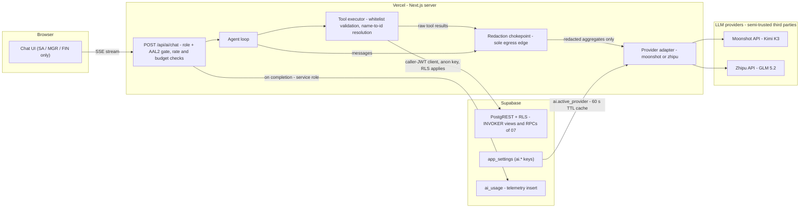
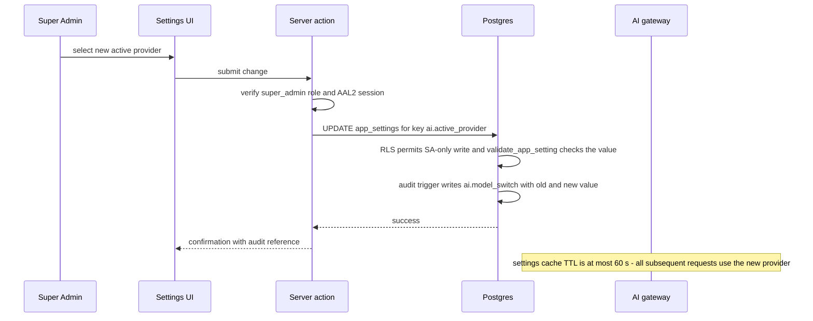
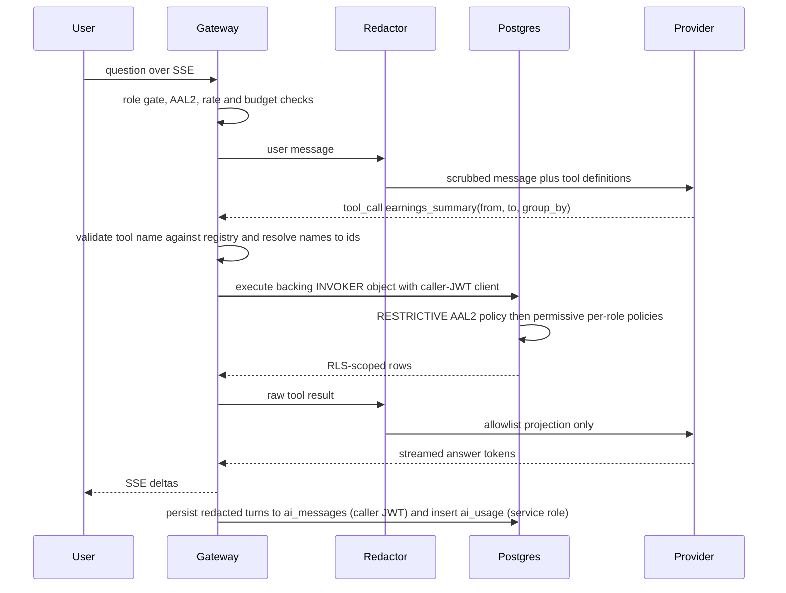
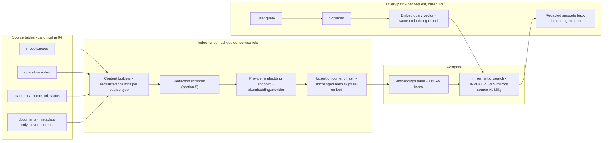

# 11 — AI Assistant & LLM Gateway

This document designs the AI layer of the studio management system: a server-side LLM gateway switchable between **Kimi K3 (Moonshot AI)** and **GLM 5.2 (Zhipu/Z.ai)**, a whitelisted tool registry whose every call executes under the caller's own RLS, an **aggregates-only** outbound redaction boundary through which every provider-bound byte must pass, pgvector-backed semantic search over internal notes and metadata, and stored AI market reports. Like every document in this package it is design-only — no code or infrastructure described here exists yet; everything is a specification of what the system *will do*.

**Related docs:** [00 — Index & Conventions](00-index.md) · [01 — Product Overview](01-overview.md) · [02 — System Architecture](02-architecture.md) · [03 — Roles & RBAC](03-roles-rbac.md) · [04 — Database Schema & RLS](04-database-erd.md) · [05 — Auth, Invites & Mandatory 2FA](05-auth-2fa.md) · [06 — Documents & Shareable Links](06-documents-sharing.md) · [07 — Statistics & Dashboards](07-analytics.md) · [08 — Security & Threat Model](08-security-threat-model.md) · [09 — Accounting](09-accounting.md) · [10 — Deployment & Operations](10-deployment-operations.md) · [12 — File Library & AI Classification](12-file-library-classification.md)

---

## 1. Scope and non-negotiables

The owner's requirement for this module reads: *"Runs the db, vectoring, reaching tools, market analysis. Full stack."* In this design that maps to four concrete capabilities:

| Requirement phrase | What is designed | Where |
|---|---|---|
| "Runs the db" / "reaching tools" | An agentic assistant that answers operational and financial questions by calling **whitelisted, read-only data tools** mapped 1:1 onto the SECURITY INVOKER analytics objects of [07 — Statistics & Dashboards](07-analytics.md) | §4 |
| "Vectoring" | pgvector semantic search over scrubbed internal notes and document *metadata* | §6 |
| "Market analysis" | Monthly AI-generated market/trend commentary from internal aggregates, stored as reports | §7 |
| "Full stack" | The complete path — chat UI, streaming gateway, provider adapters, redaction, persistence, metering — specified end to end | §2, §5, §8 |

The layer is built inside the package's existing security stance ([01](01-overview.md), [02](02-architecture.md)) and adds four invariants of its own:

> **Non-negotiables of the AI layer.**
>
> 1. **The model is a consumer of pre-scoped data, never an authority.** Every data tool executes under the caller's JWT via the anon key; RLS remains the final authority ([02 — System Architecture](02-architecture.md)). The assistant grants no new data access to anyone.
> 2. **Aggregates-only egress.** Only aggregated, de-identified data may reach Moonshot or Zhipu: stage/display names and numbers are allowed; legal names, dates of birth, contact details, payment details, IP addresses, document contents, and storage paths are **never** sent. This applies equally to chat prompts, tool results, and embedding inputs. The policy is stated canonically here (§5) and referenced everywhere else.
> 3. **No raw SQL, no write tools, no service role anywhere in the AI request path.** The agent is read-only in v1 (§4); the service role appears only in out-of-band telemetry and indexing writes that carry no caller data authority (§4, §6, §8).
>
>    > ⚠ **This clause changed for the agent, not for the assistant.** See [§4.4](#44-owner-approved-exception-freedom-hermes-the-out-of-band-agent). The **in-request assistant described by this document is unchanged**: it still holds no service role, still takes no write tool, and still executes every tool under the caller's JWT. What the owner added on 2026-08-12 is a *separate, out-of-band* worker (Freedom Hermes) that runs on its own schedule with no browser request behind it. **"No raw SQL" is untouched and remains absolute — it binds Hermes exactly as it binds the assistant.**
> 4. **Provider keys are server-only.** The browser talks only to the Next.js gateway; `MOONSHOT_API_KEY` and `ZHIPU_API_KEY` live in server-scoped Vercel env only (inventory in [08 — Security & Threat Model](08-security-threat-model.md) and [10 — Deployment & Operations](10-deployment-operations.md)).

---

## 2. Gateway architecture

The gateway is server-side only ([D2]): a Next.js route handler `POST /api/ai/chat` that streams responses to the browser over SSE, plus a server action for report generation (§7). The browser never talks to Moonshot or Zhipu — it holds no provider key, no provider URL, and no prompt-assembly logic that matters for security.

**Preconditions per request.** The Next.js middleware enforces session and AAL2 checks as the usual UX layer ([05 — Auth, Invites & Mandatory 2FA](05-auth-2fa.md)); the gateway additionally verifies the caller's role is one of **Super Admin, Manager, or Finance** — the only roles with an AI surface ([D10], rationale below; the authoritative capability rows live in [03 — Roles & RBAC](03-roles-rbac.md)). Neither check is the security boundary: even if both were bypassed, every tool call still executes under the caller's JWT and dies at the RESTRICTIVE AAL2-plus-active-profile policy defined in [05](05-auth-2fa.md). Rate and budget checks (§8) run before any provider call.

**Why Model and Operator get no AI surface in v1 ([D10]).** Their scope is narrow self-service; the assistant's value is operational and analytical; and excluding them shrinks both the prompt-injection surface and the cost surface. The exclusion is enforced at the database level — no permissive policies exist on `ai_conversations` / `ai_messages` for those roles ([04 — Database Schema & RLS](04-database-erd.md)) — not merely in the UI.

**Conversation privacy ([D11]).** Conversations and messages are **own-only for every role, including the Super Admin**. SA oversight happens through `ai_usage` (readable in full by SA) and `audit_log`, never by reading colleagues' chats.

### 2.1 Provider adapters

One `ProviderAdapter` interface, two implementations ([D3]). Model IDs are configuration values in `app_settings`, never hardcoded — swapping a model version is a settings change, not a deploy.

| Interface method | Signature (design-level) | Notes |
|---|---|---|
| `chat` | `chat(messages, toolDefs, stream) → deltas \| toolCalls` | Streaming chat completion with tool-calling; both providers expose OpenAI-compatible tool-call semantics |
| `embed` | `embed(texts[]) → vectors` | Batch embedding; used only by the indexing job and the semantic-search query path (§6) |

| Adapter | Provider / model | Chat model setting | Key env var |
|---|---|---|---|
| `moonshot` | Moonshot AI API — Kimi K3 | `ai.chat_model.moonshot` | `MOONSHOT_API_KEY` |
| `zhipu` | Zhipu (Z.ai) API — GLM 5.2 | `ai.chat_model.zhipu` | `ZHIPU_API_KEY` |

Base URLs are adapter constants; model identifiers and every tunable limit come from `app_settings` (schema and seed keys in [04](04-database-erd.md) / [10](10-deployment-operations.md)).

### 2.2 Architecture diagram

The redaction chokepoint (§5) is the **only** edge in the whole system that crosses to the LLM providers — there is no second path.

---

## 3. Active-model setting and switch

**Reading ([D4]).** The gateway resolves the active provider from the single global setting `ai.active_provider` in `app_settings` on each request, behind an in-memory cache with a TTL of at most 60 seconds per serverless instance. A switch is therefore globally effective within 60 seconds — stated and accepted; the assistant is not a real-time-critical surface.

**Switching ([D4]).** Writing `ai.active_provider` is a Super-Admin-only UPDATE enforced by RLS on `app_settings` ([04](04-database-erd.md)); the `validate_app_setting` trigger rejects values outside `"moonshot"` / `"zhipu"`; and the audit trigger records the change as `ai.model_switch` with the old and new value in the metadata. The switch is a settings-UI action, not a deploy.

**No auto-failover ([D5]).** Deliberately excluded from v1, for a governance reason rather than a technical one: the assistant is a convenience surface, not a critical path — and **silently changing the third-party data processor is a governance event that must not happen implicitly**. On provider error the gateway surfaces the failure to the user; the Super Admin switches manually (runbook 5.9 in [10 — Deployment & Operations](10-deployment-operations.md)). A future SA-configurable, default-off failover toggle is noted as a possible extension.

Embeddings are unaffected by this switch by design — the embedding provider is a separate, decoupled setting (§6, [D12]).

---

## 4. The tool registry — "runs the db" safely

The assistant reaches the database exclusively through a fixed, server-side registry of read-only tools. **This registry table is canonical here** (per the canonical-source rules in [00 — Index & Conventions](00-index.md)); no other document restates it.

Design principles:

- **1:1 onto 07's objects.** Every tool is a thin binding to an existing SECURITY INVOKER view or RPC from [07 — Statistics & Dashboards](07-analytics.md) (accounting semantics in [09 — Accounting](09-accounting.md)). The registry adds no query capability that does not already exist for the calling user.
- **Caller-context execution ([D7]).** Every tool executes via the **caller's user-context Supabase client** — the caller's JWT and the anon key — so Postgres evaluates the caller's own RLS on every read. The service role never appears anywhere in the chat/tool path. Tool results are scoped to the asking user *by construction*, not by gateway logic.
- **Business names, never UUIDs.** Tool parameters take stage names, platform names, and months. The gateway resolves names to ids via the existing directory views and keeps the mapping server-side — the model never sees or supplies a UUID.
- **Allowlist-projected results.** Only the columns listed in the projection column below are ever serialized toward the provider (§5).
- **Server-side validation.** A tool call naming anything outside this registry is rejected before execution; tool names are matched against the fixed list, never interpreted.

| Tool | Parameters | Backing object (07/09) | Result projection sent to model |
|---|---|---|---|
| `earnings_summary` | `from date, to date, group_by ('model','platform','week','month')` | `fn_earnings_summary` | group label (stage/platform name or period), gross, net |
| `earnings_monthly` | `from_month, to_month, stage_name?, platform_name?` | `v_earnings_monthly` (+ directory views for name→id) | stage_name, platform name, month, gross, net |
| `hours_summary` | `from date, to date` | `fn_hours_summary` | stage_name, hours, session_count |
| `payout_summary` | `from date, to date` | `fn_payout_summary` | status, count, total_net |
| `payout_history` | `from date, to date, status?` | `v_payout_history` | payee display name, period, net, status, paid month |
| `payee_balances` | — | `v_payee_balances` | payee type, display name, currency, balance |
| `payee_statement` | `payee_type, display_name, from, to` | `fn_payee_statement` | opening/closing balance, entry type, amount, period, description (scrubbed) |
| `split_distribution` | `from_month, to_month` | `v_split_distribution` | month, bucket, amount, share % |
| `forecast` | `months_ahead int` | `fn_forecast` | month, stage_name/platform, predicted net |
| `forecast_accuracy` | — | `v_forecast_accuracy` | month, stage_name, predicted, actual, error %, MAPE |
| `compliance_summary` | — | `fn_compliance_counts` / `v_model_compliance_summary` | stage_name, valid/expiring/expired counts |
| `semantic_search` | `query text, top_k int (<=10), source_types?` | `fn_semantic_search` (new, §6) | source type, subject stage/display/platform name, redacted content snippet, similarity |

A tool invoked by a role whose RLS denies the base rows simply returns an empty set — for example, Finance calling `compliance_summary` gets zero rows because Finance is denied `documents` entirely. This is the same property [07](07-analytics.md) §4 states for widgets: presentation may be narrower than RLS, never wider, and a "wrong" call leaks nothing.

### 4.1 Rejected: a raw SQL tool ([D6])

Not included — **not even as an SA-only, read-only variant**. Three reasons, recorded permanently:

> **No raw SQL tool.**
> (a) It breaks the whitelist principle that makes prompt injection survivable — an injected instruction could exfiltrate anything SA-visible (legal names, `payment_details`) through a "read-only" query.
> (b) The redaction chokepoint cannot reliably field-filter arbitrary result shapes; the allowlist projection (§5) only works because every tool's output shape is known in advance.
> (c) The Super Admin already has a raw-SQL path — the Supabase dashboard ([05](05-auth-2fa.md)) — that does not transit an LLM at all.

### 4.2 Rejected: write tools ([D8])

None in v1. The agent is strictly read-only; every mutation in the system remains a human flow with its existing guards — auth and invites ([05](05-auth-2fa.md)), documents ([06](06-documents-sharing.md)), accounting and maker-checker payouts ([09](09-accounting.md)).

> ⚠ **This clause changed.** It stands as written **for the in-request assistant**, which still has no write tool of any kind. It no longer describes the whole system: [§4.4](#44-owner-approved-exception-freedom-hermes-the-out-of-band-agent) records an owner decision of 2026-08-12 permitting a separate out-of-band worker to *propose* a small, fixed set of writes that **a human must authorise before anything happens**. The sentence "every mutation remains a human flow with its existing guards" is still true, and is the exact property the design preserves: Hermes cannot author a mutation, only ask for one.

### 4.4 Owner-approved exception: Freedom Hermes, the out-of-band agent

Every clause below is a control, not a statement of intent.

**What changed, in one sentence.** An always-on worker (`hermes/`, deployed to Railway, migrations 015–016) may hold a service-role client and may execute three write actions — **but only after a named human has approved that specific proposal, and never one it approved itself.**

**Why the owner accepted it.** The studio's real failure mode is a period that nobody closed and a payee who went unpaid, not an agent that acts too freely. Hermes exists to notice that work and ask. The judgement was that a proposal waiting in a queue is worth more than an alert nobody reads, provided the agent can never be the one who says yes.

1. **It is not in the AI request path.** Hermes runs on a schedule with no browser request behind it. Nothing in this document's gateway (§2), tool registry (§4), or chat surface gains a write capability or a service role. The clause in §1 that forbids the service role in the *request path* is intact because Hermes is not in one.
2. **Propose and execute are separate; authorise is neither.** A `BEFORE UPDATE` trigger on `hermes_approvals` (migration 015) raises `42501` whenever `state` becomes `approved` or `rejected` outside the `decide_approval` RPC — **for every role, including the service role Hermes runs as**. `decide_approval` is `SECURITY DEFINER`, resolves its actor as `coalesce(auth.uid(), p_actor)` so a real session always wins, and re-verifies that actor's role against the row's `required_role` in the database. Verified against the live database: a direct service-role `UPDATE … SET state='approved'` is refused, as are a model and a manager deciding a finance-required action, while a super_admin succeeds and a second decision is refused.
3. **Approved actions run as the approving human, not as the agent.** The executor RPCs (`fn_agent_generate_earning_shares`, `fn_agent_snapshot_forecast`, migration 016) take the approver's id, re-check that profile's role **and active status at execution time**, then set `request.jwt.claims` transaction-locally to that human and delegate to the existing `SECURITY INVOKER` functions **unchanged**. There is one implementation of the commission split, and the resulting ledger rows are attributed to a person. Both RPCs are `REVOKE`d from `anon` and `authenticated` and granted to `service_role` only, so no browser session can reach them.
4. **A fixed, short list of actions, and unknown actions fail safe.** Exactly three are executable: `close_period`, `snapshot_forecast`, and `create_payout` — the last inserting a **`pending`** payout only, so the existing super-admin maker-checker ([09](09-accounting.md)) still stands between Hermes and money moving. `approve_payout`, `mark_payout_paid` and `delete_document` are `human_only` with no executor at all. Any action not in the policy table resolves to `approval`, never `automatic`, and an approved action with no executor **fails loudly rather than reporting success**. Unit tests enforce all of this.
5. **No raw SQL. [D6] stands, absolutely.** No Hermes tool accepts free-form SQL. This was not weakened and is not open for extension.
6. **The same chokepoint, imported rather than copied.** The worker lives inside this repository specifically so it can `import` the app's real `src/lib/ai/redactor.ts`. A vendored copy could drift silently; a test asserts the worker holds the app's own `PROJECTIONS` and 17-key `BLOCKED_KEYS`, and that an unregistered tool still throws.
7. **Reachable only by named senior staff, each over their own channel.** *(Amended 2026-08-13: originally "reachable by one person"; the owner added a second operator, Alina.)* The Telegram surface answers only a chat that is verified *and* bound to an **active profile holding a senior role** (`super_admin`, `manager`, or `finance` — the fixed allowlist in `hermes/src/telegram/access.ts`). Models and operators can never hold a channel: the bot reads through a service-role client that sees every row, while the app shows those roles only their own — a channel would be privilege escalation, and a unit test pins the exclusion. Commands are filtered by the channel's role (the kill switch stays super_admin-only), approval cards are sent only to chats whose role could decide them, and every decision is still authorized per-tap by `decide_approval` in the database — the channel role chooses what is *shown*, never what is *allowed*. An unpaired chat can do exactly one thing: redeem a one-time pairing code, which may additionally be pinned to a specific Telegram username (migration 017) so a code minted for a named person redeems only from that person's account. Anything else is met with silence.
8. **Append-only history still binds it.** Migration 013's statement triggers refuse `UPDATE`/`DELETE` on `audit_log` and `ledger_entries` **for every role including `service_role`**, so Hermes inherits tamper-evident history rather than being trusted with it. Every decision writes a `hermes.approve` / `hermes.reject` row naming the deciding human.
9. **It can be switched off.** `hermes_policy.enabled = false` halts scheduled work, and a daily USD cost cap gates every provider call.

**The honest limitation.** Hermes holds a service-role key, and a key that exists can be stolen. RLS is not a defence against it — the trigger, the fixed action list, and the approval requirement are. The controls above are what make the key survivable, not RLS; the operational consequence is that the Railway environment must be treated with the same seriousness as the Vercel one ([10](10-deployment-operations.md)).

### 4.5 Agentic tool-call flow

---

## 5. Outbound minimization and redaction

**The chokepoint contract.** One module. Every provider-bound payload — chat messages, tool results, embedding inputs, report prompts — passes through it; there is no second serialization path to an adapter ([D9]). It is unit-testable in isolation, and — mirroring the posture [08 — Security & Threat Model](08-security-threat-model.md) takes for security headers — **any change to this module is a security-reviewed design change**, not a routine edit.

Three mechanisms, strongest first:

1. **Per-tool allowlist projection (authoritative for structured data).** Each registry entry (§4) declares exactly which fields of its result may be serialized toward the model. Everything not named is dropped. Because tool output shapes are fixed, this projection is complete — it is the boundary for structured data.
2. **Global field blocklist (backstop).** Independent of the projection, the chokepoint rejects or strips these keys wherever they appear in any provider-bound structure. **This blocklist is canonical here:**

   | Blocked key | Blocked key | Blocked key | Blocked key |
   |---|---|---|---|
   | `legal_name` | `full_name` | `date_of_birth` | `email` |
   | `phone` | `payment_details` | `payment_method` | `reference` |
   | `ip` | `ip_hash` | `user_agent` | `storage_path` |
   | `file_name` | `sha256` | `token_hash` | `token_prefix` |
   | `notes` * | | | |

   \* `notes` is blocked on every path except the embedding pipeline, which scrubs note text (mechanism 3) and then embeds the scrubbed form (§6).
3. **Free-text pattern scrubbing (best-effort defense-in-depth).** User messages, ledger `description` fields, and note bodies get pattern-based scrubbing of emails, phone numbers, and card/IBAN-like strings before egress. This is explicitly **not** the boundary — free text can encode PII in ways no pattern catches — which is exactly why mechanisms 1 and 2 carry the policy and why the embeddable sources are chosen so narrowly (§6).

**Allowed vocabulary.** What legitimately crosses to the providers: `stage_name`, `display_name`, platform names, months and dates, statuses, counts, amounts, and percentages. Aggregates and pseudonyms — nothing that identifies a person outside the studio's own pseudonymous frame.

**One documented exception.** The file-library classification channel is the single approved exception to the rule above, specified and bounded in [12 — File Library & AI Classification](12-file-library-classification.md) §6: its `classificationChannel` entry in this module is the **only** path on which file contents may cross to a provider, it is scoped to the `library` bucket alone — compliance documents in `model-documents` are never sent — it is switchable off per file (`ai_exempt`) and per category (`ai_enabled`), and **every crossing is audited** (`ai.classify`) and metered (`ai_usage`). No other path may carry file contents, and a second exception would require the same explicit owner-level decision.

**Persistence doubles as egress audit.** `ai_messages.tool_result` stores the **redacted** projection — the raw rows are never persisted in the AI tables ([04](04-database-erd.md)). The conversation log is therefore a faithful record of what actually left for the provider, reviewable after the fact without any reconstruction.

---

## 6. Vectoring

Semantic search runs on the `pgvector` extension, with the `embeddings` table and its HNSW index defined canonically in [04 — Database Schema & RLS](04-database-erd.md).

### 6.1 What gets embedded — and what never does ([D13])

Every embedded source must survive the aggregates-only policy of §5 *before* embedding, because embedding inputs transit the provider like any prompt.

| Source (`source_type`) | Embedded content | Why it is admissible |
|---|---|---|
| `model_note` | `models.notes`, scrubbed first (§5 mechanism 3) | Highest search value — free-text operational knowledge; pseudonymous subject (stage name) |
| `operator_note` | `operators.notes`, scrubbed first | Same as above for operators (display name) |
| `platform` | Platform name + url + status | Lookup data about external sites; contains no personal data |
| `document_meta` | Title, `doc_type`, issued/expires dates — **metadata only** | Never file contents, never `storage_path` or `file_name`; the documents themselves are the system's most sensitive asset ([06](06-documents-sharing.md), [08](08-security-threat-model.md)) and never leave |

**Excluded: audit-log summaries.** The audit log is SA-only readable content full of IP hashes and actor trails; embedding it would demand SA-only embedding rows for near-zero search value and violates the spirit of data minimization. It is not an embedding source.

### 6.2 Embedding provider decoupling ([D12])

The embedding provider is **deliberately decoupled from the chat switch**. Query vectors are only comparable to stored vectors produced by the *same* model — tying embeddings to `ai.active_provider` would silently break semantic search on every chat switch. Instead, three separate settings govern embeddings: `ai.embedding.provider`, `ai.embedding.model`, `ai.embedding.dim` (default: the Zhipu embedding endpoint, as a config value, not a hardcode).

Consequences, stated as design rules:

- A chat-provider switch (§3) never touches vectors.
- Changing the **embedding** model is a deliberate SA action with a full re-embed runbook (5.10 in [10](10-deployment-operations.md)), audited as `ai.reindex`. If the dimension changes, a migration ships too — the `vector(N)` column is dimension-typed, which HNSW requires.
- **One live embedding model at a time** — no per-model namespace juggling in v1. The `embeddings.embedding_model` column plus the unique key on `(source_type, source_id, embedding_model)` make a future multi-namespace design a non-breaking extension.

### 6.3 Indexing pipeline and search function

The indexing job builds content with per-source SQL that selects **only allowlisted columns**, passes it through the §5 scrubber, embeds via the configured provider, and upserts with the **service role** (the only writer of `embeddings` — see the RLS matrix in [04](04-database-erd.md)), keyed on `content_hash`: an unchanged hash skips the re-embed. The job runs incrementally on `updated_at`; `platforms` is tiny and recomputed wholesale. The Super Admin can additionally trigger a full reindex, audited as `ai.reindex`.

Search is a new INVOKER RPC, catalogued in [07](07-analytics.md) with semantics canonical here:

`fn_semantic_search(p_embedding vector(2048), p_top_k integer, p_source_types embedding_source[] DEFAULT NULL)`

- **SECURITY INVOKER**, so the `embeddings` table's RLS — which mirrors source-row visibility, per the matrix in [04](04-database-erd.md) — scopes every result to the caller. Finance, denied notes and documents, honestly gets platform rows only.
- Filters `embedding_model` to the currently configured model, so stale vectors from a superseded model can never pollute results mid-migration.
- Served by the HNSW index on `embedding vector_cosine_ops` ([04](04-database-erd.md) index plan).
- Returns pre-redacted content (`embeddings.content` is the scrubbed text that was actually embedded), so a snippet is safe to re-surface into the agent loop by construction.

---

## 7. Market analysis (AI reports)

**Inputs — internal aggregates only ([D15]).** The monthly market/trend commentary is generated exclusively from the studio's own aggregate objects: `v_earnings_monthly`, `v_split_distribution`, `fn_forecast`, `v_forecast_accuracy`, and `v_payee_balances`. **External market data is out of scope in v1**: ingesting third-party web text would open a fresh prompt-injection channel and add crawling and provider surface for uncertain value. It is recorded as a future consideration in [01 — Product Overview](01-overview.md).

**Generation flow.** A server action available to SA and Finance: gather the aggregates via caller-JWT INVOKER reads (the same [D7] identity rule as chat tools) → pass through the redaction chokepoint → prompt the active provider → store the result in `ai_reports` → audit `ai.report_create`.

**Storage and read model ([D16]).** Both forms exist: ephemeral chat answers by default, plus stored `ai_reports` rows for the monthly commentary (schema in [04](04-database-erd.md)). Reports are readable by **SA and Finance only** — the report inputs include SA/FIN-only widgets (split distribution, payee balances, forecast accuracy), so granting Manager read would widen the presentation boundary [07](07-analytics.md) already draws for those widgets.

**Dashboard surface.** [07 — Statistics & Dashboards](07-analytics.md) gains an "AI monthly insight" panel rendering the latest report, audience SA and FIN, composed into those two dashboards only.

---

## 8. Cost, rate limits, and usage accounting

**`ai_usage` semantics.** Every gateway request — chat, embedding, report — writes one metering row (schema canonical in [04](04-database-erd.md)): who, which provider and model, token counts, tool-call count, estimated cost, duration, and outcome status. Inserts are service-role-only from the gateway; users read their own rows, the SA reads all — spend oversight without chat access ([D11]).

**Why a separate table and not `audit_log` ([D14]).** Per-request token metering is high-volume operational telemetry with different readers (users see their own spend) and a different retention (2 years) than the SA-only, 7-year audit trail. Security-relevant AI events — `ai.model_switch`, `ai.settings_update`, `ai.reindex`, `ai.report_create` — still go to `audit_log` ([04](04-database-erd.md)).

**Budget enforcement ([D17]).** Three knobs, all SA-tunable values in `app_settings`:

| Setting | Limit |
|---|---|
| `ai.limits.requests_per_user_per_hour` | Per-user hourly request cap |
| `ai.limits.tokens_per_user_per_day` | Per-user daily token budget |
| `ai.limits.tokens_global_per_day` | Global daily token budget |

The gateway enforces all three **before any provider call**, by summing over `ai_usage` for the relevant window. A request over any limit is refused with a clear message and recorded with `status = 'rate_limited'` or `'budget_exceeded'` — refusals are themselves metered, so abuse patterns are visible. Provider-console spend caps act as the backstop of last resort ([10](10-deployment-operations.md)). The Super Admin reviews `ai_usage` spend against budgets monthly as part of the routine checks in [10](10-deployment-operations.md) §5.7; anomalous per-user token spikes are treated as potential injection or abuse incidents ([08 — Security & Threat Model](08-security-threat-model.md)).

Because the AI surface requires an active AAL2 staff session like everything else, there is no anonymous path to spend money against.

---

## 9. What this document does not cover

Table, column, index, trigger, and RLS-policy definitions for the AI schema (`app_settings`, `ai_conversations`, `ai_messages`, `ai_usage`, `embeddings`, `ai_reports`) are canonical in [04 — Database Schema & RLS](04-database-erd.md); the AI capability rows are canonical in [03 — Roles & RBAC](03-roles-rbac.md); the analytics objects the tool registry binds to are catalogued in [07 — Statistics & Dashboards](07-analytics.md) with accounting semantics in [09 — Accounting](09-accounting.md); the AI-specific threats (prompt injection, third-party exposure, settings abuse, cost DoS, embedding leakage) are analyzed in [08 — Security & Threat Model](08-security-threat-model.md); auth preconditions are in [05 — Auth, Invites & Mandatory 2FA](05-auth-2fa.md); document handling stays in [06 — Documents & Shareable Links](06-documents-sharing.md); and provisioning, the `ai.*` settings seed, provider-key management, and the model-switch and re-embed runbooks are in [10 — Deployment & Operations](10-deployment-operations.md).
