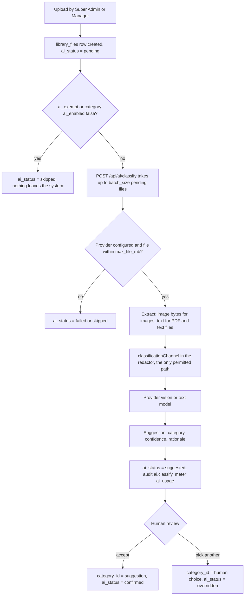

# 12 — File Library & AI Classification

This document specifies the **File Library**: an org-wide, folder-organized store for the studio's own operating documents — statements, receipts, contracts, policies, regulations, tax paperwork — and the AI classification pipeline that proposes a category for each uploaded file for a human to confirm or override. It defines the feature boundary against the compliance-document subsystem of [06](06-documents-sharing.md) (different table, different bucket, different threat profile), carries the **canonical column definitions** for `doc_categories` and `library_files` and the `library` bucket's storage policies, specifies the batch classification loop, and states — in full, as a boxed exception — the owner-approved carve-out from the aggregates-only egress policy of [11 — AI Assistant & LLM Gateway](11-ai-llm.md) §5 that this feature depends on. Like every document in this package it is design-only: nothing described here is implied to exist yet.

**Related docs:** [00 — Index & Conventions](00-index.md) · [01 — Product Overview](01-overview.md) · [02 — System Architecture](02-architecture.md) · [03 — Roles & RBAC](03-roles-rbac.md) · [04 — Database Schema & RLS](04-database-erd.md) · [05 — Auth, Invites & Mandatory 2FA](05-auth-2fa.md) · [06 — Documents & Shareable Links](06-documents-sharing.md) · [07 — Statistics & Dashboards](07-analytics.md) · [08 — Security & Threat Model](08-security-threat-model.md) · [09 — Accounting](09-accounting.md) · [10 — Deployment & Operations](10-deployment-operations.md) · [11 — AI Assistant & LLM Gateway](11-ai-llm.md)

---

## 1. What the Library is

The Library is the studio's own filing cabinet. A Super Admin or Manager uploads a file, drops it in a folder, and files it under a category; the system suggests that category on upload so filing is a click rather than a decision. It is **org-wide**: a Library file belongs to the studio, not to a model, and carries no `model_id`.

That single sentence is what separates it from everything in [06 — Documents & Shareable Links](06-documents-sharing.md), and the separation is deliberate and total:

| | Compliance documents ([06](06-documents-sharing.md)) | File Library (this document) |
|---|---|---|
| Table | `documents` | `library_files` |
| Bucket | `model-documents` (private) | `library` (private) |
| Subject | One model — `model_id` is mandatory | The studio — no model scoping at all |
| Contents | Passports, IDs, contracts, releases, consent and tax forms **of performers** | The studio's own operating paperwork |
| Organization | Model → document type | Virtual folders + a category vocabulary |
| External sharing | Yes — hashed, expiring, revocable share tokens | **No.** There is no share-link path into the Library |
| AI | **Never.** No compliance document is ever sent to a provider | Classification only, under the §6 carve-out |

Two structural decisions follow from that table and are settled:

- **A separate bucket, not a folder in the existing one.** Mixing the studio's receipts into `model-documents` would put the studio's most sensitive objects and its most mundane ones behind the same policy surface, where one mistaken policy edit reaches both. Two buckets means the identity-document policies can stay as narrow as [06 §2.3](06-documents-sharing.md) makes them, and the carve-out in §6 can be scoped to a bucket boundary that is checkable in one line.
- **Flat storage paths, virtual folders.** The object key is `{file_id}/{filename}`; `folder_path` is a database column only. Re-filing a document is therefore a metadata `UPDATE` — never a byte move, never a storage-policy re-evaluation, and never an operation that can half-succeed and leave an object stranded under a path no row points at.

Access is **Super Admin and Manager only**. Models, finance and operators have no policy on these tables at all, so the Library is not merely empty for them — it is invisible.

---

## 2. Schema

> **Canonical source note.** [04 — Database Schema & RLS](04-database-erd.md) is canonical for every table in the system *except* the two below: the Library postdates that document, so `doc_categories` and `library_files` are defined **here** and nowhere else. The conventions of [00 §5.4](00-index.md) still apply — identifiers are `uuid`, timestamps are `timestamptz`.

### 2.1 `doc_categories` — the classification vocabulary

| Column | Type | Constraints / default | Notes |
|---|---|---|---|
| `id` | uuid | PK, default `gen_random_uuid()` | |
| `slug` | text | NOT NULL, UNIQUE | Stable machine key (`incoming_money`, `tax`, …). Referenced by code and seeds; never renamed in place. |
| `name` | text | NOT NULL | Display label. |
| `description` | text | | **Not decoration.** This text is handed verbatim to the classifier as the definition of the category, so it *is* part of the prompt — see §4.2. Editing it changes model behavior and belongs in review. |
| `ai_enabled` | boolean | NOT NULL, default `true` | `false` = the classifier may never suggest this category; filing is human-only. Seeded `false` for `identity`. |
| `sort` | integer | NOT NULL, default `0` | UI ordering; `other` sorts last. |
| `created_at` | timestamptz | NOT NULL, default `now()` | |

Index: `(sort, name)`.

### 2.2 `library_files` — file metadata and classification state

| Column | Type | Constraints / default | Notes |
|---|---|---|---|
| `id` | uuid | PK, default `gen_random_uuid()` | Also the first segment of the storage key. |
| `folder_path` | text | NOT NULL, default `'/'`, CHECK `LIKE '/%'` | Virtual folder. A DB column only — see §1. |
| `name` | text | NOT NULL | Display filename. |
| `mime_type` | text | | Drives the extraction branch in §4.1. |
| `size_bytes` | bigint | CHECK `> 0` when present | Compared against `ai.classify.max_file_mb` before any provider call. |
| `storage_path` | text | NOT NULL, UNIQUE | Flat key in the `library` bucket: `{file_id}/{filename}`. Never encodes `folder_path`. |
| `sha256` | text | | Integrity hash, as for `documents`. |
| `category_id` | uuid | FK → `doc_categories`, ON DELETE RESTRICT | **The authoritative filing.** Only a human sets it (directly, or by confirming a suggestion). RESTRICT means a category in use cannot be deleted out from under its files. |
| `ai_suggested_category_id` | uuid | FK → `doc_categories` | What the model proposed. Kept separate from `category_id` forever, so "what the machine thought" and "what the studio decided" never blur. |
| `ai_confidence` | numeric(4,3) | CHECK between 0 and 1 | Deliberately finer than the `numeric(5,2)` percentage convention. |
| `ai_rationale` | text | | One or two sentences from the model. Shown in the review UI; it is the reviewer's evidence, not an audit substitute. |
| `ai_status` | `ai_review_status` | NOT NULL, default `'pending'` | State machine of §4.3. |
| `ai_exempt` | boolean | NOT NULL, default `false` | Per-file opt-out. Set at upload, it prevents any crossing (§6). |
| `classified_at` | timestamptz | | When the suggestion was produced. |
| `classified_provider` | `ai_provider` | | Which provider produced it — `moonshot` or `zhipu` ([11 §3](11-ai-llm.md)). |
| `uploaded_by` | uuid | NOT NULL, FK → `profiles` | |
| `created_at` / `updated_at` | timestamptz | NOT NULL, default `now()` | `updated_at` maintained by the standard touch trigger. |

Indexes: `(folder_path)`; a **partial** index on `(ai_status) WHERE ai_status = 'pending'` — the batch loop's only query, kept cheap as the table grows; `(category_id)`; `(ai_suggested_category_id)`; `(uploaded_by)`; `(created_at DESC)`.

### 2.3 The `ai_review_status` enum

Added for this feature (settled build decision), alongside the enums in [04](04-database-erd.md):

| Value | Meaning |
|---|---|
| `pending` | Uploaded, not yet classified. The batch loop's work queue. |
| `suggested` | The model proposed a category; awaiting human review. |
| `confirmed` | A human accepted the suggestion. |
| `overridden` | A human chose a different category than the suggestion. |
| `skipped` | Deliberately excluded — `ai_exempt`, oversized, or an unsupported type. **Nothing crossed to a provider.** |
| `failed` | The run errored, or no provider is configured. Nothing was filed. |

### 2.4 RLS intent

Derived from the capability matrix in [03 — Roles & RBAC](03-roles-rbac.md), which stays canonical for capabilities:

| Role | `library_files` | `doc_categories` | Rationale |
|---|---|---|---|
| `super_admin` | Full CRUD | Full CRUD | Owns the Library and the vocabulary. |
| `manager` | Full CRUD | **SELECT only** | Managers file documents; they do not define the categories. Since a category `description` is prompt text (§2.1), write access to `doc_categories` would be write access to the classifier's instructions — a privilege that stays with the Super Admin. |
| `model` | **None** | **None** | No policy exists, so the tables are invisible. |
| `finance` | **None** | **None** | Deny in v1. See §7 for the scoped v2 extension. |
| `operator` | **None** | **None** | No policy exists. |
| `anon` | **None** | **None** | Zero grants, as everywhere. The only anonymous surface in the system is `share-view` ([06 §5.3](06-documents-sharing.md)), which cannot address this bucket or these tables. |

The package-wide precondition still applies underneath all of it: the AAL2 + active-profile RESTRICTIVE policy defined once in [05 §5](05-auth-2fa.md) sits under every one of these tables, so an AAL1 session reads nothing here either.

### 2.5 The `library` bucket

A second **private** bucket, `library`, public access off, object key `{file_id}/{filename}`.

| Role | `library` bucket access | Policy intent |
|---|---|---|
| `super_admin` | Read + write, all objects | Full CRUD. |
| `manager` | Read + write, all objects | Upload, download, replace, delete. |
| `model` / `finance` / `operator` | **None** | No policy at all. |
| `anon` | **None** | No grants; no share-link path exists into this bucket. |

`storage.objects` has no equivalent of the per-table restrictive policy, so — exactly as for `model-documents` ([06 §2.3](06-documents-sharing.md)) — each policy spells out `is_aal2()` **and** `is_active_profile()` inline. Omitting either conjunct from any one policy would open a storage path to an under-assured session.

Downloads use the same mechanism as compliance documents: a server-side `createSignedUrl(path, 60)`, audited as `library.download`. There is no public URL and no long-lived URL, here or anywhere.

---

## 3. Audit trail

Every Library action lands in the append-only `audit_log` ([04 §4.16](04-database-erd.md)), Super-Admin-readable only:

| Action | When |
|---|---|
| `library.upload` | File object + metadata row created. Metadata records `folder_path`, `mime_type`, `size_bytes`, and `ai_exempt` — so a file's exemption status at upload time is provable after the fact. |
| `library.categorize` | Written by trigger whenever `category_id`, `ai_suggested_category_id` or `ai_status` changes — covering both the machine's suggestion and the human decision that follows it. |
| `ai.classify` | **One row per provider crossing** (§6). Written by the classification route before/around the call, not by a trigger. |
| `library.download` | Signed-URL issuance for a Library file. |
| `library.delete` | File removed. |

Metering runs alongside the audit: each crossing also writes an `ai_usage` row ([04 §4.21](04-database-erd.md), [11 §8](11-ai-llm.md)). That requires **one additive value on the `ai_request_kind` enum** — `classify`, alongside `chat`, `embedding` and `report`. It is additive by design: adding an enum value invalidates no existing row, and classification must never be metered under a kind that means something else, or the spend view stops answering "what is the AI actually doing?".

---

## 4. The classification pipeline

### 4.1 Flow

### 4.2 What is sent, and how

The classifier is prompted with the **category vocabulary** — each enabled category's `slug`, `name`, and `description` verbatim from `doc_categories` (§2.1) — and asked to return one slug, a confidence in `[0,1]`, and a one-or-two-sentence rationale. Two extraction branches:

| Source | Branch | Sent to the provider |
|---|---|---|
| `image/*` | Vision | The image bytes, using `ai.vision_model.{provider}`. |
| `application/pdf`, `text/*` | Text | Text extracted locally in the server route, capped at a leading excerpt — a category is decided by a document's first page, not its last. A PDF with no extractable text layer is routed to the vision branch page-wise, or marked `skipped`. |
| Anything else | — | Nothing. `ai_status = skipped`. |

The response is validated before it is trusted: the returned slug must exist, must be `ai_enabled`, and the confidence must parse into range. Anything else is `failed`, never a silent `other`. Model output is data, not instruction — it can only ever land in `ai_suggested_category_id`, which no policy treats as authoritative.

### 4.3 Human confirmation is the filing step

The machine never files anything. `category_id` — the column every list, filter and (in v2) permission reads — moves only when a human moves it. `confirmed` and `overridden` are recorded as different states on purpose: the ratio between them over time is the honest measure of whether the vocabulary in §5 is any good, and a category that is overridden constantly is a `description` that needs rewriting.

### 4.4 The batch loop

Classification is **client-driven batching, not a queue**:

- `POST /api/ai/classify` — a Next.js **server route**, per the settled decision that all AI runs in the Next.js server (Edge Functions are only `share-view` and `bootstrap-admin`; see [02](02-architecture.md) and `supabase/config.toml`).
- Each call selects up to `ai.classify.batch_size` (seeded `5`, [11 §8](11-ai-llm.md)) files with `ai_status = 'pending'` — the partial index of §2.2 is exactly this query — classifies them, and returns `{ done, remaining }`.
- The client re-invokes while `remaining > 0`, showing progress.

No cron, no worker, no queue table. The reasons are the ones this package keeps choosing: a caller-driven loop runs **under the caller's identity and AAL2 session**, so the role gate is the same gate as every other capability; there is no background actor to hold credentials; the work stops when the person stops; and every call is bounded, so no single request can run away with the token budget. The cost is that the studio must keep a tab open to finish a large upload — an acceptable trade for a back-office tool with a handful of users.

Per-call guards, all from `app_settings`: the caller's role and AAL2 are verified first; `ai.classify.max_file_mb` (seeded `10`) marks oversized files `skipped` rather than truncating them; and the standard `ai.limits.*` budgets ([11 §8](11-ai-llm.md)) apply, with refusals metered like any other request.

---

## 5. Seeded categories

Seeded by migration, since the classifier has nothing to choose from otherwise. `description` values are the prompt text of §4.2.

| Slug | Name | `ai_enabled` | Covers |
|---|---|---|---|
| `incoming_money` | Incoming money | ✅ | Platform payout statements, remittance advices, settlement reports, bank deposit confirmations — money **received**. |
| `receipts` | Receipts & expenses | ✅ | Purchase receipts, supplier invoices, expense claims, equipment and subscription bills — money **spent**. |
| `legal` | Legal | ✅ | Notices, disputes, judgments, formal legal opinions. Routine commercial agreements go to `contracts`. |
| `regulations` | Regulations | ✅ | External rules published by someone else: statutes, regulatory guidance, platform compliance and record-keeping obligations. |
| `policies` | Internal policies | ✅ | The studio's own rules: handbook, code of conduct, security and privacy policies, SOPs. |
| `contracts` | Contracts | ✅ | Signed commercial agreements and amendments: model/operator contracts, platform agreements, NDAs. |
| `tax` | Tax | ✅ | Returns, assessments, VAT/sales-tax records, withholding certificates, authority correspondence. |
| `identity` | Identity documents | ❌ | Passports, national IDs, licences, proof of address. **Never auto-classified** — see below. |
| `other` | Other | ✅ | Genuine fallback only. |

`identity` is seeded `ai_enabled = false` and that is a control, not a default. Compliance identity documents belong in `model-documents` and never reach this feature at all; the category exists because a stray identity document can still be *uploaded* to the Library by mistake, and when it is, the studio needs somewhere honest to file it — by hand, with no machine involvement. A category the classifier cannot suggest is also a category the classifier is never told about, so its description never becomes an invitation to look for identity documents.

---

## 6. Policy carve-out — the classification channel

> ### ⚠ Owner-approved exception to the aggregates-only policy
>
> [11 — AI Assistant & LLM Gateway](11-ai-llm.md) §5 states the package's outbound rule: **only aggregated or de-identified business data may leave the system**, and `storage_path`, `file_name` and document contents are on the blocklist. File classification cannot be done under that rule — classifying a document requires the document.
>
> The owner has approved **two** exceptions, each bounded as follows. Every clause below is a control, not a description of intent:
>
> 1. **Two scopes, two channels.** `classificationChannel` takes a `library_files` row and nothing else. `complianceAnalysisChannel` (added 2026-08-12, migration 014) takes a `documents` row and nothing else, and **only** one whose `ai_analysis_opt_in` is `true`.
>
>    > ⚠ **This clause changed.** It previously read: *compliance documents are never sent to a provider, under any setting, by any path.* The owner has since decided that compliance documents may be analysed, because the operational value of summarising contracts, tax forms and statements outweighed the exposure in their judgement. The boundary was not deleted — it was replaced with a per-document consent gate that is **off by default**, read at crossing time (so revocation is immediate), writable only by Super Admin and Manager, and audited on both the toggle and the crossing. These files contain third parties' identity data; the flag is the record of a deliberate decision to send a specific document to a specific processor.
> 2. **Two channels, no third.** The `classificationChannel` and `complianceAnalysisChannel` entries in the redaction chokepoint ([11 §5](11-ai-llm.md)) are the only paths on which file contents may cross. There is no third serialization path, and the chat gateway, the tool registry and the embedding pipeline are all unchanged — none of them can carry a file. Any change to that channel is a security-reviewed design change, exactly as for the chokepoint itself.
> 3. **Opt-outs (library) and opt-in (compliance).** Library: per file, `library_files.ai_exempt = true` prevents any crossing (`ai_status = skipped`); per category, `doc_categories.ai_enabled = false` removes a category from the classifier's world entirely — seeded `false` for `identity`. Compliance: the inverse and stricter default — `documents.ai_analysis_opt_in` is `false` until a human turns it on for that one document, and turning it off again clears the stored analysis.
> 4. **Every crossing is audited.** One `ai.classify` (library) or `ai.analyse` (compliance) row per crossing, in the append-only `audit_log`, recording the file id, mime type, size, provider and model — never the content. The question "which files has this studio ever sent to a provider?" has a complete, tamper-evident answer.
> 5. **Every crossing is metered.** One `ai_usage` row per crossing (provider, model, tokens, duration, status), so classification competes for the same `ai.limits.*` budgets as everything else and shows up in the same spend view ([11 §8](11-ai-llm.md)).
> 6. **Only the file, never the file's neighbours.** The channel sends extracted content plus the category vocabulary. It does not send `storage_path`, `sha256`, uploader identity, folder structure, or any joined row from elsewhere in the database. The global field blocklist of [11 §5](11-ai-llm.md) still applies to everything except the extracted content itself.
>
> **The honest limitation (library).** Exemption is a decision made *at upload*. A file that nobody marked exempt, and whose category was not disabled, **transits the provider once** — before any suggestion exists to review. Marking it exempt afterwards prevents future crossings; it cannot recall the first one. There is no design in which a classifier reads a document without reading the document, so the mitigation is procedural and must be stated plainly in the upload UI: *anything not marked exempt will be sent to the AI provider for classification.* The studio's protection against a mis-upload is the `ai_exempt` checkbox on the upload form and the fact that identity documents have their own subsystem, not a technical guarantee at the moment of upload.

This carve-out changes nothing else. Chat, tools, embeddings, and reports remain aggregates-only; adding a second exception would require the same explicit, documented, owner-level decision that produced this one.

---

## 7. Deferred to v2

Recorded so the v1 shape is understood as a floor, not a ceiling:

- **Finance read on money categories.** Finance has a legitimate interest in `incoming_money`, `receipts` and `tax`, and none whatsoever in `contracts`, `legal` or `policies`. A category-scoped SELECT policy (`current_user_role() = 'finance' AND category_id IN (…)`) is the natural extension — deferred only because it makes `category_id` a *permission* column, which means the human confirmation step (§4.3) becomes a privilege boundary and deserves its own review. In v1, filing is organization; in v2, filing is access.
- **Library embeddings.** Indexing extracted Library text into the pgvector store ([11 §6](11-ai-llm.md)) would let "find the platform agreement with the 30-day termination clause" work. It needs a new `embedding_source` value, its own redaction decision (the aggregates-only rule applies to embedding inputs too, and this carve-out does **not** extend to them), and a re-embed runbook entry ([10](10-deployment-operations.md)).
- **Retention rules per category** — e.g. tax records held seven years, receipts three — driving an expiry view in the shape of the derived compliance status of [06 §4](06-documents-sharing.md).

## 7. Analysis output (migration 014)

Both channels now return more than a filing decision. Each analysed file carries:

| Column | Meaning |
|---|---|
| `ai_summary` | A short plain-language summary of what the document is and says. |
| `ai_key_figures` | A JSON array of `{label, value}` facts — totals, dates, reference numbers, counterparties. |

For library files these ride along with the existing category suggestion in the same crossing — the analyser reads the document once and returns filing plus substance together, so richer output costs no additional egress. Compliance documents have no category vocabulary (they already carry a `doc_type`), so `complianceAnalysisChannel` returns summary and figures only.

**Supported formats.** PDF (text layer), Word `.docx`, Excel `.xls`/`.xlsx`/`.xlsm`/`.xlsb`/`.ods`, CSV, plain text and JSON go down the text branch; images go to the vision model.

Legacy `.xls` is **first-class**, not a fallback: the studio holds many of them. It is BIFF — an OLE compound file, a genuinely different format from the OOXML `.xlsx` — and is parsed by SheetJS, which reads both. SheetJS is installed from the vendor's own CDN rather than the npm registry, because the registry copy is deprecated and carries known CVEs; that single parser also replaced `exceljs`, removing a vulnerable transitive dependency.

Still unreadable: `.doc` and `.ppt` (legacy binary Word/PowerPoint). They are recognised explicitly and skipped with `legacy_office`, so the UI can tell the user to convert rather than reporting a bare "unsupported type".
